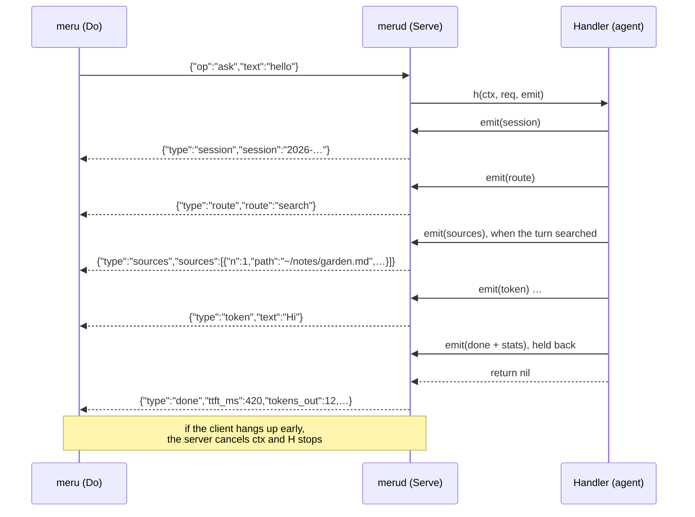

# rpc

**Code:** `internal/rpc/` (`protocol.go`, `citation.go`, `args.go`, `usage.go`, `client.go`, `server.go`)
**Milestone:** v0.1; sources and the index ops in v0.2
**Architecture:** [The shape: daemon + thin client](../../ARCHITECTURE.md#the-shape-daemon--thin-client)

## What it does

`rpc` carries messages between `meru` (the client) and `merud` (the daemon)
over a Unix socket at `~/.meru/merud.sock`. A Unix socket works like a network
connection, but it is a file on disk, and only processes on this machine can
open it.

The protocol is newline-delimited JSON. The client opens a connection and
writes one `Request`. The server writes `Event`s back, one JSON object per
line, and the last one is `done` or `error`. One connection carries one
request, and closing the connection cancels the turn.

## The picture



## Walk through the code

### protocol.go

The message types. `Request` has an `Op` (`ask` or `ping`), an optional
`Session` to continue, the question `Text`, and a `Source` (`cli`, `tui` or
`job`). `Event` has a `Type` and only the fields that type needs. A `route`
event sets `Fallback` when the router wasn't sure and used its fallback route.
The `done` that ends an ask carries the turn's stats: time to first token
(`ttft_ms`), total time (`duration_ms`), the main model's token counts
(`tokens_in`, `tokens_out`), and the time the model spent writing
(`eval_ms`). Every field has `omitempty`, so a `ping`'s `done` stays
`{"type":"done"}`, and a client built before these fields existed skips
them.

v0.2 added, without changing anything older clients read:

| Addition | What it carries |
| --- | --- |
| `sources` event | `Sources`, a list of `Citation`s: the excerpts from your files that the prompt held, numbered as the answer cites them (`n`), with the shortened `path`, `heading`, `start_line`/`end_line` or `page`, and `score`. It comes after `route` and before the first `token`, and only when the search found something. |
| `index` op | `Path` in the request: a folder or file to index, or empty for every `[index]` folder. The reply is `progress` events (one line of news in `Text`), one `report` event, then `done`. |
| `index_status` op | The reply is one `status` event, then `done`. |
| `report` event | `Report`, an `IndexReport`: files seen, indexed, unchanged, removed, failed and skipped, chunks written, and the time taken. |
| `status` event | `Status`, an `IndexStatus`: the configured folders, the counts of files, chunks and vectors, whether a scan runs, and the last full scan's report, time and error. |

`Report` and `Status` are pointers. `omitempty` leaves out a nil pointer but
never a struct value, so without the pointer every event would carry an empty
report.

Adding a slice field (`Sources`) made `Event` a type Go can't compare with
`==`, so tests compare events with `reflect.DeepEqual`.

### citation.go

Two helpers both clients use, so `meru` and `meru chat` show sources the same
way:

- **`Citation.String`** writes one line: `[1] ~/notes/garden.md, "Budget",
  lines 3–5`. A method named `String` also makes `fmt.Println(c)` print it
  this way.
- **`Cited(answer, sources, usedTools)`** finds the `[1]` and `[1, 3]` marks
  in the answer with a regular expression and returns the sources they name.
  When the answer cites none, it returns them all, because the model still
  read them. A turn that called a tool is the exception: its answer may come
  from the tool's result, so no marks means no sources.

### args.go

Helpers both clients use to show a tool call's arguments, which arrive as raw
JSON (`json.RawMessage`):

- **`ArgsLines(args, maxLines)`** indents the JSON with `json.Indent`, one field
  per line, for an approval prompt. Past `maxLines`, the last line says how
  many it left out: `… 12 more lines`.
- **`ArgsLine(args, width)`** squeezes the JSON onto one line with
  `json.Compact`, for a tool line or `meru log`, and cuts it to `width`.
- **`Cut(s, width)`** does the cutting. It counts characters (runes), not bytes,
  so it never splits a character such as "é" that takes two bytes.

Arguments that aren't valid JSON come back as they are, so a broken tool can't
hide what it sent.

### usage.go

Helpers both clients use to show a `usage` event, so `meru usage` and the `/usage`
box in `meru chat` show the same numbers:

- **`UsageTable(windows)`** returns rows of cells: the window names first, then one
  row per measure (sessions, questions, tokens in and out, active time, docs
  touched, tool calls). Each measure pairs its label with a function that reads its
  value from a window; Go keeps a function in a struct field like any other value.
- **`ShortCount(n)`** writes a count in a few characters: `950`, `1.2k`, `18k`,
  `1.4M`, with one decimal below ten, counting by 1,000.
- **`ShortDuration(ms)`** writes a time as its two largest units: `45s`, `2m 14s`,
  `3h 05m`.
- **`UsageNote`** is the line under the table: today, week and month follow the
  local calendar, while 1h and 30d roll back from now.

Each client lays out the cells its own way: `meru` with a `text/tabwriter`, and
`meru chat` by hand, so it can drop windows that don't fit the terminal.

### client.go

`Do` dials the socket, sends the request and returns the events as an
iterator, which callers read with `for ev, err := range rpc.Do(...)`. Cancelling
the caller's context closes the connection.

### server.go

`serveConn` answers `ping` itself and hands `ask`, `index` and
`index_status` to the handler. Any other op gets an `unknown op` error.

**Listen** claims the socket. A socket file can outlive a `merud` that crashed,
so `Listen` checks what is there first:

```go
case info.Mode()&fs.ModeSocket == 0:
    return nil, fmt.Errorf("%s exists and isn't a socket; ...", path)
default:
    if pingOK(ctx, path) {
        return nil, fmt.Errorf("another merud is already listening on %s", path)
    }
    if err := os.Remove(path); err != nil { ... }
```

A live `merud` answers the ping, and `Listen` refuses to start a second one. A
dead one doesn't answer, and `Listen` deletes its leftover file. `Listen` never
deletes a regular file it didn't make. After listening it sets the socket's
mode to `0600`, so other users on the machine can't connect.

**Serve** accepts connections until its context is cancelled and runs each one
in its own goroutine:

```go
stop := context.AfterFunc(ctx, func() { ln.Close() })
defer stop()

var wg sync.WaitGroup
defer wg.Wait()

for {
    conn, err := ln.Accept()
    ...
    wg.Go(func() { serveConn(ctx, conn, h, log) })
}
```

- `context.AfterFunc` runs `ln.Close()` when `ctx` is cancelled. That makes the
  blocked `Accept` return an error, and the loop ends.
- `wg.Go` starts a goroutine and counts it. `defer wg.Wait()` makes `Serve`
  wait for every connection to finish before it returns, so no goroutine
  outlives the server.

**serveConn** handles one connection. It reads the request line, answers
`ping` itself, and passes `ask` to the handler. The handler is a function type:

```go
type Handler func(ctx context.Context, req Request, emit func(Event) error) error
```

The handler calls `emit` for each event. When it returns, the server writes the
closing `done` (on `nil`) or `error` (with the error's text). Keeping the last
event in the server means every reply ends the same way.

A handler that wants its `done` to carry stats emits one. `emit` doesn't send
it; the server keeps it in a local variable and sends it in place of the plain
`done` if the handler returns `nil`:

```go
done := Event{Type: EventDone}
emit := func(ev Event) error {
    ...
    if ev.Type == EventDone {
        done = ev // hold it back until the handler returns
        return nil
    }
    ...
}
```

If the handler fails after emitting its `done`, the server sends `error` and
drops the `done`, so the client still sees one closing event, and it comes
last.

The client sends nothing after its request, so any further read returns only
when the client hangs up. A small goroutine waits for that and cancels the
handler's context:

```go
wg.Go(func() { watchHangup(br, cancel) })
```

That is how Ctrl-C in `meru` stops the model in `merud`: the client closes its
end, the read fails, `cancel` runs, and the agent's model call sees `ctx.Done()`.

One more guard: once `ctx` is cancelled, `serveConn` sets the connection's
deadline to now. A client that stopped reading can't then hold a write, and
its goroutine, open forever.

**The trace starts here.** For an `ask`, `serveConn` starts an `rpc.request`
span before it calls the handler. It is the root of the question's trace: the
agent's `meru.turn` and everything under it nest inside it, and every log line
the turn writes gets its `trace_id`. The span carries `meru.rpc.op`,
`meru.source` and `meru.question.chars`, the question's length, never its text.

At debug level `serveConn` writes `rpc ping` for a ping, `rpc request` when a
question arrives, and one closing line: `rpc done sent`, `rpc error sent` with
the error, or `rpc cancelled` with the reason. To tell a hang-up from a
shutdown it keeps the server's own context as `serverCtx`: if that one is
cancelled too, `merud` is stopping; if not, the client hung up. A cancel also
adds a `cancelled` event to the span.

## Go ideas used here

- **Goroutines and `sync.WaitGroup`** — one goroutine per connection, all
  waited for. More in [go-basics/goroutines.md](go-basics/goroutines.md).
- **`context`** — cancels the handler when the client leaves or `merud`
  stops. More in [go-basics/context.md](go-basics/context.md).
- **`defer`** — deferred calls run last in, first out; `serveConn` relies on
  that order. More in [go-basics/defer.md](go-basics/defer.md).
- **Function types** — `Handler` is a type whose values are functions, so a
  method value such as `agent.Handle` fits it.
- **Iterators (`iter.Seq2`)** — `Do` returns a function that `for ... range`
  can loop over.
- **`sync.Mutex`** — `serveConn` locks around writes so two events never mix
  on the wire.

## Try it

```sh
go test -race ./internal/rpc/...
```

`TestRoundTrip` also sends the index ops and a `sources` event through a real
socket, to show their payloads survive the trip through JSON. `TestCited`
covers which sources count as cited. `TestArgsLines` and `TestArgsLine` cover
indenting, cutting, and arguments that aren't JSON.

`TestClientDisconnectCancelsHandler` hangs up mid-answer and checks that the
handler's context ends with `context.Canceled`. `TestDebugLog` runs a question
that succeeds, one that fails and one whose client hangs up, and checks each
debug line and that none holds the question.

## Why it's built this way

- **One request per connection.** No request IDs, no multiplexing, and
  "close the connection" means "stop" without a separate cancel message.
- **Newline-delimited JSON** instead of gRPC or HTTP. You can debug it with
  `nc -U ~/.meru/merud.sock`, and it needs nothing outside the standard library.
- **The server writes `done` and `error`**, so a handler can't forget to end
  the reply or end it twice. The stats ride on `done` instead of a separate
  `stats` event, so clients keep one rule: the last event ends the reply.
