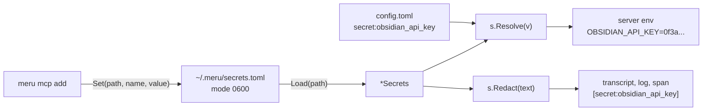

# secrets

**Code:** `internal/secrets/` (`doc.go`, `secrets.go`, `mode_unix.go`,
`mode_windows.go`, and the test `secrets_test.go`)
**Milestone:** v0.3
**Architecture:** [Adding an MCP server](../../ARCHITECTURE.md#adding-an-mcp-server)

## What it does

Some MCP servers need an API key, such as Obsidian's Local REST API plugin or a
hosted server's bearer token. Meru keeps every key in one file, `~/.meru/secrets.toml`, and never in
`config.toml`. The file is a flat list of `name = "value"` pairs:

```toml
obsidian_api_key = "0f3a..."
```

`config.toml` refers to a key by name, writing `secret:<name>` where the value
would go:

```toml
env = { OBSIDIAN_API_KEY = "secret:obsidian_api_key" }
```

This package reads and writes that file. `merud` uses `Resolve` to swap each
`secret:` value for the real key when it starts a server, and `Redact` to hide
every key in text it writes to transcripts, logs and traces. `meru mcp add` uses
`Set` to save a key you paste.

## The picture



## Walk through the code

### secrets.go

`Load` stats the file first. A missing file isn't an error; you just have no keys
yet. Then it checks the file's mode and parses it:

```go
info, err := os.Stat(path)
if errors.Is(err, fs.ErrNotExist) {
    return &Secrets{values: map[string]string{}}, nil
}
...
if err := checkMode(path, info); err != nil {
    return nil, err
}
```

`read` decodes the TOML into `map[string]any` rather than `map[string]string`, so
that a number such as `port = 27124` gives a clear message ("must be a quoted
string") instead of a generic type error. The line `s, ok := v.(string)` is a
**type assertion**: it asks whether the `any` value holds a string and, when `ok`
is true, hands it back as one.

`Resolve` passes any value that doesn't start with `secret:` through as it is.
For one that does, it returns the key, or an error that names the missing entry
and never shows a value.

`Redact` replaces each stored value with `[secret:<name>]`:

```go
for _, name := range names {
    text = strings.ReplaceAll(text, s.values[name], "["+Prefix+name+"]")
}
```

It skips values shorter than 8 characters, because a short value such as `abc`
would also match ordinary words. It replaces the longest values first, so a key
that contains another key is hidden whole.

`Set` reads the current entries, adds or replaces one, and writes the whole file
again. It writes to a temporary file in the same folder and then renames it over
the old one. A rename replaces a file in one step, so a crash leaves either the
old file or the new one, never half of one. `os.CreateTemp` makes the file with
mode `0600`, so the new file is private from its first byte. `Set` skips the mode
check when it reads, so it also repairs a file someone made readable by others.

### mode_unix.go and mode_windows.go

```go
//go:build !windows

func checkMode(path string, info fs.FileInfo) error {
    if perm := info.Mode().Perm(); perm&0o077 != 0 {
        return fmt.Errorf("secrets %s has mode %#o, so other users can read it; run chmod 600 %s", path, perm, path)
    }
    return nil
}
```

On macOS and Linux a file's mode holds three sets of permission bits: owner,
group, others. `0o077` masks the group and others bits; if any is set, another
account could read your keys, and `Load` refuses the file. Windows has no such
bits (Go reports every file as `0666` or `0444`), so the Windows file accepts
every file and leaves the job to the access list on your profile folder. The
`//go:build` line picks one of the two files at compile time.

## Go ideas used here

- **Type assertions** — `v.(string)` checks what an `any` holds. More in
  [go-basics/type-switches.md](go-basics/type-switches.md).
- **Build tags** — one `checkMode` per platform. More in
  [go-basics/build-tags.md](go-basics/build-tags.md).
- **`defer`** — `defer os.Remove(tmp.Name())` cleans up the temporary file on
  every path; after a successful rename there is nothing left to remove. More in
  [go-basics/defer.md](go-basics/defer.md).
- **`errors.Is`** — tells "no file yet" apart from real read errors. More in
  [go-basics/errors.md](go-basics/errors.md).

## Try it

```sh
go test ./internal/secrets/
```

The tests cover a good file, a bad one, a file others can read, `Resolve` on
present and missing names, `Redact` with overlapping values, and `Set` creating,
replacing and repairing the file.

## Why it's built this way

- **A plain file, not the system keychain.** The keychain differs on macOS,
  Linux and Windows, and needs a library for each. A file readable only by you is
  how ssh keeps its keys, and it works the same everywhere Meru runs.
- **Names in config, values here.** You can share or commit `config.toml`
  without leaking a key, and `merud` knows exactly which strings to redact.
- **`Set` rewrites the file.** Keeping a user's comments would need a TOML editor
  that preserves them; the header at the top of the file says comments don't
  survive.
