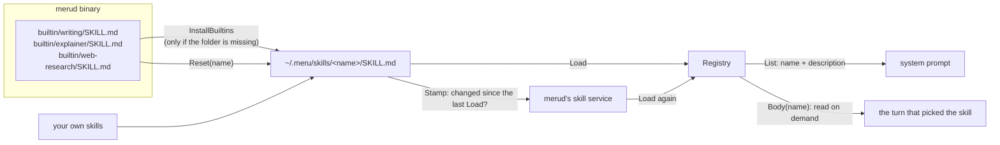

# skills

**Code:** `internal/skills/` (`doc.go`, `frontmatter.go`, `skills.go`, `builtin.go`,
`stamp.go`, `builtin/`, and the tests `frontmatter_test.go`, `skills_test.go` and
`stamp_test.go`)
**Milestone:** v0.4
**Architecture:** [Skills](../../ARCHITECTURE.md#skills) and
[Built-in skills](../../ARCHITECTURE.md#built-in-skills)

## What it does

A skill is a folder under `~/.meru/skills/` holding one `SKILL.md` file: a short
header with a `name` and a `description`, then Markdown instructions. This package
reads those folders into a `Registry`. `merud` puts each skill's name and
description in the system prompt, and reads the instructions only when a turn
picks the skill (see [agent](agent.md) for the pick). The package also carries
Meru's four built-in skills, `writing`, `explainer`, `web-research` and
`file-research`, inside the binary, and copies each to disk when its folder is
missing.

## The picture



## Walk through the code

### frontmatter.go

The header at the top of a `SKILL.md` is YAML, a text format for settings.
Full YAML is large, and skill headers use a small corner of it, so Meru reads that
corner by hand instead of adding a YAML library:

```go
fields, body, err := parseFrontmatter(data)
// fields["name"] == "explainer"
// fields["metadata.author"] == "aarora79"
```

`parseFrontmatter` checks that the file opens with a `---` line and finds the next
`---` line, which ends the header. Everything after it is the body. `parseFields`
then reads the header one `key: value` line at a time and collects any indented
lines below each key. What it does with those lines depends on the value:

| Header | Result |
| --- | --- |
| `description: one line` | the text as written |
| `description: starts here` plus indented lines | the lines joined with spaces |
| `description: >` plus indented lines | the lines folded into one paragraph |
| `description: \|` plus indented lines | the lines with their line breaks kept |
| `metadata:` plus indented `key: value` lines | flattened: `metadata.author`, `metadata.version` |
| `version: "1.5"` or `'1.5'` | the text without the quotes |
| `tools:` plus an indented list | the list lines kept as text |

It stops with an error that names the line for a missing or unclosed header, a key
with spaces in it, a missing space after `:`, a key that appears twice, or a tab used
for indentation (YAML forbids tabs). A strict parser means a typo shows up as a
warning at load time, not as a skill that quietly loses its description.

### skills.go

`Load(dir, disabled)` lists the folders in `dir` and calls `loadSkill` on each,
except the folders `disabled` names. `disabled` is `[skills] disabled` from
`config.toml`; `Load` skips those folders without a warning, since the user
asked for it. `loadSkill`
reads `SKILL.md` through `readSkillFile`, which stops reading one byte past the
256 KiB limit:

```go
data, err := io.ReadAll(io.LimitReader(f, maxFileBytes+1))
if len(data) > maxFileBytes {
    return nil, "", fmt.Errorf("%s is over the %d KiB limit", fileName, maxFileBytes>>10)
}
```

Then it checks the header. The name must match the folder, be at most 64 bytes, and
use lowercase letters and digits joined by hyphens. That pattern can't hold `/`,
`..` or a space, so a skill name is always a safe folder name. The description must
be present and at most 1,024 bytes, and the body must not be empty.

A bad skill doesn't fail the load. `Load` records the reason and moves on, and
`Warnings()` hands the list back so `merud` can log it and `meru skills list` can
show it. One broken folder shouldn't take away every other skill.

The `Registry` never changes after `Load` returns, so goroutines can read it with no
lock. To pick up a new skill, call `Load` again and swap in the new registry.

- `List()` returns `[]Summary` (name and description), sorted by name so the system
  prompt reads the same on every run.
- `Get(name)` and `Has(name)` look a skill up. `Get` copies the `Extra` map, so a
  caller that changes it can't change the registry.
- `Body(name)` reads the file again and returns the instructions. Reading at use
  time means an edit shows up without a reload. If the edit renamed the skill,
  `Body` refuses and asks for a reload.
- `File(name)` returns the whole `SKILL.md`, header and all, for `meru skills
  show`. It shares `readLimited` with `Body`, so the 256 KiB limit holds here too.

### builtin.go

The built-in skills sit in `internal/skills/builtin/<name>/SKILL.md`, and one line
puts them inside the binary:

```go
//go:embed builtin
var builtinFS embed.FS
```

The `//go:embed` line tells the compiler to copy the `builtin` folder into the
program. [go-basics/embed.md](go-basics/embed.md) explains it.

`InstallBuiltins(dir, disabled)` runs at every start. It skips a built-in that
`disabled` names, so a user who deletes one and disables it doesn't get it back
on the next start. For each other built-in it checks whether `<dir>/<name>`
exists (as a folder, a file or a link), and skips it if so. That rule
is "your copy wins" from ARCHITECTURE.md: Meru never overwrites a skill you edited.
When the folder is missing, `installOne` writes the files into a hidden temporary
folder and renames it into place. A crash halfway through leaves a hidden folder that
`Load` ignores, never a half-written skill that later runs would take for your copy.

`Reset(dir, name)` is for `meru skills reset`. It accepts only names Meru ships, so
`../writing` or `poster-making` fail with `ErrNotBuiltin`. It refuses when the skill
folder is a symbolic link, because writing through it would change files somewhere
else. It overwrites only the files Meru ships, so a notes file you added stays.
Each file goes through `writeFileAtomic`, which writes a temporary file and renames it
over the old one, so a reader sees the old file or the new one, never half of each.

Folders get mode `0700` and files `0600`: only you can read them.

`IsBuiltin(name)` says whether Meru ships a skill of that name. `Edited(dir,
name)` compares your `SKILL.md` byte for byte with the copy inside the binary,
for the `[edited]` mark in `meru skills list`. Saving the file without a change
doesn't count as an edit.

### stamp.go

`merud` needs to know when you add, edit or delete a skill, so it can call `Load`
again. `Stamp(dir)` answers that in microseconds. It lists `dir` and, for each folder
whose name doesn't start with `.`, stats the `SKILL.md` inside and writes one
line:

```text
explainer:21034:1727185821000000000
writing:7512:1727185821000000000
```

The name, the size and the modification time in nanoseconds. Any edit changes
the size or the time; a new or deleted folder adds or drops a line. A folder with
no `SKILL.md` still writes `name:-`, so adding the file later changes the stamp.
`merud` keeps the stamp it took just before its last `Load` and compares a fresh
one on every turn. With a handful of skills that costs a few microseconds.

### The built-in files

`builtin/writing/SKILL.md` and `builtin/explainer/SKILL.md` are byte-for-byte copies
of `.claude/skills/writing/SKILL.md` and `.claude/skills/explainer/SKILL.md`, which
come from the owner's `my-ai-assets` repo. Nobody edits them here. To update one,
copy the new version into both places. `TestBuiltinsMatchRepo` fails when the two
copies differ.

`builtin/web-research/SKILL.md` and `builtin/file-research/SKILL.md` are
Meru's own, so they have no twin in `.claude/skills/`, and
`TestBuiltinsMatchRepo` checks only the two copied skills against the repo (the
`fromAssets` list). It tells the model how to answer a
question about current facts with `web_search` and `web_fetch`: search first,
treat a snippet as a pointer, read the one or two best pages with a prompt,
prefer the project's own site, check dates against today, quote versions from
the page, cite each URL and say when sources disagree. Its description decides
when the fast model picks it, so it names the questions that need it: "the
latest version or release of something, news, prices", and "when asked to search
the web". The integration test in `internal/agent` checks that the `lite` model
picks it for "search the web for the latest Go release".

`file-research` does the same job for your own files. It names the four file
tools and when each fits: `search_files` for a topic in any words, `grep` for
an exact name, code or phrase, `list_folder` to see a folder, and `read_file`
for a whole file once a search has named it. It says to try other words once
when a search misses, to stop after two or three rounds of tool calls, to cite
`search_files`' excerpts by number and name any other file by its path, and to
say where it looked when nothing answers. Its description names the questions
it fits: what your files, notes or knowledge base say, or a file to find or
read. It matters most with `[index] retrieval = "agentic"`, where no excerpts
sit in the prompt.

`merud` runs `InstallBuiltins` at every start, and it copies only a skill whose
folder is missing. So a user who installed Meru before `web-research` or
`file-research` shipped gets them on the next start, and keeps any edits to the
others.

The explainer skill tells the model to build a printable poster with the
`poster-making` skill. Meru doesn't ship `poster-making` (AGENTS.md keeps it a repo
tool), so inside Meru that step has no skill to load. The model should skip the
poster, and the skill's HTML page and Markdown twin still come out. The file stays
as copied; if the step causes trouble, fix it upstream in `my-ai-assets`.

## Go ideas used here

- **embed** — compiling files into the binary. More in
  [go-basics/embed.md](go-basics/embed.md).
- **Named results and deferred cleanup** — `installOne` and `writeFileAtomic` name
  their `err` result, and a deferred function removes the temporary file or folder
  when `err` is set. More in [go-basics/defer.md](go-basics/defer.md).
- **Errors you can test for** — `ErrNotFound` and `ErrNotBuiltin` are wrapped with
  `%w`, so callers use `errors.Is`. More in [go-basics/errors.md](go-basics/errors.md).
- **Table-driven tests** — `TestParseFrontmatter` and `TestLoad` list their cases in
  a slice and run each as a subtest. More in [go-basics/testing.md](go-basics/testing.md).

## Try it

```sh
go test -race ./internal/skills/...
go test -run TestBuiltinsMatchRepo -v ./internal/skills/
```

The second command proves the shipped skills match the repo copies.
`TestDisabled` checks `[skills] disabled`: a disabled built-in isn't installed,
a disabled folder doesn't load, a name that matches nothing does no harm, and a
folder you add loads with no change to the list.

## Why it's built this way

- **No YAML library.** A general YAML parser is thousands of lines and accepts far
  more than a skill header needs. The hand parser is about 260 lines with its comments, reads every
  skill in this repo, and rejects the rest with a line number.
- **The body loads on demand.** Keeping only names and descriptions in the prompt
  lets you add skills without growing every prompt (ARCHITECTURE.md, "Skills").
- **A stamp, not a watcher.** A file watcher would need a watch on the folder and
  on every skill folder inside it, kept in step as folders come and go, plus a
  goroutine to own it. A stamp per turn needs none of that and costs microseconds.
- **Warnings, not failure.** Skills are files you edit by hand. A typo in one should
  cost you that one skill, with a message saying why.
- **Disable by name, in config.** Deleting a built-in's folder alone doesn't
  stick, because `merud` installs it again on the next start. One list in
  `[skills] disabled` covers built-ins and your own skills the same way.
- **Copy on first run, never overwrite.** The simpler option, reading the built-ins
  straight from the binary, would leave you no way to edit them.
