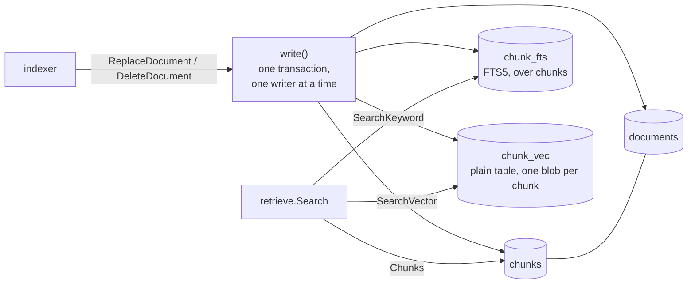

# store

**Code:** `internal/store/` (`doc.go`, `store.go`, `schema.go`, `documents.go`, `search.go`,
`toolcalls.go`)
**Milestone:** v0.2; `tool_calls` in v0.3
**Architecture:** [Storage](../../ARCHITECTURE.md#storage) and
[How hybrid search works](../../ARCHITECTURE.md#how-hybrid-search-works)

## What it does

The store is Meru's one SQLite file, `~/.meru/meru.db`. It holds every indexed
file (a **document**), the pieces of text the indexer cut each file into
(**chunks**), one vector per chunk, and a keyword index over the chunk text.
The indexer writes to it; retrieval reads from it. From v0.3 it also holds
`tool_calls`, the audit log of every tool call, which `dispatch` writes and
`meru log` reads.

Everything in the file can be rebuilt from your files, so the store never
holds the only copy of anything. Delete `meru.db` and `merud` builds it again.

The driver is `ncruces/go-sqlite3`. It runs SQLite compiled to WebAssembly
and then translated to Go, so Meru builds with no C compiler. Two SQLite
extensions come with it:

- **vec1**, SQLite's own vector extension. The store uses only its distance
  functions; the vectors sit in a plain table, `chunk_vec`.
- **FTS5**, SQLite's full-text search, holds the keyword index in `chunk_fts`.

## The picture



All three of `chunks`, `chunk_fts` and `chunk_vec` use the chunk ID as their
key, so a hit from either search names a chunk the same way.

## Walk through the code

### store.go: opening the file

`Open` does four things in order:

1. Checks the options: a path, an embedding model name, and a vector size.
2. Calls `createPrivate`, which creates `meru.db`, `meru.db-wal` and
   `meru.db-shm` with mode `0600` (owner read and write only) if they don't
   exist, and sets that mode if they do. SQLite would otherwise create them
   with mode `0644`, readable by every user on the machine.
3. Opens a pool of connections with `driver.Open`. The `register` callback
   loads vec1 and FTS5 into each new connection.
4. Runs `migrate` and then `checkVectors` (both in `schema.go`).

The connection string sets write-ahead-log (WAL) mode:

```go
q.Add("_pragma", "journal_mode(wal)")
q.Set("_txlock", "immediate")
```

In WAL mode a reader sees the last committed state and never waits for a
writer. `_txlock=immediate` makes every transaction take SQLite's write lock
at `BEGIN`, so a write can't fail halfway through with "database is locked".

Writes go through one helper:

```go
func (s *Store) write(ctx context.Context, fn func(tx *sql.Tx) error) error {
    s.writeMu.Lock()
    defer s.writeMu.Unlock()
    tx, err := s.db.BeginTx(ctx, nil)
    ...
    if err := fn(tx); err != nil {
        _ = tx.Rollback()
        return err
    }
    return tx.Commit()
}
```

`writeMu` is a `sync.Mutex`, a lock. Writers in `merud` take turns, and
readers skip the lock. `fn` gets the transaction and does its SQL; if it
returns an error, `write` rolls back and nothing changes.

### schema.go: migrations and the vector check

`migrations()` returns a list of SQL steps. Step `i` takes the database from
`schema_version` `i` to `i+1`, and `meta` records the version. `migrate` runs
each step the file hasn't seen, one transaction per step. v0.3 appended step 2
for `tool_calls`, and later milestones add `messages` and `memories` the same way. A shipped
step never changes, because existing files have already run it.

The first step creates `documents`, `chunks`, `chunk_vec` and `chunk_fts`:

```sql
CREATE TABLE chunk_vec (
    chunk_id INTEGER PRIMARY KEY REFERENCES chunks(id),
    vector   BLOB NOT NULL
);
CREATE VIRTUAL TABLE chunk_fts USING fts5(
    heading, text, content='chunks', content_rowid='id'
);
```

`chunk_vec` is an ordinary table: one row per chunk, the vector packed into a
blob. It has no search index. Vector search reads every row, which the
benchmark below shows is fast enough for a personal index. The vectors live
apart from `chunks` so a search reads IDs and vectors and never touches text.

`content='chunks'` makes `chunk_fts` an **external content** table. It indexes
the `heading` and `text` columns of `chunks` without keeping its own copy of
the text, and its `rowid` is the chunk ID.

`checkVectors` compares the embedding model name and vector size in `meta`
with the ones `Open` got. When either differs, it runs `DELETE FROM chunk_vec`
and records the new pair. Vectors from two models can't be compared, so all
of them go. Documents and chunks stay, so keyword search keeps working while
the indexer re-embeds.

`NeedsReembed` reports that gap. It counts rows instead of keeping a flag:
some chunks lack a vector exactly when the model changed and the indexer
hasn't finished. The count stays right if `merud` crashes halfway through
re-embedding.

### documents.go: writing documents

`ReplaceDocument` stores one file and its chunks in one transaction:

1. `deleteChunks` removes the document's old keyword rows, vectors and chunks.
2. An upsert (`INSERT … ON CONFLICT (path) DO UPDATE … RETURNING id`) writes
   the document row and keeps its ID.
3. `insertChunk` writes each chunk, then its keyword row and its vector under
   the chunk's new ID.

The order in `deleteChunks` matters. FTS5 forgets a row of an external
content table only when told the exact text it indexed:

```sql
INSERT INTO chunk_fts (chunk_fts, rowid, heading, text)
SELECT 'delete', c.id, c.heading, c.text FROM chunks c ...
```

So the keyword rows go first, while `chunks` still holds the text. Skip this
and FTS5 keeps matching words from text that no longer exists.

`encodeVector` turns a vector into the blob vec1's functions read: 32-bit
floats, 4 bytes each, in the machine's byte order. SQLite's WebAssembly
machine is little-endian on every host, so it always writes little-endian.
It also scales every vector to length 1 first; the next section says why.

`Paths(prefix)` treats the prefix as a folder: `/notes` matches `/notes/a.md`
and not `/notes2/b.md`. It compares with `substr` rather than `LIKE`, so a `%`
or `_` in a folder name has no special meaning.

### search.go: the two searches

`SearchVector` computes the distance from the query to every stored vector
and keeps the `k` nearest:

```sql
SELECT chunk_id, vec1_l2_distance(vector, ?1) / 2 AS distance
FROM chunk_vec ORDER BY distance, chunk_id LIMIT ?2
```

Embedding models are trained for **cosine distance**, which looks only at the
angle between two vectors: 0 for the same direction, 2 for the opposite.
vec1 has a `vec1_cos_distance` function, but it measures both vectors'
lengths on every row. Because `encodeVector` stores every vector at length 1,
the squared straight-line (L2) distance between two of them is exactly twice
their cosine distance. Halving `vec1_l2_distance` gives the same number with
less work: 147 ms instead of 198 ms over 100,000 vectors.

`SearchKeyword` runs BM25 over `chunk_fts`:

```sql
SELECT rowid, rank FROM chunk_fts WHERE chunk_fts MATCH ? ORDER BY rank, rowid LIMIT ?
```

The query text comes from the user, and FTS5 has its own query language
(`AND`, `OR`, `NEAR`, `*`, `column:`, parentheses). `ftsQuery` makes any input
safe. It splits the text into words at every character that isn't a letter,
digit or combining mark, wraps each word in double quotes, and joins them
with `OR`:

```text
what's NEAR(x*)?   →   "what" OR "s" OR "NEAR" OR "x"
```

Inside double quotes FTS5 reads every word as plain text. `OR` lets a long
question match a chunk that holds only its key words, and BM25 scores common
words such as "what" low.

`Chunks(ids)` loads chunk text and document paths for a list of IDs. It passes
the IDs as one JSON array and lets SQLite's `json_each` turn it into rows, so
the SQL text never changes with the number of IDs. It then puts the rows back
in the caller's order.

### toolcalls.go: the audit log

Migration step 2 creates `tool_calls`: one row per tool call, with its session,
time, kind, server, tool, arguments, result, outcome, your approval choice, how
long it ran, and the turn's trace ID. The arguments are JSON text and the result
plain text, cut to 4,000 characters (`MaxToolResult`), so a row reads well in the
`sqlite3` shell. Indexes on `ts` and `session` serve `meru log` and a look at one
session.

`InsertToolCall` writes one row through `write`, like every other write.
`ToolCalls(limit)` returns the newest rows first; a limit of zero or less returns
all of them.

The transcripts hold the truth, so `ReplayToolCalls` can rebuild the table from
them. merud calls it at startup; it does nothing when the table already has rows.
Otherwise it walks `sessions/`, reads each `.jsonl` file with
`transcript.ReadLines`, and pairs each call's lines by `call_id`:

```go
case transcript.TypeToolCall:
    calls = append(calls, ToolCall{CallID: l.CallID, Outcome: "cancelled", ...})
    open[l.CallID] = len(calls) - 1
case transcript.TypeToolResult:
    i, ok := open[l.CallID]
    ...
    delete(open, l.CallID)
```

A `tool_call` line opens a call and its `tool_result` line closes it. Tracking
open calls, instead of one map entry per ID, handles a model that reuses a call ID
in a later turn. A call that never closed, because merud stopped mid-call, keeps
the outcome `cancelled`. `dispatch` compacts the arguments and cuts times to the
second, as the transcript does, so a replayed row matches the row written live;
`TestReplayMatchesLive` checks it.

## Go ideas used here

- **`database/sql`** — Go's standard interface to SQL databases: a pool, queries,
  rows and scanning. More in [go-basics/sql.md](go-basics/sql.md).
- **Transactions** — `BeginTx`, `Commit`, `Rollback`, and why every write here
  runs inside one. More in [go-basics/transactions.md](go-basics/transactions.md).
- **`sync.Mutex`** — a lock; `writeMu` makes writers take turns.
- **Function values** — `write` takes `fn func(tx *sql.Tx) error`, a function
  the caller writes inline.
- **`defer`** — `defer rows.Close()` hands the connection back to the pool on
  every path out. More in [go-basics/defer.md](go-basics/defer.md).
- **`errors.Is` and `sql.ErrNoRows`** — how `Document` tells "not indexed" from
  a real failure. More in [go-basics/errors.md](go-basics/errors.md).
- **Struct embedding** — `ChunkWithDoc` embeds `Chunk`, so `c.Text` works
  without writing `c.Chunk.Text`.
- **`filepath.WalkDir`** — visits every file under a folder; `ReplayToolCalls`
  uses it to find the session files. More in [go-basics/filepath.md](go-basics/filepath.md).

## Try it

```sh
go test -race ./internal/store/
go test -run '^$' -bench . -benchtime 20x ./internal/store/
```

`TestSearchKeyword` feeds FTS5 syntax, quotes and SQL fragments as queries.
`TestSearchVector` checks the distances are true cosine distances for vectors
of any length. `TestConcurrentReadsDuringWrites` runs four readers against a
writer and checks no reader ever sees half a write. The benchmark indexes
10,000 and then 100,000 chunks with 768-number vectors; `-short` skips the
larger one.

Measured on an Apple M4 Max (v0.35.6 of the driver), 768 dimensions:

| Operation | 10,000 chunks | 100,000 chunks |
| --- | --- | --- |
| index every chunk, 100 per document | 0.59 s | 6.1 s |
| `ReplaceDocument`, one 100-chunk document | 6 ms | 6 ms |
| `SearchVector`, k = 50 | 13 ms | 147 ms |
| `SearchKeyword`, k = 50, 8 common words | 9 ms | 90 ms |

Search time grows with the index, because both searches read every
candidate. Write time doesn't change with size. The keyword figure is the worst case: the test
vocabulary has 33 words, so each query word matches most chunks.

## Why it's built this way

- **One pool, one lock for writers.** A second connection pool just for writes
  would also work, but one mutex around `write` gives the same "one writer at a
  time" with less to follow.
- **Explicit SQL instead of triggers.** SQLite triggers could keep `chunk_fts`
  and `chunk_vec` in step with `chunks` by themselves. `deleteChunks` and
  `insertChunk` do it in Go instead, so the whole write reads top to bottom in
  one file.
- **No vector index.** vec1 offers an exact "flat" index and approximate
  indexes that need training. At 10,000 chunks the flat index searched in
  15–18 ms, no faster than the plain table's 13 ms, and each insert got
  slower as it grew: indexing 10,000 chunks took 7 s instead of 0.6 s, and
  replacing one document took 186 ms instead of 6 ms. First-time indexing and re-embedding after a model change matter
  more than a few milliseconds of search, so the vectors sit in a plain
  table. `meru.retrieval.duration` will show when search needs more.
- **Counting instead of a flag for re-embedding.** A flag in `meta` would need
  someone to clear it at the right moment. Comparing the chunk and vector
  counts can't go stale.
