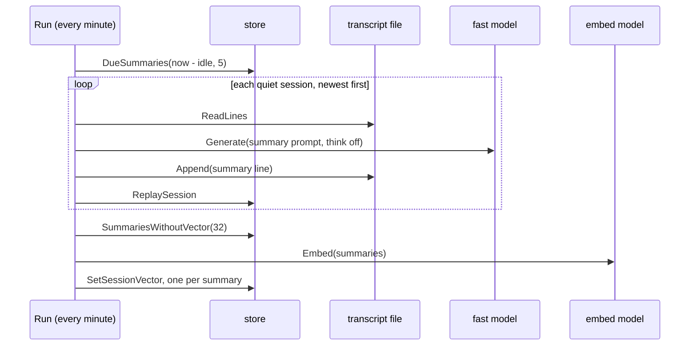

# summarize

**Code:** `internal/summarize/` (`doc.go`, `summarize.go`, `summarize_test.go`, `integration_test.go`)
**Milestone:** v0.4
**Architecture:** [Facts and episodes](../../ARCHITECTURE.md#facts-and-episodes)

## What it does

`summarize` writes Meru's memory of what happened when. Once a session has had
no question for `[agent] summary_idle` (30 minutes by default), the
**Summarizer** asks the `fast` model for a one- or two-sentence summary and
appends it to the transcript as a `summary` line. It then embeds the summary,
so a later question such as "what did we decide about the garden beds?" can
find the session by meaning. `merud` runs one Summarizer beside the socket
server, and the agent reads what it wrote through `retrieve.SearchSessions`.

## The picture



## Walk through the code

### Run and Tick

`Run` makes one pass at once, then one a minute, until `merud` stops:

```go
t := time.NewTicker(Every)
defer t.Stop()
for {
    s.Tick(ctx)
    select {
    case <-ctx.Done():
        return
    case <-t.C:
    }
}
```

A `time.Ticker` sends the time on its channel `C` once a minute. `select`
waits on two channels and runs whichever is ready first: `ctx.Done()` closes
when `merud` stops, and `t.C` brings the next tick. More in
[go-basics/select.md](go-basics/select.md).

`Tick` asks the store for up to five sessions that are due: at least one
answer, nothing new for the idle time, and no summary newer than the last
question or answer. It summarizes them one at a time, then embeds up to 32
summaries that lack a vector.

**The backlog cap.** The first run after an upgrade finds every old transcript
without a summary. Five a minute, newest first, means 100 old sessions take 20
minutes. Each pass keeps the fast model busy for about a second on the `lite`
profile (five summaries at about 200 ms), so a question asked meanwhile waits
that long at most. The newest sessions go first: a person most often asks about
them.

### summarize and ask

`summarize` handles one session inside a `meru.summarize` span. It reads the
transcript, builds the text the model reads with `Input`, calls `ask`, appends
the summary line, and replays the file into the store. It logs `session
summarized` at debug level with the session, the summary's length and the
time taken, never the text.

`ask` calls the fast model inside a `gen_ai.chat` span, with a 150-token cap
and thinking off:

```go
comp, err := s.eng.Generate(ctx, msgs, nil,
    engine.Options{Model: s.model, MaxTokens: maxTokens, NoThink: true})
```

MiniCPM5 is a "thinking" model, and hidden reasoning would cost seconds for
two sentences. The system prompt asks for one or two sentences in the past
tense, with the names, numbers and dates kept, because those are the words a
later question names. `tidy` makes the reply one line, and `clip` cuts it to
600 characters.

When the model writes nothing, the session's first question stands in. Without
that, the session would stay due and cost a model call every minute.

### Input

`Input` turns a transcript into what the model reads:

```text
User: Let's plan the garden. How many raised beds should we build?
[…]
User: OK, two then. Should I start tomatoes from seed?
Meru: Yes, indoors six weeks before the last frost.
```

It keeps the first question, which usually names what the session is about,
then walks back from the newest line and keeps lines while the total stays
under 4,000 characters, about 1,000 tokens. `[…]` marks the gap. Each line is
cut to 800 characters first, so one long answer can't fill the budget. Tool
lines and old summary lines stay out.

### embed

`embed` lists up to 32 summaries with no vector and embeds them in one call.
`store.SetSessionVector` stores each vector only while the session's summary
still reads the text that was embedded, so a newer summary written in between
waits for its own vector on the next pass. After a change of embedding model,
the store clears every summary vector, and this step fills them again, 32 a
minute.

### What happens to a session that goes on

A session that gets a new question after its summary is due again once it goes
quiet. The next summary line goes after the first, and the store keeps the
newest. The transcript keeps both.

## Go ideas used here

- **`time.Ticker` and `select`** — a channel that delivers the time once per
  interval, and a way to wait on it and on `ctx` at once. More in
  [go-basics/select.md](go-basics/select.md).
- **Named results with `defer`** — `summarize` names its `err` result so the
  deferred function can mark the span with it. More in
  [go-basics/defer.md](go-basics/defer.md).
- **Function fields** — `now func() time.Time` holds the clock. `New` sets it
  to `time.Now`, and tests replace it to move time forward.
- **Runes** — `clip` counts runes, Go's name for Unicode characters, so it never
  cuts one in half.

## Try it

```sh
go test -race ./internal/summarize/
go test -tags integration -v -run Integration ./internal/summarize/
```

`TestTickSummarizesQuietSessions` runs a real store in a temporary folder
against a fake engine. It checks that only the quiet session gets a summary,
that the model call names the fast model with thinking off, that the summary
gets a vector, and that a session that grows gets a second summary that wins.
`TestTickCapsTheBacklog` writes seven old sessions and checks that the first
pass summarizes the newest five. The integration test summarizes one session
with the real `lite` model: on the development machine a warm call took about
200 ms, summary and embedding together.

## Why it's built this way

- **A one-minute poll, not a timer per session.** A timer per session would
  fire at the exact moment, but it needs starting, resetting on each turn and
  stopping at shutdown. One query a minute over the `sessions` table finds the
  same sessions with one goroutine, and half a minute late costs nothing.
- **The fast model.** A summary is short and needs no tools, so the small
  model does it well and leaves the main model free for questions.
- **Summaries in the transcript, not only in the database.** The transcript is
  the source of truth, so a deleted `meru.db` rebuilds the summaries by replay
  with no model call.
- **Newest wins, nothing rewritten.** Appending a new summary keeps the
  transcript append-only and leaves a record of the old one.
