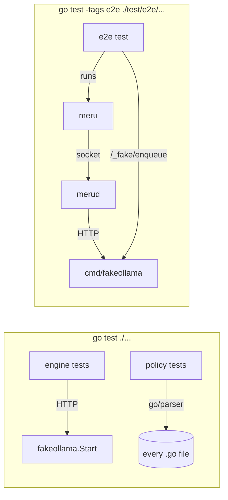

# testing

**Code:** `internal/policy/` (`doc.go`, `scan_test.go`, `privacy_test.go`, `layout_test.go`, `pins_test.go`, `connectors_test.go`),
`internal/testutil/fakeollama/` (`fake.go`, `api.go`, `wire.go`), `cmd/fakeollama/` (`main.go`)
**Milestone:** v0.1
**Architecture:** [Privacy boundary](../../ARCHITECTURE.md#privacy-boundary)

## What it does

This note explains how Meru tests itself. Three kinds of test run:

- **Unit tests** sit next to the code they test, in `*_test.go` files, and run
  with `go test ./...`. They never need a real model: they talk to a fake Ollama.
- **Policy tests** in `internal/policy` read Meru's own source and fail when the
  code breaks a non-negotiable, such as importing a cloud-model SDK.
- **End-to-end tests** in `test/e2e/` build the real `merud` and `meru`, start
  `cmd/fakeollama`, and drive a whole turn. A build tag keeps them out of the
  ordinary test run.

[docs/ci.md](../ci.md) lists every check CI runs on top of these.

## The picture



## Walk through the code

### Table-driven tests

Every Meru test follows one shape: a slice of cases, and a loop that runs each
case as a subtest. From `internal/testutil/fakeollama/fake_test.go`:

```go
tests := []struct {
    name       string
    path       string
    wantStatus int
}{
    {"unknown model", "/api/chat", 404},
    {"wrong method", "/api/chat", 405},
}
for _, tt := range tests {
    t.Run(tt.name, func(t *testing.T) {
        // send the request, compare with tt.wantStatus
    })
}
```

The slice holds anonymous structs: a struct type written in place, with no
name. `t.Run` gives each case its own name in the output, so a failure reads
`TestErrors/unknown_model`. Adding a case means adding one line.

### The fake Ollama

`fakeollama.Start` runs an HTTP server on a free loopback port for one test:

```go
srv := fakeollama.Start(t, fakeollama.Config{})
srv.Enqueue("", fakeollama.Reply{Text: "hi there"})
// point OllamaEngine at srv.URL and call it
reqs := srv.Requests("/api/chat") // what Meru sent
```

`Start` uses `httptest.NewServer` from the standard library, which listens on
127.0.0.1, and registers `t.Cleanup` to close the server when the test ends.
`Enqueue` scripts the next reply, for one model or for any model (`""`). A
`Reply` can carry text, exact chunks, tool calls, hidden thinking, log
probabilities, usage counters, an HTTP error, an error part way through a
stream, and delays. Thinking pieces stream before the text, each in a chunk
with an empty `content` and a `thinking` field. The fake honours a request's
`num_predict` the way Ollama does: each thinking piece and each text chunk
counts as one token, and a reply cut short loses its tool calls and ends with
`done_reason` `"length"`.
`FailNext` makes the next request to a path fail, and `SetLatency` slows every
response. Unscripted calls get "Hello from fake Ollama." `/api/tags` lists
`Config.Models` as the models on disk, or, when the fake accepts every name, the
models loaded so far; `/api/show` answers a 404 for a model not in
`Config.Models`, as Ollama does for one that isn't pulled.

The fake speaks the same JSON as Ollama. A streamed reply is NDJSON
(newline-delimited JSON): one object per line, the last with `"done": true`
and the usage counters. The durations it reports are fixed (1 ms per prompt
token, 10 ms per output token), so a test can check exact values.

`cmd/fakeollama` serves the same handler as a separate program for the
end-to-end tests. It refuses any address that isn't loopback and prints
`listening on http://127.0.0.1:PORT` so the test can read the port. The test
scripts it over HTTP:

| Endpoint | Does |
| --- | --- |
| `POST /_fake/enqueue` | `{"model": "m", "replies": [Reply, ...]}` queues replies |
| `POST /_fake/fail` | `{"path": "/api/chat", "status": 500, "error": "boom"}` fails the next request |
| `GET /_fake/requests` | Returns every request received, as JSON |

### The policy tests

`scan_test.go` walks the module with `filepath.WalkDir`, skipping the
directories the go command skips (`testdata`, `vendor`, and names that start
with `.` or `_`). It parses each file with `go/parser` into a syntax tree and
pulls out two things: import paths and string literals.

```go
ast.Inspect(f.file, func(n ast.Node) bool {
    lit, ok := n.(*ast.BasicLit)
    if !ok || lit.Kind != token.STRING {
        return true
    }
    // lit.Value is the literal as written, quotes included
    return true
})
```

`ast.Inspect` calls the function on every node in the tree. `n.(*ast.BasicLit)`
is a type assertion: it asks "is this node a literal?" and sets `ok` to the
answer. Comments never show up as literals, which is why a link in a comment
passes.

The checks are plain functions that take parsed files and return messages
like `internal/engine/cloud.go:12: imports "…", a cloud-model SDK`. The real
tests run them on the whole module. `TestChecksCatchViolations` runs them on
small made-up sources and counts the findings, so a bug that made a check see
nothing can't pass unnoticed.

`layout_test.go` checks that `cmd/meru` stays thin in two ways. It reads the
client's import lines, and it runs `go list -deps ./cmd/meru` to see every
package the client pulls in, however indirectly. When it finds the engine, it
prints the chain: `cmd/meru -> internal/rpc -> internal/engine`. The desktop app
and the Mac installer get the same two checks, each with its own list of
packages it must not reach.

`installer_test.go` holds the installer's own rules, because it is the one
program besides `merud` that starts other programs. Only
`internal/installer/run.go` may import `os/exec`; no installer file may import
`syscall` or call `os.StartProcess`; and `installer.Programs()`, the allowlist,
may name no shell, interpreter or downloader, and only absolute paths.

None of the clients, nor the installer, may reach `internal/connectors`: `merud`
installs and starts the connectors, and a client asks it about them.
`connectors_test.go` holds that package to the installer's rule: only
`internal/connectors/run.go` may import `os/exec`, so every npm, uv and docker
command it runs goes through one Runner, and every connector the supervisor
starts goes through `stdioTransport`, both by absolute path and with no shell.
The runtime downloads, Node from nodejs.org and uv from its GitHub release,
are the one other place besides the Mac installer where `allowed_urls.txt`
lists a URL that Meru fetches.

`pins_test.go` checks that every program Meru installs, or tells you to install,
names one exact version. It reads the connector manifests, the string literals in
`internal/installer`, `internal/catalog` and `cmd/meru`, every file in `scripts/`
and `deploy/`, and the code blocks of the Markdown files under `docs/`. A line
fails when it holds `@latest`, `:latest` or `version = "latest"`, a version range
such as `@^2` or `>=1.30`, a container image with no `@sha256:` digest, a command
that starts with `uvx` or `npx` and a package with no exact version, or a file
fetched from a `master` branch. Prose outside a code block may say "latest".
Meru's own `releases/latest` link passes: it is how you get Meru, not a
dependency. `pinOffenders` names each place that breaks the rule today, such
as the installer's `searxng:latest`; each keeps working until the connector
supervisor replaces it (issue #87), and an entry that no longer matches anything
fails the test, so the list can only shrink. `TestPinRulesCatch` runs the rules on
made-up lines, the way `TestChecksCatchViolations` does for the other checks.

`models_test.go` keeps the installers on one model table. The Mac installer
reads `config.Recommendations` itself, but `scripts/install.sh`, the
`meru-install` skill and the README's benchmark table can't read Go, so each
holds a copy. A third test checks that each README row names the table's model;
the row's figures come from the results page and aren't checked. One test reads the
script's `-ge N` memory checks with a regular expression, and the other finds
the skill's `| N GB` table rows; each fails when a copy names a different answer
model from the table, or has a row too many or too few. Change the table in
`internal/config/recommend.go`, and CI shows which copies to change with it.

## Go ideas used here

- **The `testing` package** — how Go finds and runs tests. More in
  [go-basics/testing.md](go-basics/testing.md).
- **Build tags** — how `//go:build e2e` keeps the end-to-end tests out of
  `go test ./...`. More in [go-basics/build-tags.md](go-basics/build-tags.md).
- **`httptest`** — a real HTTP server on loopback, started and stopped inside
  one test.
- **Embedding** — `fakeollama.Server` holds a `*Fake` with no field name, so
  `srv.Enqueue` works as if `Enqueue` were declared on `Server`.

## Try it

```sh
go test -race ./...                             # unit and policy tests
go test -run TestNoNonLoopbackURLLiterals -v ./internal/policy/
go run ./cmd/fakeollama -addr 127.0.0.1:11500   # then, in another terminal:
curl -s 127.0.0.1:11500/api/chat -d '{"model":"m","messages":[]}'
make e2e                                        # end-to-end: real binaries, fake Ollama
```

The `curl` call prints five NDJSON lines: four words, then the `done` line. Add `-vision m` to make `/api/show` list the `vision` capability for model
`m`, for a turn with images.

## Why it's built this way

- **A fake, not a mock library.** The fake speaks HTTP, so the engine's real
  client code runs in every test, JSON decoding and all. A mock of the engine's
  own interface would skip the code most likely to break. The standard library
  has everything a fake needs, so Meru adds no test dependency.
- **Policy as tests, not a separate linter.** A custom `go vet` analyzer would
  need `golang.org/x/tools` and a build step. A test needs neither and runs
  wherever `go test` runs, including on a laptop before a push.
- **Deny-lists in text files.** The policy package must itself pass the policy
  tests. Keeping provider hosts out of its Go source keeps it honest, and a
  text file with one entry per line is easy to review.
