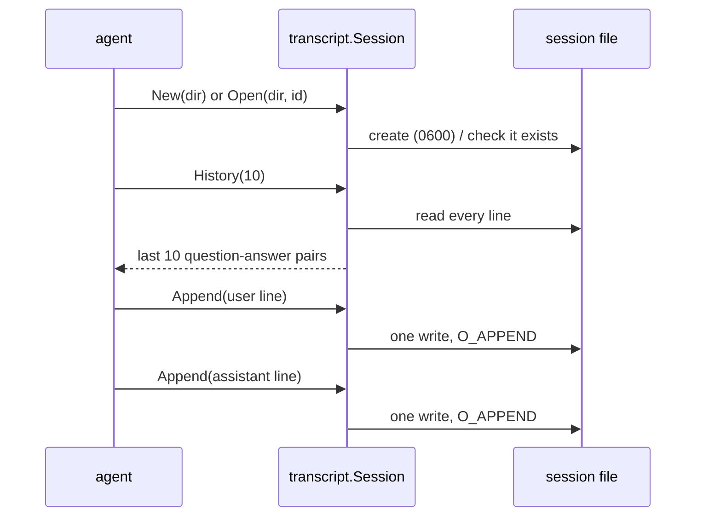

# transcript

**Code:** `internal/transcript/` (`doc.go`, `transcript.go`, `list.go`)
**Milestone:** v0.1; tool lines and the assistant line's route, ms and sources in v0.3;
summary lines and `ReadFrom` in v0.4
**Architecture:** [Session transcripts](../../ARCHITECTURE.md#session-transcripts)

## What it does

Each conversation with Meru is a **session**, and each session is one file in
JSON Lines (JSONL) format: one JSON object per line, one line per event. The
agent writes a `user` line when a question arrives and an `assistant` line when
the answer is complete. On the next turn it reads the file back to give the
model the conversation so far.

These files are the source of truth. The database that arrives in v0.2 copies
them for search and can always be rebuilt from them.

```text
~/.meru/sessions/2026/09/2026-09-23T101502-7f3a.jsonl
```

```json
{"ts":"2026-09-23T10:15:02Z","type":"user","text":"hello","trace_id":"4bf9…"}
{"ts":"2026-09-23T10:15:03Z","type":"assistant","text":"Hi!","tokens_in":31,"tokens_out":2,"route":"search","ms":1480,"sources":["/Users/me/notes/hello.md"],"trace_id":"4bf9…"}
```

A user line carries `images` when the question carried images from the desktop
app: the full paths of the copies in `~/meru-output/uploads/`. The line names
them and never holds their bytes.

An assistant line also carries `outcome` when the turn ended without a full
answer: `timeout`, `cut_off`, `gave_up`, `bad_output` or `no_vision`. The text then holds
the apology, or the text so far and a note that Meru stopped it. A full answer leaves the
field out (`omitempty`).

An assistant line carries `notice` when the answer claimed an action, such as
"Done. It's now at ~/Projects/garden", and no tool call in the turn succeeded.
It holds the warning the user read under the answer: "Meru didn't run any tool
for this answer, so nothing changed on your computer." A client that reopens
the session can show it again.

An assistant line carries `web` when the turn read the web: up to five
`WebNote` values, each a URL, a title and a gist of at most 300 characters.
The agent builds them from the web calls' results (see
[agent](agent.md#web-first-webfirstgo-webnotesgo)). A `tool_call` line carries
`caller: "meru"` when `merud` made the call itself, before the model's first
round, and no `caller` when the model asked for it.

From v0.3 the assistant line also records the turn's facts: `route` is the
route the turn took, `ms` how long it took from question to answer, and
`sources` the full paths of the files whose excerpts went into the prompt, each
once. The store's `turns` table, which `meru usage` adds up, rebuilds from
these fields. Lines written before v0.3 lack them, and a turn that didn't
search has no `sources`.

## The picture



## Walk through the code

### New and Open

`New` names the file from the current time plus four random hex digits, and
creates it with `O_EXCL`, which fails if the file already exists. Two sessions
started in the same second get different suffixes; if they ever collide, `New`
tries another suffix.

`Open` takes an ID from a client, so it checks the ID against a strict pattern
before building a path from it:

```go
var idPattern = regexp.MustCompile(`^\d{4}-\d{2}-\d{2}T\d{6}-[0-9a-f]{4}$`)

if !idPattern.MatchString(id) {
    return nil, fmt.Errorf("session ID %q isn't valid", id)
}
```

Without this check, an ID such as `../../.ssh/id_rsa` could point the agent at
any file the user can read. The pattern allows no slashes and no dots, so the
ID can only name a file inside the sessions folder.

### Append

```go
f, err := os.OpenFile(s.path, os.O_WRONLY|os.O_APPEND, 0o600)
...
if _, err := f.Write(b); err != nil { ... }
if err := f.Close(); err != nil { ... }
```

- `O_APPEND` tells the operating system to put every write at the end of the
  file, even when two writers share it.
- The whole line, newline included, goes out in one `Write`, so lines from two
  writers never mix.
- `Close` can report a write the operating system had delayed, so we check its
  error instead of deferring it.
- `Session` holds only the path. There is no open file to leak and nothing for
  the caller to close.

### History

`History(n)` reads every line and pairs each `user` line with the `assistant`
line that answered it. A question with no answer, from a turn that failed or
was cancelled, drops out, so the model never sees two questions in a row. It
keeps the last `n` pairs. An answer with a `notice` gets it after its text, in
square brackets, so on the next turn the model reads that its claim didn't
happen instead of building on it.

An answer with web notes gets one line per note after that, from `webNotes`:

```text
It moves notes between apps.

[from the web: Acme Flow https://acme.example/flow — Acme Flow moves notes between apps.]
```

A real session showed why. A turn read a product's page and answered well, and
the next three answers, whose history held only the question and answer text,
made up the product's features. With the notes, a follow-up knows what the page
said without the page itself. The agent's history budget still applies: it
drops the oldest turns, notes and all, when the history passes 8,000
characters.

A question with `images` gets one note per image after its text, from
`imageNotes`:

```text
which plant is this?

[image: garden-bed.jpg]
```

So a later turn knows the user shared an image, and the prompt doesn't carry
it again. An image costs the model hundreds of tokens, and the answer that
looked at it already sits in the history. `imageNotes` builds the text with a
`strings.Builder`, which grows one buffer instead of making a new string for
each `+`.

A crash in the middle of `Append` can leave half a line. The next `Append` then
writes on the end of it, so a damaged line can turn up anywhere in the file.
`read` skips any line that isn't valid JSON, which loses that one event and
keeps the rest of the session usable.

### ReadLines

`ReadLines(path)` returns every line of one session file, by path, with the same
skip rule as `read`; both share `readFile`. The store's `ReplayToolCalls` uses it
to rebuild `tool_calls` from the `tool_call`, `approval` and `tool_result` lines
that `dispatch` writes, and `ReplayTurns` to rebuild `turns` from the user,
`tool_call` and assistant lines.

### List and Lines

`list.go` serves the desktop app's list of past chats. `List(dir, limit)` walks the
sessions folder with `filepath.WalkDir`, which never follows a symbolic link, and
keeps each file whose name matches the session ID pattern. It sorts them by the
time the file last changed, newest first, and reads only as many as it returns:
each file gives its first question as the title, cut to 80 characters on one
line, and its number of questions. A session with no question, such as one that
failed before its first line, stays out.

`Session.Lines()` returns every line of one open session, for `merud`'s
`session_turns` op, which groups them into turns (see [merud](merud.md)).
`testdata/sessions/` holds three small session files and one stray file for
`List`'s tests, including a torn line.

### Model switch lines

`TypeModelSwitch` lines say which main model writes the answers from there on:
`Tier` is `"main"`, `From` the model before and `To` the one after. The agent
writes one before an answer whose model differs from the session's last one, so
a session's first answer gets one with an empty `From`. `Session.Model` reads the
file and returns the `To` of the last one, through `LastModel`, which the store
could use on lines it already holds. The assistant line gained `TTFTMs`,
`EvalMs`, `BadCalls` and `Capped`, the numbers `/usage by model` adds up.

### Summary lines

From v0.4, `merud` appends a `summary` line once a session has gone quiet
for `[agent] summary_idle` (see [summarize](summarize.md)):

```json
{"ts":"2026-09-23T10:46:00Z","type":"summary","text":"The user chose two raised beds for the garden."}
```

A session that goes on after its summary gets another one later. The file
keeps both, and the newest wins.

### ReadFrom

`ReadFrom(path, offset)` reads only the lines that start at byte `offset` and
end in a newline. It returns them and the offset just past the last newline.
The store's replay passes that offset back next time, so a turn costs only
its own new lines, however long the session.

```go
b, err := r.ReadBytes('\n')
if errors.Is(err, io.EOF) {
    return lines, offset, nil // b, if any, is a line still being written
}
```

`bufio.Reader.ReadBytes` returns everything up to and including the next
newline. At the end of the file it returns the rest with `io.EOF`. A line with
no newline yet is still being written, or a crash tore it, so `ReadFrom`
leaves it for next time and doesn't move the offset past it.

## Go ideas used here

- **Pointer receivers** — `func (s *Session) Append(...)` makes `Append` a
  method on `*Session`. The method gets the session's address rather than a
  copy.
- **Errors wrapped with `%w`** — every error names the session. More in
  [go-basics/errors.md](go-basics/errors.md).
- **Struct tags with `omitempty`** — keep empty fields out of the JSON. More in
  [go-basics/struct-tags.md](go-basics/struct-tags.md).
- **`defer f.Close()`** — in `read`, where a close error can't lose data. More in
  [go-basics/defer.md](go-basics/defer.md).
- **`for range 5`** — a loop that runs five times (Go 1.22 and later).

## Try it

```sh
go test ./internal/transcript/...
```

`TestOpenRejectsBadIDs` tries path-traversal IDs; `TestHistorySkipsTornLines`
simulates a crash mid-write. `TestHistory`'s "images become notes" case checks
that a user line with two images comes back with two `[image: ...]` notes and
no image bytes. `TestReadFromReadsOnlyNewCompleteLines` checks
that a half-written line waits and a torn one is skipped.

## Why it's built this way

- **Plain files, one per session.** You can `grep`, `tail -f` or back them up
  with no special tools.
- **Open, write, close on every line** instead of holding the file open. A turn
  writes two lines, so the cost doesn't show, and there is no file handle to
  manage across a turn that the client may abandon.
- **Pairs, not raw lines, for history.** The model needs clean alternating
  turns; the file keeps everything, including unanswered questions.
- **Skip damaged lines rather than fail.** Failing would lock the user out of
  a session because of one torn write.
