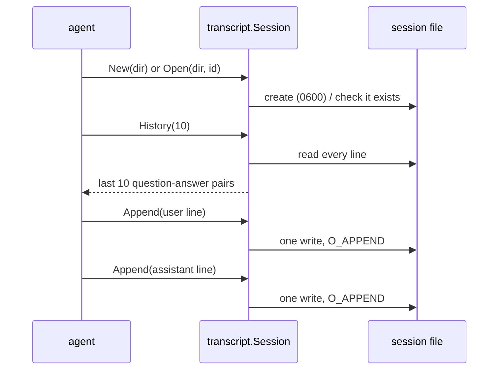

# transcript

**Code:** `internal/transcript/` (`doc.go`, `transcript.go`)
**Milestone:** v0.1
**Architecture:** [Session transcripts](../../ARCHITECTURE.md#session-transcripts)

## What it does

Each conversation with Meru is a **session**, and each session is one file in
JSON Lines (JSONL) format: one JSON object per line, one line per event. The
agent writes a `user` line when a question arrives and an `assistant` line when
the answer is complete. On the next turn it reads the file back to give the
model the conversation so far.

These files are the source of truth. The database that arrives in v0.2 copies
them for search and can always be rebuilt from them.

```text
~/.meru/sessions/2026/09/2026-09-23T101502-7f3a.jsonl
```

```json
{"ts":"2026-09-23T10:15:02Z","type":"user","text":"hello","trace_id":"4bf9…"}
{"ts":"2026-09-23T10:15:03Z","type":"assistant","text":"Hi!","tokens_in":31,"tokens_out":2,"trace_id":"4bf9…"}
```

## The picture



## Walk through the code

### New and Open

`New` names the file from the current time plus four random hex digits, and
creates it with `O_EXCL`, which fails if the file already exists. Two sessions
started in the same second get different suffixes; if they ever collide, `New`
tries another suffix.

`Open` takes an ID from a client, so it checks the ID against a strict pattern
before building a path from it:

```go
var idPattern = regexp.MustCompile(`^\d{4}-\d{2}-\d{2}T\d{6}-[0-9a-f]{4}$`)

if !idPattern.MatchString(id) {
    return nil, fmt.Errorf("session ID %q isn't valid", id)
}
```

Without this check, an ID such as `../../.ssh/id_rsa` could point the agent at
any file the user can read. The pattern allows no slashes and no dots, so the
ID can only name a file inside the sessions folder.

### Append

```go
f, err := os.OpenFile(s.path, os.O_WRONLY|os.O_APPEND, 0o600)
...
if _, err := f.Write(b); err != nil { ... }
if err := f.Close(); err != nil { ... }
```

- `O_APPEND` tells the operating system to put every write at the end of the
  file, even when two writers share it.
- The whole line, newline included, goes out in one `Write`, so lines from two
  writers never mix.
- `Close` can report a write the operating system had delayed, so we check its
  error instead of deferring it.
- `Session` holds only the path. There is no open file to leak and nothing for
  the caller to close.

### History

`History(n)` reads every line and pairs each `user` line with the `assistant`
line that answered it. A question with no answer, from a turn that failed or
was cancelled, drops out, so the model never sees two questions in a row. It
keeps the last `n` pairs.

A crash in the middle of `Append` can leave half a line. The next `Append` then
writes on the end of it, so a damaged line can turn up anywhere in the file.
`read` skips any line that isn't valid JSON, which loses that one event and
keeps the rest of the session usable.

### ReadLines

`ReadLines(path)` returns every line of one session file, by path, with the same
skip rule as `read`; both share `readFile`. The store's `ReplayToolCalls` uses it
to rebuild `tool_calls` from the `tool_call`, `approval` and `tool_result` lines
that `dispatch` writes.

## Go ideas used here

- **Pointer receivers** — `func (s *Session) Append(...)` makes `Append` a
  method on `*Session`. The method gets the session's address rather than a
  copy.
- **Errors wrapped with `%w`** — every error names the session. More in
  [go-basics/errors.md](go-basics/errors.md).
- **Struct tags with `omitempty`** — keep empty fields out of the JSON. More in
  [go-basics/struct-tags.md](go-basics/struct-tags.md).
- **`defer f.Close()`** — in `read`, where a close error can't lose data. More in
  [go-basics/defer.md](go-basics/defer.md).
- **`for range 5`** — a loop that runs five times (Go 1.22 and later).

## Try it

```sh
go test ./internal/transcript/...
```

`TestOpenRejectsBadIDs` tries path-traversal IDs; `TestHistorySkipsTornLines`
simulates a crash mid-write.

## Why it's built this way

- **Plain files, one per session.** You can `grep`, `tail -f` or back them up
  with no special tools.
- **Open, write, close on every line** instead of holding the file open. A turn
  writes two lines, so the cost doesn't show, and there is no file handle to
  manage across a turn that the client may abandon.
- **Pairs, not raw lines, for history.** The model needs clean alternating
  turns; the file keeps everything, including unanswered questions.
- **Skip damaged lines rather than fail.** Failing would lock the user out of
  a session because of one torn write.
