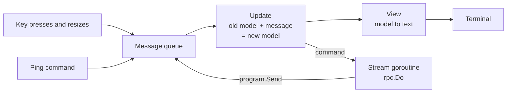
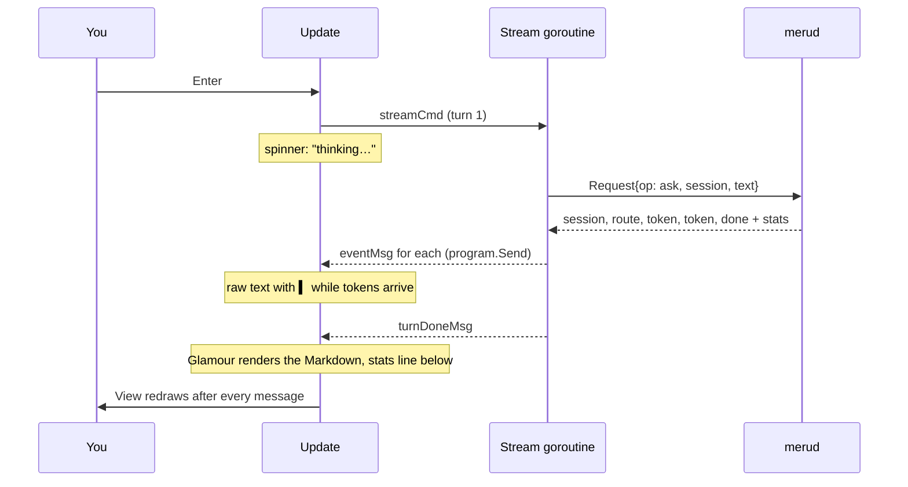

# tui

**Code:** `internal/tui/` (`doc.go`, `model.go`, `view.go`, `styles.go`, `stream.go`, `run.go`), plus the `chat` case in `cmd/meru/main.go`
**Milestone:** v0.1; sources under answers in v0.2
**Architecture:** [Terminal UI](../../ARCHITECTURE.md#terminal-ui)

## What it does

`meru chat` opens a chat screen in the terminal. You type a question in the box at
the bottom and press Enter. The answer appears above it a few words at a time as the
model writes it, and once it is finished, Meru redraws it as formatted Markdown:
headings, bold text, lists, and code blocks with coloured syntax. This package draws
that screen. It sends each question to `merud` over the Unix socket with `rpc.Do` and
draws whatever comes back. It holds no model or store logic.

`cmd/meru/main.go` calls `tui.Run` for `meru chat`. Before that, `chatInfo` reads the
profile and main model from `~/.meru/config.toml` for the header. If the file doesn't
load, the header leaves them out; `merud` reports config errors itself.

## The picture

The screen, top to bottom:

```text
Meru मेरु lite · minicpm5:2b · session 101500-ab12              ● connected
────────────────────────────────────────────────────────────────────────────
You
  │ How do I reverse a slice in Go?

Meru  direct · 0.91
  Use slices.Reverse. It works in place:

  • no copy
  • any element type

    slices.Reverse(s)
  0.8s to first token · 40.0 tok/s · 2.4s
╭──────────────────────────────────────────────────────────────────────────╮
│ Ask Meru anything…                                                       │
╰──────────────────────────────────────────────────────────────────────────╯
enter send · ctrl+c stop/quit · ctrl+d quit · ↑ last question · pgup/pgdn scroll
```

In colour, the name, the "You" label, the question's bar and the input border are
Meru's teal; "● connected" is green and "● merud not running" red; a route the router
fell back to is amber; errors sit in a red box.

Bubble Tea, the library we build on, runs one loop. A message arrives, `Update` turns
the old state into a new one, `View` draws the new state, and Bubble Tea repaints the
terminal. Every input reaches `Update` as a message: a key press, a window resize, a
token from `merud`, the answer to the opening ping.



One question, from Enter to the end of the answer:



## Walk through the code

### The Elm-style loop

The pattern comes from Elm, a language for web pages. You describe the screen as one
value, the *model*, and write two functions: one to change it, one to draw it. Your
code never paints the terminal and never waits on input. Bubble Tea does both and
calls your functions.

In Go, a `tea.Model` is any type with three methods:

```go
func (m Model) Init() tea.Cmd
func (m Model) Update(msg tea.Msg) (tea.Model, tea.Cmd)
func (m Model) View() string
```

- `Init` returns the first *command* to run. Ours starts the cursor blinking and
  pings `merud`.
- `Update` takes a message and returns the next model plus an optional command.
- `View` returns the whole screen as one string.

A *command* (`tea.Cmd`) is a function that does slow work, such as reading from a
socket. Bubble Tea runs each command in a goroutine (a function running alongside the
rest of the program) and feeds its return value back to `Update` as a message. That
keeps `Update` fast: it never blocks, so the screen stays responsive while an answer
streams.

`Update` and `View` touch no terminal and no socket, so tests call them with made-up
messages and check the result.

### model.go

`Model` is a struct (a named group of fields) that holds everything on screen:

```go
type Model struct {
	ask  askFunc // sends a request to merud
	send sender  // puts stream events back into the program
	info Info    // profile and model for the header

	input        textarea.Model // where the user types
	conversation viewport.Model // the scrolling pane above the input
	spin         spinner.Model  // spins while merud thinks
	help         help.Model     // the key help at the bottom

	turns     []exchange
	session   string
	link      link // connected, not running, or not known yet
	streaming bool
	turn      int
	cancel    context.CancelFunc
	// ...
}
```

`textarea`, `viewport`, `spinner` and `help` come from Bubbles, a set of ready-made
parts from the Bubble Tea authors. Each part is a small model of its own. Our
`Update` passes key presses it doesn't want to `m.input.Update`, which handles typing,
Backspace and cursor movement.

`turns` holds the conversation, one `exchange` per question:

```go
type exchange struct {
	question   string
	state      turnState // active, done, stopped or failed
	route      string
	confidence float64
	fallback   bool
	answer     string    // raw text, grown token by token
	err        string
	stats      rpc.Event // the closing "done" event and its stats
	rendered      string // the answer as Glamour drew it
	renderedWidth int    // the width it was drawn for
}
```

`turnState` and `link` are small integer types with named values made with `iota`,
which counts 0, 1, 2 inside a `const` block.

`Update` picks what to do with a *type switch*, which branches on the concrete type of
the message ([go-basics/type-switches.md](go-basics/type-switches.md)):

```go
switch msg := msg.(type) {
case tea.WindowSizeMsg:
	m.resize(msg.Width, msg.Height)
	return m, nil
case tea.KeyMsg:
	return m.handleKey(msg)
case pingMsg:
	// ...
case eventMsg:
	m.handleEvent(msg)
	return m, nil
// ...
}
```

`Update` has a *value receiver*, `(m Model)`: Go hands it a copy of the model. It
changes the copy and returns it, and Bubble Tea keeps what comes back. The helpers
`handleEvent`, `resize` and `refresh` have *pointer receivers*, `(m *Model)`, so they
can change that copy in place before `Update` returns it.

The keys live in a `keyMap` in `styles.go`. Each `key.Binding` pairs the keys with the
text the help line shows, and `handleKey` tests a press with `key.Matches`, so the
help line and the behaviour come from one place.

| Key | Idle | While an answer streams |
|---|---|---|
| Enter | send the question | ignored |
| Ctrl-J | new line in the question | same |
| Ctrl-C | quit | stop this answer, keep the chat open |
| Ctrl-D | quit | stop and quit |
| Up (on the input's first line) | put the last question back | same |
| PgUp / PgDn | scroll the conversation | same |

The input is a multi-line text area. Enter sends, so the text area's "new line" key is
set to Ctrl-J. `layout` grows the box by one row per line, up to five, and gives the
conversation the rows that are left.

`submit` runs on Enter. It clears the input, adds an `exchange`, bumps the turn
counter, and returns two commands joined by `tea.Batch`: the stream and the spinner.

```go
ctx, cancel := context.WithCancel(context.Background())
m.cancel = cancel
// ...
req := rpc.Request{
	Op:      rpc.OpAsk,
	Session: m.session, // empty on the first question
	Text:    text,
	Source:  rpc.SourceTUI,
}
return m, tea.Batch(streamCmd(ctx, m.ask, m.send, m.turn, req), m.spin.Tick)
```

A *context* carries a "stop now" signal. `context.WithCancel` makes a new one and a
`cancel` function that sends the signal. The model keeps `cancel`, so Ctrl-C can stop
the turn later. The context itself goes only into the command, because Meru's rule is
never to store a context in a struct.

`handleEvent` applies one event from `merud` to the newest turn:

- `session`: remember the ID. `submit` sends it with every later question, so `merud`
  continues the same conversation.
- `route`: keep the route, its confidence, and whether the router fell back.
- `token`: add the text to the answer.
- `done`: keep the stats for the line under the answer.
- `error`: mark the turn failed and keep the message.

Any event also marks `merud` as connected. `handleDone` ends the turn. A connection
error marks the turn failed and turns the header's status red.

### view.go

`View` stacks five parts: the header, a rule, the conversation, the input box and the
help line.

```go
return strings.Join([]string{m.header(), rule, m.conversation.View(), input, m.help.View(m.keys)}, "\n")
```

`header` puts the name, profile, model and a short session ID on the left and the
connection status on the right. When the terminal is narrow, the details shrink with
an ellipsis, then disappear.

`renderTurn` draws one turn. What goes under the "Meru" label depends on the state:

- waiting for the first token: the spinner and "thinking…";
- streaming: the raw text, wrapped, with a teal `▍` at the end;
- finished or stopped: the answer rendered as Markdown;

and then, on lines of their own: for a finished answer, the files it cites and the
stats; "stopped"; or the error box.

`sourcesBlock` draws the files, dim, like the stats line under them:

```text
  The Q3 budget for the garden project is 4,200 dollars [1].
  Sources
  [1] ~/notes/garden.md, "Budget", lines 3–5
  0.8s to first token · 40.0 tok/s · 2.4s
```

The list comes from `merud`'s `sources` event, which `handleEvent` keeps in the
turn's `sources` field. It waits until the answer is finished, because
`rpc.Cited` needs the whole text to see which numbers it cites; when it cites
none, the block lists every excerpt the model read. `Citation.String`, shared
with `meru`, writes each line, and each wraps to the screen width.

The answer stays raw while it streams for two reasons. Half-written Markdown renders
badly: an open code fence swallows everything after it. And Glamour takes longer to
render an answer than the model takes to write a token.

**Glamour** turns Markdown into terminal text. A `glamour.TermRenderer` holds one
style and one wrap width:

```go
r, err := glamour.NewTermRenderer(
	glamour.WithStandardStyle(m.look.markdownStyle),
	glamour.WithColorProfile(m.look.renderer.ColorProfile()),
	glamour.WithWordWrap(m.width),
)
```

Building one parses the style, so the model keeps it and builds a new one only when
the width changes. Each finished answer keeps its rendered text and the width it was
drawn for, so a resize redraws every answer at the new width and a token redraws
none. `tidy` trims the blank lines and padding Glamour puts round its output.

`statsLine` formats the numbers `merud` sends with `done`: time to first token, tokens
per second, and total time. Tokens per second uses Ollama's own writing time
(`eval_ms`) when it is there. A `done` with no stats, from an older `merud`, gives no
line.

### styles.go

A Lip Gloss *style* describes how to draw text: colour, bold, borders, padding.
`style.Render(s)` returns `s` wrapped in the terminal's escape codes for that look.

```go
question: r.NewStyle().
	Border(lipgloss.NormalBorder(), false, false, false, true).
	BorderForeground(teal).
	PaddingLeft(1).
	MarginLeft(answerIndent),
```

That style draws the teal bar to the left of each question: a border on the left side
only (the four booleans are top, right, bottom, left), one space of padding, and two
columns of margin.

The colours are `lipgloss.AdaptiveColor` values, each with one hex value for light
terminals and one for dark ones. Lip Gloss asks the terminal which background it has
and picks. `newStyles` builds every style from a `*lipgloss.Renderer`, the object
that knows how many colours the terminal supports. With `NO_COLOR` set, the renderer's
profile is plain ASCII and `Render` adds no escape codes at all.

### stream.go

`streamCmd` builds the command that runs one turn:

```go
return func() tea.Msg {
	for ev, err := range ask(ctx, req) {
		if err != nil {
			return turnDoneMsg{turn: turn, err: err}
		}
		send.Send(eventMsg{turn: turn, ev: ev})
	}
	return turnDoneMsg{turn: turn}
}
```

`ask` is `rpc.Do` in the real program. It returns an iterator: `range` over it gives
one event per step until `merud` sends `done` or `error`. Each event goes into the
program with `send.Send`, which puts it on Bubble Tea's message queue. When the loop
ends, the command returns `turnDoneMsg`, and Bubble Tea queues that too. Both come
from the same goroutine, so `turnDoneMsg` always arrives after the last event.

Every message carries its turn number. When you press Ctrl-C, `Update` cancels the
context and marks the screen idle at once. The goroutine may still deliver an event
or two before it notices, so `handleEvent` and `handleDone` drop any message whose
turn isn't the one streaming now.

`pingCmd` is the other command. It pings `merud` once when the chat opens, with a
two-second timeout, and returns a `pingMsg` that sets the header's status.

`sender` is an interface (a list of methods a type must have) with one method,
`Send`. `*tea.Program` has that method, so it fits. The tests pass a fake that pushes
messages onto a channel instead ([go-basics/channels.md](go-basics/channels.md)).

### run.go

`Run` builds the real `ask` from the socket path, picks the look, creates the
program, and hands over the terminal:

```go
relay := &programRelay{}
p := tea.NewProgram(newModel(ask, relay, info, terminalLook()), tea.WithAltScreen(), tea.WithContext(ctx))
relay.p = p
final, err := p.Run()
```

`terminalLook` asks Lip Gloss's default renderer about the terminal before Bubble Tea
takes it over. A dark background gets Glamour's `dark` style, a light one `light`, and
no colour gets `notty`, which keeps the structure and sends no escape codes.

The model needs a way to send into the program, but the program is built from the
model. `programRelay` breaks the circle: the model gets the relay first, and the relay
learns the program one line later. `tea.WithAltScreen` draws on the terminal's second
screen, so your shell history comes back untouched when you quit.

## Go ideas used here

- **Type switch**: branch on the concrete type inside an interface value. More in
  [go-basics/type-switches.md](go-basics/type-switches.md).
- **Channels**: the fake sender in the tests hands messages between goroutines on a
  channel. More in [go-basics/channels.md](go-basics/channels.md).
- **Value and pointer receivers**: `Update` works on a copy; helpers change that copy
  through a pointer.
- **Interfaces by method set**: `*tea.Program` satisfies `sender`, and `keyMap`
  satisfies `help.KeyMap`, without saying so.
- **`iota`**: numbers the `turnState` and `link` constants 0, 1, 2 and up.
- **Test flags**: `view_test.go` declares `-update` with `flag.Bool`, and the test
  binary parses it before the tests run.

## Try it

Run the tests. They need no terminal and no `merud`:

```sh
go test -race ./internal/tui/...
```

The golden tests in `view_test.go` draw the screen at a fixed size with colour off and
compare it with the files in `internal/tui/testdata/`: an empty screen, waiting,
streaming, a finished Markdown answer, a fallback route, an answer with sources, an
error, a stopped answer, and a 40-column terminal. After a deliberate change to the look, rewrite them and read
the diff:

```sh
go test ./internal/tui -update
git diff internal/tui/testdata
```

With `merud` running, open the chat:

```sh
go run ./cmd/meru chat
```

Ask for a list and a code sample, then a follow-up that only makes sense with the
first answer in mind. Press Ctrl-C during a long answer to stop it, and Ctrl-D to
leave. Run it again with `NO_COLOR=1` to see the plain version.

## Why it's built this way

**Why Bubble Tea over a plain read-print loop?** A loop that reads a line and prints
the reply works until you want to type while an answer streams, resize the window, or
scroll back. Each of those needs its own goroutine and locking. Bubble Tea puts every
input on one queue and handles them one at a time in `Update`, so the model needs no
locks.

**Why `program.Send` for tokens?** The other common pattern returns a command per
token that waits on a channel for the next one. That spreads one turn across many
commands. With `Send`, one goroutine owns the whole turn and reads like the one-shot
`meru "..."` client.

**Why turn numbers?** Cancelling a context doesn't stop a goroutine on the spot. Turn
numbers let `Update` ignore the stragglers without waiting for the goroutine to
finish.

**Why Glamour?** Models answer in Markdown. As plain text, a code block and a list
look like the prose around them, and `**bold**` shows its asterisks. Glamour is the
Markdown renderer from the Bubble Tea authors and uses the same colour handling as Lip
Gloss. It brings in a Markdown parser (goldmark) and a syntax highlighter (chroma);
we judged that cost worth readable answers. One-shot `meru "..."` doesn't use it and
still prints plain text for scripts and pipes.

**Why render only finished answers?** Rendering on every token would redraw the whole
answer dozens of times a second, and half-written Markdown renders wrong. The raw
text streams at once, and the Markdown appears when the answer is complete.

**Why a renderer passed in, not the global one?** The tests build the model with an
ASCII renderer, so the golden files hold plain text however the tests are run. The
real program passes Lip Gloss's default renderer, which honours `NO_COLOR`.
