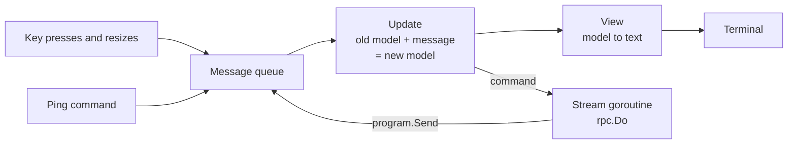
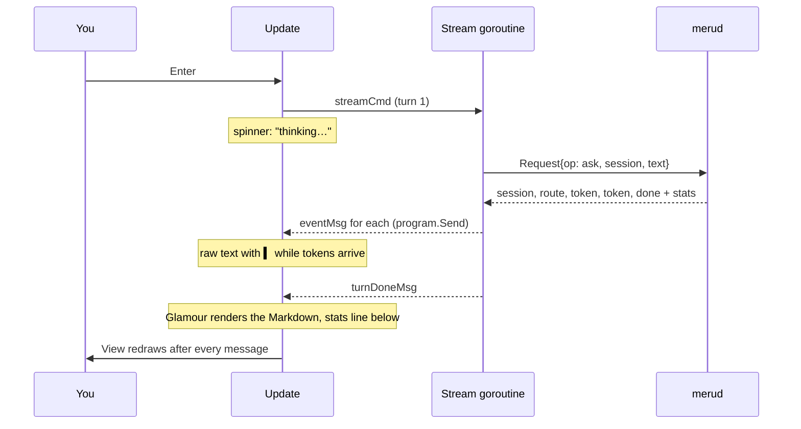
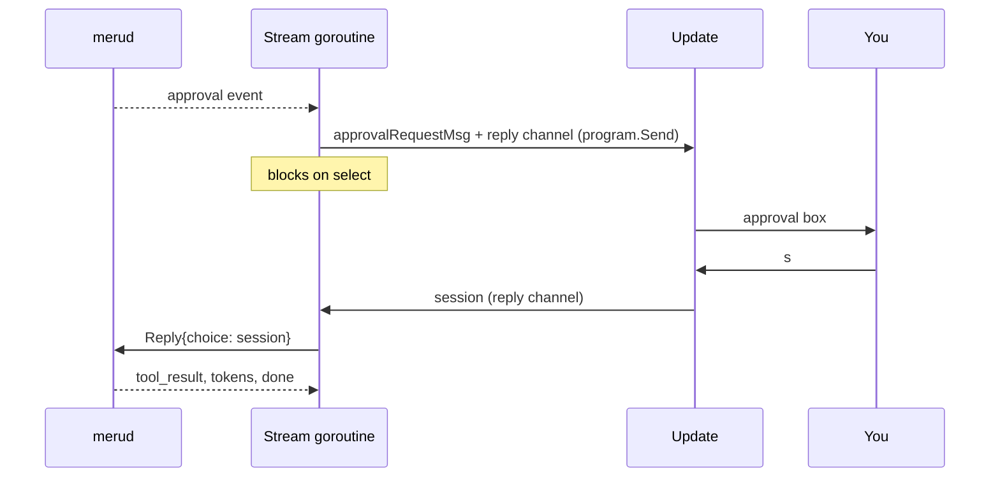

# tui

**Code:** `internal/tui/` (`doc.go`, `model.go`, `view.go`, `styles.go`, `stream.go`, `approval.go`, `commands.go`, `code.go`, `links.go`, `copy.go`, `clipboard.go`, `open.go`, `box.go`, `usage.go`, `me.go`, `mcp.go`, `models.go`, `scope.go`, `attach.go`, `save.go`, `used.go`, `chats.go`, `folders.go`, `skills.go`, `logbox.go`, `about.go`, `help.go`, `run.go`), plus the `chat` case in `cmd/meru/main.go`
**Milestone:** v0.1; sources under answers in v0.2; tool lines, the approval box, usage in the header and in `/usage`, and `/mcp` in v0.3; the memory count, the profile nudge and `/me` in v0.4; the desktop app's features (`/chats`, `/scope`, `/attach`, `/save`, `/used`, the Library boxes, Edit first and the version) after v0.4
**Architecture:** [Terminal UI](../../ARCHITECTURE.md#terminal-ui), [Approving a tool call](../../ARCHITECTURE.md#approving-a-tool-call)

## What it does

`meru chat` opens a chat screen in the terminal. You type a question in the box at
the bottom and press Enter. The answer appears above it a few words at a time as the
model writes it, and once it is finished, Meru redraws it as formatted Markdown:
headings, bold text, lists, and code blocks with coloured syntax. This package draws
that screen. It sends each question to `merud` over the Unix socket with `rpc.Do` and
draws whatever comes back. It holds no model or store logic.

Each code block in a finished answer gets a dim `⧉ copy N` label under it, and
`/copy N`, Ctrl-Y or a click on the label puts the block on the clipboard. Each web
or file link shows its URL cut to fit its line, and a click opens the full URL in
the browser.

`cmd/meru/main.go` calls `tui.Run` for `meru chat`. Before that, `chatInfo` reads the
profile and main model from `~/.meru/config.toml` for the header,
`[chat] mouse_copy` into `Info.MouseCopy`, and Meru's folder into `Info.Dir` for
the `/about` box. If the file doesn't load, the header
leaves them out and mouse copying stays on, its default; `merud` reports config
errors itself.

## Matching the desktop app

The chat does what the desktop app does wherever a terminal can, with the ops the
app already sends; `merud` got no new op for it. The short version of the audit
(the pull request that brought the chat level holds the full table):

| App feature | `meru chat` |
| --- | --- |
| Streaming, Markdown, code blocks with Copy, links, cited sources, stats, notices | has: the answer, `⧉ copy N`, OSC 8 links, the Sources list, the stats line, the amber note |
| Approvals: once, this chat, deny; Edit first | has: `o`, `s`, `d`, and `e` for Edit first |
| Queue and Stop | has: Enter queues five, Ctrl-C stops and drops them |
| Slash commands | has: the same list, in the same order; `/help` lists them |
| Where Meru looks | has: `/scope`, shown in the header |
| Attachments, files and images | has: `/attach <path>`; no drag and drop or file dialog, which need a window |
| Share as file, Save to a note | has: `/save chat`, `/save` |
| Try again | has: `/retry` |
| What this answer used, Remembered, Forget | has: `/used`, with `d d` to forget |
| Past chats and reopening one | has: `/chats [words]` |
| Library: Connections, Folders, About you, Skills, Models, Activity, Usage, About | has: `/mcp`, `/folders`, `/me`, `/skills`, `/model`, `/log`, `/usage`, `/about`; partial for Connections (no form for a server of your own: `meru mcp add stdio\|http`) and Models (the sets, not the cards of models we tried) |
| Setup | in another terminal: `meru setup` and `meru setup user` |
| Version beside the name | has |
| SVG preview, image previews, sidebar and panel layout | not in a terminal: they draw pictures or need a mouse-driven window |

## The picture

The screen, top to bottom:

```text
Meru मेरु lite · minicpm5:2b · session 101500-ab12              ● connected
────────────────────────────────────────────────────────────────────────────
You
  │ How do I reverse a slice in Go?

Meru  direct · 0.91
  Use slices.Reverse. It works in place:

  • no copy
  • any element type

    slices.Reverse(s)
    ⧉ copy 1
  0.8s to first token · 40.0 tok/s · 2.4s
╭──────────────────────────────────────────────────────────────────────────╮
│ Ask Meru anything…                                                       │
╰──────────────────────────────────────────────────────────────────────────╯
enter send · ctrl+c stop/quit · ↑ recall · pgup/dn scroll · /help commands
```

Once `merud` has answered the first status check, the header also says how big the
search index is and how many memories Meru keeps, and on a wide terminal how much
you asked in the last hour:

```text
Meru मेरु lite · minicpm5:2b · 2637 docs (11698 vectors, 84 MB) · 7 memories        1h: 4 questions · 18k in · 2.1k out  ● connected
```

While Meru knows nothing about you, the header says `no profile`, and the empty
conversation says how to fix that:

```text
Meru मेरु lite · minicpm5:2b · 2637 docs · no profile                  ● connected
────────────────────────────────────────────────────────────────────────────────

  Ask a question below. The answer comes from models on this machine.

  Meru doesn't know you yet. Type /me add and a line about yourself, or run meru
  setup user in another terminal.
```

When the model calls a tool, a dim line inside the Meru message tracks it. When the
tool is one you asked to approve first, an amber box opens under that line and waits
for your answer:

```text
Meru  tools · 0.82
  ✓ notes.search · 120 ms
  → mail.send
  ╭───────────────────────────────────────────────────╮
  │ Run mail.send?  mcp                               │
  │ {                                                 │
  │   "to": "sam@example.com",                        │
  │   "subject": "Garden plan",                       │
  │   "body": "We sow the tomatoes on 12 April."      │
  │ }                                                 │
  │                                                   │
  │  o once   s this session  [d deny]  e edit first  │
  ╰───────────────────────────────────────────────────╯
...
o once · s this session · d deny · e edit first · ←/→ enter choose · ctrl+c stop
```

Once the call ends, its line changes to `✓ mail.send · 80 ms`, or to
`✗ mail.send · declined` when you said no.

Type `/me` and press Enter, and a box takes the conversation's place with what Meru
knows about you, the memories that go into every prompt:

```text
  ╭────────────────────────────────────────────────────────────────────────────╮
  │ About you                                                                  │
  │                                                                            │
  │ me                                                                         │
  │ › Name: Dana Reyes                                                         │
  │   Work: staff engineer on the registry team at Acme, in the platform group │
  │                                                                            │
  │ preferences                                                                │
  │   Answers: short, with bullet points                                       │
  │                                                                            │
  │ /me add <fact> or /me prefer <how you like answers> adds one.              │
  ╰────────────────────────────────────────────────────────────────────────────╯
```

`/mcp` opens the app's Connections: each tool source, each tool with its policy,
and the catalog servers not added yet. ↑ and ↓ move the `›` marker, and ← and →
step the marked tool through Off, Ask and Allow:

```text
  ╭──────────────────────────────────────────────────────────────╮
  │ Connections                                                  │
  │                                                              │
  │   meru · built in · 11 of 11 tools on                        │
  │ ›   Always asks configure                                    │
  │     Allow       datetime                                     │
  │     Ask         write_file                                   │
  │ …                                                            │
  │   Add a connection                                           │
  │     google · Gmail, Google Calendar, Drive and Docs          │
  │     obsidian · Obsidian · needs an API key                   │
  │                                                              │
  │ Ask means Meru asks before each call. meru mcp add           │
  │ stdio|http adds a server of your own.                        │
  ╰──────────────────────────────────────────────────────────────╯
```

`/usage` opens a box of the same kind, with one column per window of time:

```text
  ╭───────────────────────────────────────────────────────────────╮
  │ Usage                                                         │
  │                                                               │
  │                   1h   today     week   month     30d     all │
  │ sessions           1       2        5      12      14      30 │
  │ questions          4       9       31      88      97     212 │
  │ tokens in        18k     41k     150k    420k    468k    1.4M │
  │ tokens out      2.1k    5.3k      19k     61k     66k    180k │
  │ active time   2m 14s  5m 01s  20m 10s  1h 01m  1h 07m  3h 05m │
  │ docs touched       3       7       22      51      55     140 │
  │ tool calls         1       2        6      14      15      40 │
  │                                                               │
  │ Today, week and month follow the local calendar.              │
  ╰───────────────────────────────────────────────────────────────╯
...
esc/q close · ctrl+c stop/quit
```

In colour, the header's name and the input border are Meru's teal. The "You" label and
the bar beside your question are blue, and the "Meru" label is green, so a glance tells
you who wrote what. "● connected" is green and "● merud not running" red; a route the
router fell back to is amber, and so is a warning `merud` sends about an answer;
errors sit in a red box.

Bubble Tea, the library we build on, runs one loop. A message arrives, `Update` turns
the old state into a new one, `View` draws the new state, and Bubble Tea repaints the
terminal. Every input reaches `Update` as a message: a key press, a window resize, a
token from `merud`, the answer to the opening ping.



One question, from Enter to the end of the answer:



## Walk through the code

### The Elm-style loop

The pattern comes from Elm, a language for web pages. You describe the screen as one
value, the *model*, and write two functions: one to change it, one to draw it. Your
code never paints the terminal and never waits on input. Bubble Tea does both and
calls your functions.

In Go, a `tea.Model` is any type with three methods:

```go
func (m Model) Init() tea.Cmd
func (m Model) Update(msg tea.Msg) (tea.Model, tea.Cmd)
func (m Model) View() string
```

- `Init` returns the first *command* to run. Ours starts the cursor blinking and
  pings `merud`.
- `Update` takes a message and returns the next model plus an optional command.
- `View` returns the whole screen as one string.

A *command* (`tea.Cmd`) is a function that does slow work, such as reading from a
socket. Bubble Tea runs each command in a goroutine (a function running alongside the
rest of the program) and feeds its return value back to `Update` as a message. That
keeps `Update` fast: it never blocks, so the screen stays responsive while an answer
streams.

`Update` and `View` touch no terminal and no socket, so tests call them with made-up
messages and check the result.

### model.go

`Model` is a struct (a named group of fields) that holds everything on screen:

```go
type Model struct {
	ask  askFunc // sends a request to merud
	send sender  // puts stream events back into the program
	info Info    // profile and model for the header

	input        textarea.Model // where the user types
	conversation viewport.Model // the scrolling pane above the input
	spin         spinner.Model  // spins while merud thinks
	help         help.Model     // the key help at the bottom

	turns     []exchange
	session   string
	link      link // connected, not running, or not known yet
	streaming bool
	turn      int
	cancel    context.CancelFunc
	approval  *pendingApproval // the tool call waiting for an answer, or nil
	// ...
}
```

`textarea`, `viewport`, `spinner` and `help` come from Bubbles, a set of ready-made
parts from the Bubble Tea authors. Each part is a small model of its own. Our
`Update` passes key presses it doesn't want to `m.input.Update`, which handles typing,
Backspace and cursor movement.

`turns` holds the conversation, one `exchange` per question:

```go
type exchange struct {
	question   string
	state      turnState // active, done, stopped or failed
	route      string
	confidence float64
	fallback   bool
	skills     []string // skills the turn loaded, from the route event
	sources    []rpc.Citation
	tools      []toolCall // the turn's tool calls, in order
	answer     string    // raw text, grown token by token
	err        string
	stats      rpc.Event // the closing "done" event and its stats
	rendered      string // the answer as Glamour drew it
	renderedWidth int    // the width it was drawn for
}
```

`turnState` and `link` are small integer types with named values made with `iota`,
which counts 0, 1, 2 inside a `const` block.

`Update` picks what to do with a *type switch*, which branches on the concrete type of
the message ([go-basics/type-switches.md](go-basics/type-switches.md)):

```go
switch msg := msg.(type) {
case tea.WindowSizeMsg:
	m.resize(msg.Width, msg.Height)
	return m, nil
case tea.KeyMsg:
	return m.handleKey(msg)
case pingMsg:
	// ...
case eventMsg:
	m.handleEvent(msg)
	return m, nil
// ...
}
```

`Update` has a *value receiver*, `(m Model)`: Go hands it a copy of the model. It
changes the copy and returns it, and Bubble Tea keeps what comes back. The helpers
`handleEvent`, `resize` and `refresh` have *pointer receivers*, `(m *Model)`, so they
can change that copy in place before `Update` returns it.

The keys live in a `keyMap` in `styles.go`. Each `key.Binding` pairs the keys with the
text the help line shows, and `handleKey` tests a press with `key.Matches`, so the
help line and the behaviour come from one place.

| Key | Idle | While an answer streams |
|---|---|---|
| Enter | send the question | queue the question; up to five wait |
| Ctrl-J | new line in the question | same |
| Ctrl-C | quit | stop this answer, drop the queue, keep the chat open |
| Ctrl-D | quit | stop and quit |
| Up (on the input's first line) | put the last question back | same |
| PgUp / PgDn | scroll the conversation | same |
| `/usage` then Enter | open the usage box | same; the answer keeps streaming behind it |
| `/mcp` then Enter | open the MCP status box | same |
| `/exit` then Enter | quit | stop and quit, like Ctrl-D |

While the approval box is open, the keys answer it instead, and typing doesn't reach
the input:

| Key | What it does |
|---|---|
| o, s, d | approve once, approve for this session, deny; only the choices `merud` offers work |
| ← / → then Enter | move the selection, then pick it |
| Ctrl-C | stop the turn; the call doesn't run |
| Ctrl-D | quit |

While the usage box is open, Esc or q closes it. Ctrl-C and Ctrl-D work as always,
and every other key does nothing.

The input is a multi-line text area. Enter sends, so the text area's "new line" key is
set to Ctrl-J. `layout` grows the box by one row per line, up to five, and gives the
conversation the rows that are left.

`submit` runs on Enter. A line that starts with `/` goes to `command` in
`commands.go` and never reaches the model. Otherwise `submit` clears the input. While
a turn runs, it appends the question to `m.queue` and stops there. When the screen
is idle, it calls `startTurn`, which adds an `exchange`, bumps the turn counter, and
returns two commands joined by `tea.Batch`: the stream and the spinner.

```go
ctx, cancel := context.WithCancel(context.Background())
m.cancel = cancel
// ...
req := rpc.Request{
	Op:      rpc.OpAsk,
	Session: m.session, // empty on the first question
	Text:    text,
	Source:  rpc.SourceTUI,
}
return m, tea.Batch(streamCmd(ctx, m.ask, m.send, m.turn, req), m.spin.Tick)
```

A *context* carries a "stop now" signal. `context.WithCancel` makes a new one and a
`cancel` function that sends the signal. The model keeps `cancel`, so Ctrl-C can stop
the turn later. The context itself goes only into the command, because Meru's rule is
never to store a context in a struct.

`handleEvent` applies one event from `merud` to the newest turn:

- `session`: remember the ID. `submit` sends it with every later question, so `merud`
  continues the same conversation.
- `route`: keep the route, its confidence, whether the router fell back, and the
  names of the skills the turn loaded. `badge` draws them after the confidence,
  as in `direct · 0.91 · writing`.
- `sources`: keep the excerpts for the list under the answer.
- `tool_call`: add a tool line. `tool_result`: `finishTool` finds the line with the
  same ID and fills in the outcome and the time.
- `token`: add the text to the answer.
- `notice`: keep `merud`'s warning about the answer, for the line under it.
- `done`: keep the stats for the line under the answer.
- `error`: mark the turn failed and keep the message.

Any event also marks `merud` as connected. `handleDone` ends the turn. A connection
error marks the turn failed and turns the header's status red.

#### Typing ahead

You can type the next question while an answer streams. Enter puts it in
`m.queue`, a slice of strings, oldest first, and the conversation draws it under
the running turn:

```text
You  queued
  │ Which of those grow in shade?
```

When a turn ends, `handleDone` takes the oldest question off the front of the
queue, `m.queue[1:]`, and passes it to `startTurn`. It returns the command that
runs the new turn, and `Update` batches it with the status and usage checks.
`tea.Batch` skips a nil command, so `Update` needs no `if` for an empty queue. The
next question goes after an error too, so each question gets its own answer or its
own error. `merud` still sees one turn at a time, in the same session, and nothing
in `rpc` or `merud` changed for this.

`maxQueue` caps the queue at five. Each queued question costs a whole turn with the
model, so a longer line is more likely a held-down Enter or a paste than a plan.
Past the cap, the question stays in the input and the notice line says the queue
is full.

Ctrl-C stops the running turn and calls `dropQueue`, which empties the queue and
returns a notice such as `dropped 2 queued questions`. Someone who stops an answer
wants the screen back; three more answers starting on their own would take it away
again. Up still brings back the last question you typed, queued or sent, so a
dropped question is one key away.

While a turn runs, the help line reads `enter queue · ctrl+c stop` in place of
`enter send · ctrl+c stop/quit`. `shortHelp` in `view.go` changes the labels on a
copy of the key map: `m.keys` is a struct value, so `keys := m.keys` copies it,
and `SetHelp` on the copy leaves the model's own keys alone.

### view.go

`View` stacks five parts: the header, a rule, the conversation, the input box and the
help line.

```go
return strings.Join([]string{m.header(), rule, pane, input, helpLine}, "\n")
```

`pane` is the conversation, or the `/usage`, `/me` or `/mcp` box drawn at the same
size while one is open.
`helpLine` lists the keys; while a box is open, it lists the keys that answer that
box. `helpView` draws it and drops keys from the end until the line fits. The help
component from Bubbles cuts a long line and ends it with "…" on its own, except
when the keys that fit leave less than two columns: then it adds every key and the
line runs off the screen.

`header` puts the name, profile, model, the size of the search index, the memory
count, a `no profile` marker and a short session ID on the left. `docCount` writes the size, such as
`2637 docs (11698 vectors, 84 MB)`, from the `IndexStatus` that `merud` sends: the
document and vector counts, and `DBBytes`, the size of `meru.db` on disk. A
`DBBytes` of 0 means an older `merud` didn't send it, so the size stays out:
`(11698 vectors)`. `humanBytes` writes the size with one decimal below ten, counting
by 1,024 as `ls -lh` does, and labels the units KB, MB and GB. The whole count stays
out until `merud` has answered once, so the header never shows a zero it hasn't
checked.

`memoryCount` writes `7 memories` from the same status, and nothing when `merud`
sends -1, its way of saying it couldn't read the memory folder. When the status
says `Profile` is 0, no memory of kind `me` or `preferences` exists, and `details`
adds `no profile`. `noProfile` makes that call for the header and for the empty
conversation, which adds the nudge under its usual hint.

On the right sit the last hour's usage, dim, from `lastHour`
(`1h: 4 questions · 18k in · 2.1k out`), and the connection status. When the
terminal is narrow, the header gives things up in this order: the usage first,
because `/usage` shows it in full; then the bracket with the vectors and size, whole,
because cutting it mid-way would leave an open `(`, and the memory count with it;
then the rest of the details shrink with an ellipsis from the right, and last they
disappear. `no profile` sits before the session ID, so it outlasts it: the marker
asks you to do something, and the ID only labels the chat. The status always stays.

`renderTurn` draws one turn. Under the "Meru" label come the tool lines first, one
per call, dim, drawn by `toolText`: `→ notes.search` while the call runs, then
`✓ notes.search · 120 ms` or `✗ mail.send · declined`. On the newest turn, the
approval box follows them while it is open. What comes next depends on the state:

- waiting for the first token: the spinner and "thinking…", unless the approval box
  already says what Meru waits for;
- streaming: the raw text, wrapped, with a teal `▍` at the end;
- finished or stopped: the answer rendered as Markdown;

and then, on lines of their own: for a finished answer, `merud`'s notice if it
sent one, the files it cites and the stats; "stopped"; or the error box.

`sourcesBlock` draws the files, dim, like the stats line under them:

```text
  The garden project sows tomatoes on 12 April [1].
  Sources
  [1] ~/notes/garden.md, "Planting", lines 3–5
  0.8s to first token · 40.0 tok/s · 2.4s
```

When `merud` sent a `notice`, because the answer claimed an action and no tool
call in the turn succeeded, an amber line sits between the answer and the
sources:

```text
  Done. It's now at ~/Projects/garden/.
  note: Meru didn't run any tool for this answer, so nothing changed on your
  computer.
  0.8s to first token · 40.0 tok/s · 2.4s
```

The `note:` prefix keeps the line apart from the answer when colour is off.

The list comes from `merud`'s `sources` event, which `handleEvent` keeps in the
turn's `sources` field. It waits until the answer is finished, because
`rpc.Cited` needs the whole text to see which numbers it cites; when it cites
none, the block stays empty. `Citation.String`, shared
with `meru`, writes each line, and each wraps to the screen width.

The answer stays raw while it streams for two reasons. Half-written Markdown renders
badly: an open code fence swallows everything after it. And Glamour takes longer to
render an answer than the model takes to write a token.

**Glamour** turns Markdown into terminal text. A `glamour.TermRenderer` holds one
style and one wrap width:

```go
r, err := glamour.NewTermRenderer(
	glamour.WithStyles(chatStyle(m.look.markdownStyle)),
	glamour.WithColorProfile(m.look.renderer.ColorProfile()),
	glamour.WithWordWrap(m.width),
)
```

`chatStyle` starts from one of Glamour's built-in styles, "dark", "light" or
"notty". The colour styles print "## " and "### " in front of each heading, which in
the chat looked like Markdown that failed to render, so `chatStyle` clears those
marks and leaves the colour and bold to show the heading. "notty" has no colour or
bold, so it keeps its marks. `glamourstyles.DefaultStyles` holds pointers to styles
Glamour shares, so `chatStyle` copies the struct (`c := *s`) and changes only the
copy.

Building one parses the style, so the model keeps it and builds a new one only when
the width changes. Each finished answer keeps its rendered text and the width it was
drawn for, so a resize redraws every answer at the new width and a token redraws
none. `tidy` trims the blank lines and padding Glamour puts round its output.
`renderedAnswer` also adds the copy labels and the links; code.go and links.go,
below, explain how. It hands the work to `drawAnswer`, which takes two switches,
links and labels, and tries three times: both on, then links off, then both off. Each
try that finds a marker out of place gives up, and the next draws less. If Glamour
itself fails, the answer shows as wrapped plain text.

`statsLine` formats the numbers `merud` sends with `done`: time to first token, tokens
per second, and total time. Tokens per second uses Ollama's own writing time
(`eval_ms`) when it is there. A `done` with no stats, from an older `merud`, gives no
line.

### styles.go

A Lip Gloss *style* describes how to draw text: colour, bold, borders, padding.
`style.Render(s)` returns `s` wrapped in the terminal's escape codes for that look.

```go
question: r.NewStyle().
	Border(lipgloss.NormalBorder(), false, false, false, true).
	BorderForeground(blue).
	PaddingLeft(1).
	MarginLeft(answerIndent),
```

That style draws the blue bar to the left of each question: a border on the left side
only (the four booleans are top, right, bottom, left), one space of padding, and two
columns of margin.

The colours are `lipgloss.AdaptiveColor` values, each with one hex value for light
terminals and one for dark ones. Lip Gloss asks the terminal which background it has
and picks. `newStyles` builds every style from a `*lipgloss.Renderer`, the object
that knows how many colours the terminal supports. With `NO_COLOR` set, the renderer's
profile is plain ASCII and `Render` adds no escape codes at all.

### stream.go

`streamCmd` builds the command that runs one turn:

```go
return func() tea.Msg {
	for ev, err := range ask(ctx, req) {
		if err != nil {
			return turnDoneMsg{turn: turn, err: err}
		}
		send.Send(eventMsg{turn: turn, ev: ev})
	}
	return turnDoneMsg{turn: turn}
}
```

`ask` is `rpc.Do` in the real program. It returns an iterator: `range` over it gives
one event per step until `merud` sends `done` or `error`. Each event goes into the
program with `send.Send`, which puts it on Bubble Tea's message queue. When the loop
ends, the command returns `turnDoneMsg`, and Bubble Tea queues that too. Both come
from the same goroutine, so `turnDoneMsg` always arrives after the last event.

Every message carries its turn number. When you press Ctrl-C, `Update` cancels the
context and marks the screen idle at once. The goroutine may still deliver an event
or two before it notices, so `handleEvent` and `handleDone` drop any message whose
turn isn't the one streaming now.

`pingCmd` is the other command. It asks `merud` for its index status, with a
two-second timeout, and returns a `pingMsg`. The answer does two jobs: it shows that
`merud` is up, and it carries the index's size for the header. `usageCmd` runs next
to it and asks for `OpUsage`, the usage numbers, which come back as a `usageMsg`.
The chat runs both when it opens, after each answer, and on a timer: every 5 seconds
while a scan runs (the header then reads `2637 docs (11698 vectors, 84 MB) ·
indexing`), every 30 seconds otherwise, when only the watcher adds files.
`nextRefresh` picks the wait. The timer is a `tea.Tick`, a command that sends a
`refreshMsg` once the time is up. Update answers it with both requests and the next
tick, and only that branch books a tick, so there is one chain of checks however
many answers come in.

`usageMsg` has an `answered` field, true when `merud` replied at all. A `merud`
older than `OpUsage` replies with an error event, `unknown op "usage"`: the header
then leaves the usage out, and the status stays green, because `merud` did answer.
When `merud` can't be reached, the header keeps the last numbers, as it keeps the
document count, and `pingCmd` alone turns the status red.

**Approvals cross from the goroutine to `Update`.** When a tool call needs your
approval, `merud` sends an `approval` event. `rpc.Do` doesn't hand that event to the
loop; it calls the `ApproveFunc` it was given and waits for a choice to write back.
That call happens on the stream goroutine, which can't draw a box or read a key.
Only `Update` can. `approveVia` bridges the two:

```go
func approveVia(send sender, turn int) rpc.ApproveFunc {
	return func(ctx context.Context, a rpc.Approval) (rpc.Choice, error) {
		reply := make(chan rpc.Choice, 1)
		send.Send(approvalRequestMsg{turn: turn, approval: a, reply: reply})
		select {
		case c := <-reply:
			return c, nil
		case <-ctx.Done():
			return "", ctx.Err()
		}
	}
}
```

The function makes a channel, sends it to `Update` inside an `approvalRequestMsg`,
and blocks. `select` waits for whichever comes first: `Update` putting your choice on
the channel, or the turn's context ending because you pressed Ctrl-C
([go-basics/select.md](go-basics/select.md)). The channel is *buffered* with room for
one value, so `Update` can put the choice there and move on without waiting, even if
the goroutine already gave up. `Update` must never block, or the whole screen would
freeze.



`sender` is an interface (a list of methods a type must have) with one method,
`Send`. `*tea.Program` has that method, so it fits. The tests pass a fake that pushes
messages onto a channel instead ([go-basics/channels.md](go-basics/channels.md)).

### approval.go

`openApproval` runs when an `approvalRequestMsg` reaches `Update`. It stores the
request in `m.approval`, hides the input's cursor, and redraws. A request from a turn
that has stopped, or one with no choices, gets "deny" at once: nobody could see it,
so nobody could agree to it. The box opens with "deny" selected, so an Enter meant
for the input can't approve a call by accident.

While `m.approval` is set, `handleKey` sends every key except Ctrl-C and Ctrl-D to
`approvalKey`. A choice's letter picks it; ← and → move the selection and Enter
picks it. Other keys do nothing, so text you type can't slip into the next question.
`closeApproval` puts the choice on the reply channel, clears `m.approval` and gives
the input its cursor back. `stopTurn` calls it with "deny", so Ctrl-C, Ctrl-D and a
dropped connection all close the box.

`approvalBoxView` draws the box: the name and kind, the arguments as indented JSON
(`rpc.ArgsLines`, at most ten lines), and the choices merud offered. Square brackets
mark the selected choice, so the selection shows with colour off too. `View` swaps
the help line for a `keyList`, a slice of key bindings with the two methods the
help component needs, so the bottom line lists the keys that answer the box.

`e` is Edit first, as in the app. `editFirst` answers deny, then puts the call in
the input as a draft (`draftOf`): "Run mail.send with these arguments instead:" and
the arguments as the box shows them, for the user to change and send as a new
question. The model then makes the call again with the new text, and `merud` asks
again, so nothing runs that the user didn't see. The app lays a mail out as To,
Subject and Body; the chat keeps the JSON the box already shows.

An approval box closes any open box (`dropBoxes`): the approval needs the keys,
and it sits in the conversation those boxes cover.

### commands.go

A line that starts with `/` never reaches the model; `submit` hands it to
`command`, which splits the name from its argument with
`strings.Cut(text, " ")` and sends each name to its function. Most live in the
file of the box they open: `/chats` in chats.go, `/scope` and `/retry` in
scope.go, `/attach` in attach.go, `/save` in save.go, `/used` in used.go, `/me` in
me.go, `/folders` in folders.go, `/model` in models.go and `/usage` in usage.go.
`/mcp`, `/skills`, `/log`, `/about` and `/help` open their box right in `command`
and send the first request with `requestCmd` (box.go).

`commandList` is the one list of names, in the order `/help` shows them. The
desktop app's `TestCommandsMatchChat` reads that constant from this file's
source and fails when the app's list differs, so a command added here must also
go into `internal/desktop/commands.go` and `commands.js`. `commandHelp` holds each
command's line for the `/help` box, and `TestCommandHelp` checks that it names the
same commands in the same order.

`/new` calls `newSession`, which stops a streaming answer, clears the screen and
forgets the session ID, so the next question asks `merud` for a new session. It
also counts up `m.turn`: the stopped answer may still send events, and
`handleEvent` drops any event whose turn number isn't the current one, so a late
`session` event can't bring the old session back. `newSession` also drops the
queue and the attachments, which belonged to the old conversation, and says how
many questions went.

Commands that only open a box, copy text or talk to `merud` run at once while a
turn runs and never wait in the queue. `/retry` is a question, so it queues like
one. A model switch, a reopened chat and a save wait for the turn to end: `merud`
would unload the model writing the answer, the answer would land in the wrong
conversation, and two approval boxes could open at once. `/exit` does what Ctrl-D
does. Any other `/word` stays in the input, so a typo can be fixed, and the bottom
line points at `/help`.

`/new` exists because a conversation carries forward: each turn's prompt holds the
turns before it. After a small model answers "I don't know" twice, it tends to say it
again even when the next search finds the right files.

**Source links.** `sourcesBlock` wraps each source line to the screen width, then,
when `look.links` is on, wraps every resulting screen line in `rpc.Hyperlink` with
the file's URL. Linking after wrapping keeps a link from spanning a line break, which
some terminals draw badly. `look.links` follows styling: `terminalLook` turns it off
with `NO_COLOR` or on a terminal with no colour, and the tests' plain renderer leaves
it off, so the golden files stay plain text.

### code.go

This file finds an answer's code blocks and puts a `⧉ copy N` label under each.

`findCodeBlocks` parses the answer's Markdown with goldmark, the CommonMark parser
Glamour uses, so both agree on where a block starts and ends. `ast.Walk` visits each
node; a `FencedCodeBlock` (```` ``` ```` or `~~~`) or a `CodeBlock` (four spaces of
indent) becomes a `codeBlock`, at any depth inside lists and quotes. Inline code is a
different node, so it gets no label. Each block keeps three things:

- `text`, what `/copy` copies: the lines without the fences, the language tag or the
  indent that made the block, and without the newline after the last line;
- `end`, the byte offset just past the block's last line;
- `prefix`, what starts each of its lines in the source, such as the `"> "` of a
  quote or the spaces of a list item.

`handleDone`, and Ctrl-C on a streaming answer, call `numberBlocks` once the turn
ends. It stores the blocks on the turn and gives the first one the number after the
session's last block, so the numbers run on from answer to answer and `/copy 7`
names one block on the whole screen. `/new` starts them again at 1.

Placing a label is the hard part. Glamour's output is ANSI-coloured, wrapped and
indented, so a line of it doesn't map back to a line of the source. Two easy fixes
break:

- Rendering the prose and each block on their own and stitching them together breaks
  a block that sits inside a list item, because the list then ends before the block.
- Counting Glamour's lines to find where a block ends breaks as soon as a long line
  wraps.

So `markBlocks` lets Glamour place the labels. It adds one marker line, such as
`MERUCOPY3X`, as the last line of each block, with the block's prefix so the line
stays inside the block. Glamour draws the marker like any other line of code: in the
right place, at any width, however it wraps or indents the block. `labelBlocks` then
finds each marker in the output, with the colour codes stripped, and swaps the line
for the label, dim, keeping whatever Glamour drew before the marker. The marker is
one word of letters and digits, so no syntax highlighter splits it, and it's short
enough that Glamour never wraps it.

If `labelBlocks` finds a different number of markers than blocks, `renderedAnswer`
draws the answer again without markers or labels, so no stray `MERUCOPY3X` reaches
the screen. That covers a screen too narrow for the marker, and an answer that
happens to contain one.

`labelAt` is the mouse's hit test: given one screen line and a column, it returns the
number of the label under that column, or 0. It counts columns with
`ansi.StringWidth`, because `⧉` takes three bytes in the string and one cell on
screen.

### links.go

This file makes the links in a finished answer clickable. Glamour draws a Markdown
link, `[Gmail link](https://mail.google.com/...)`, as its text and then the URL, and
wraps the URL like any word, at its dots and dashes. A long URL then sits on two
lines, and the terminal's own URL detection finds only the first half. So the chat
swaps each URL for a marker before Glamour draws, and swaps the marker back after,
the same trick code.go uses for the labels.

`findLinks` parses the answer with `markdownParser`, goldmark set up as Glamour sets
it up: with the GitHub extensions, whose Linkify turns a bare `https://...` in the
text into a link. Without them, the two parsers would disagree about the bare URLs.
It keeps three kinds of link: a Markdown link, an autolink in angle brackets
(`<https://...>`) and a bare URL. It keeps only `http`, `https` and `file`, so a
`javascript:` or `mailto:` link stays as Glamour draws it. goldmark never makes a link
inside code, and the walk skips images, raw HTML and tables, whose links Glamour
lists under the table on its own. The parser has already undone any escapes in a
URL, so `inlineLink` looks for the URL as written, right after `](` and right before
`)`. A reference link, `[text][ref]`, and a link with a title don't match, and stay
as Glamour draws them.

`markLinks` swaps each URL for a marker such as `MERULINK:3Xxxxxx`. The marker reads
as a URL, so Glamour keeps it as the link's destination, and it has no `.` or `-`,
so Glamour never breaks it. The x's pad it to the width of what replaces it, so
Glamour wraps the line round the marker as it would round the URL. How wide may that
be? `linkRoom` takes the screen width, less Glamour's two-column margin on each side
and four columns for each list, quote or heading the link sits in. That guess errs
short on purpose: a URL cut a few columns early costs less than one that runs off
the screen.

What replaces the marker depends on `look.links`:

- **On:** `shortURL` drops the scheme and a closing `/`, and cuts what is left with
  `…` when it is still too wide. Cutting from the end keeps the host, which says
  where the link goes. `rpc.Hyperlink` wraps it in the OSC 8 codes that point at the
  full URL.
- **Off** (`NO_COLOR`, or a terminal with no colour): nothing on screen can open a
  link, so the screen shows the full URL. `splitWidth` cuts one too long for its
  line into pieces as wide as the room, each with its own marker. Each piece fills
  its line, so they stack one to a line and read back as the URL.

A Markdown link keeps its text, so the screen shows `Gmail link
mail.google.com/mail/u/0/#inbox/18f2…`. The link text isn't the clickable part: a
model can write any text over any URL, and showing the host next to it lets you see
where a click goes before you click.

`swapLinks` puts the URLs back. It checks first that each marker shows exactly once
and that no line holding one is wider than the screen. If either check fails,
`drawAnswer` gives up and the next try draws the answer without links, so no stray
`MERULINK` reaches the screen. The copy labels' markers go in first, and `findLinks`
parses the marked answer, so the offsets `markLinks` uses match the text it
changes. Code blocks hold no links, so the two kinds of marker never meet.

The one-shot `meru "..."` prints the answer as the model wrote it, with each URL
whole on one line, and the terminal finds it there, so it needs none of this.

### copy.go

The three ways to copy all end in `copyBlock`:

- `/copy N` parses N and calls `copyBlock(N)`;
- `/copy` alone and Ctrl-Y call `copyLast`, which finds the newest finished answer
  and copies its last block. An answer still streaming has no numbers yet, so
  `copyLast` skips it;
- a left click calls `handleMouse`, which asks `labelUnder` for the label at the
  click. The conversation pane starts `headerLines` rows down, and what it shows is
  exactly `m.conversation.View()`, so the click's row picks one line of that.

A left click that lands on no label goes on to `linkUnder` in open.go, which opens
the link under the pointer, if there is one.

`copyBlock` looks the number up with `block`, which walks the turns. It returns a
command, `copyCmd`, and doesn't copy on the spot: copying starts a program, and a
`tea.Cmd` runs off the loop that draws the screen. The command reports back with a
`copiedMsg`, and `Update` shows its `notice`, such as `copied block 3 (2 lines)`, or
the error. A number with no block, or no blocks at all, gets a notice and no command.

Ctrl-Y is free in the input box: the Bubbles text area binds nothing to it (it uses
Ctrl-K and Ctrl-U to delete, Ctrl-V to paste). `TestCtrlYFreeInInput` checks this, so
an upgrade that takes the key fails a test.

The mouse only reaches `Update` when `Info.MouseCopy` is on, because only then does
`Run` ask for it. `handleMouse` checks the flag again, and does nothing while a box
is open. With the mouse captured the terminal no longer scrolls on the wheel, so
`handleMouse` scrolls the conversation three lines per notch.

### clipboard.go

`clipboard.copy` puts text on the system clipboard. `clipboardCommand` picks the
program: `pbcopy` on macOS, `clip.exe` on Windows, and elsewhere the first of
`wl-copy` (Wayland), `xclip -selection clipboard` and `xsel -b -i` (X11) that is on
`PATH`. `runProgram` starts it with `exec.CommandContext`, which runs the program
directly with no shell, and passes the text on standard input, so nothing in an
answer can run as a command. It leaves the program's output unset: `xclip` and
`wl-copy` leave a child running to hold the clipboard, and with a pipe to write to,
`Run` would wait for that child. A five-second timeout stops a program stuck on a
display server.

With no program found, `copy` writes OSC 52 to the terminal instead: `ESC ] 52 ; c ;`,
the text in base64, then BEL. The terminal does the copying, which also works over
SSH, but some terminals ignore the code and none answers. So the notice says the copy
went through the terminal.

`clipboard` holds `lookPath`, `run` and `terminal` as fields, and the model holds the
copy function as `m.copy`, so tests swap in fakes and never touch the real clipboard.

### open.go

With `[chat] mouse_copy` on, the chat captures the mouse, and the terminal never
sees a click. A terminal opens an OSC 8 link on a click, so without this file a
click on a link would do nothing. open.go finds the link under the pointer and
opens it.

`linkUnder` picks the screen line the way `labelUnder` does, and `linkAt` walks that
line. A link on screen is `ESC ] 8 ; params ; URL ST`, then the text, then
`ESC ] 8 ; ; ST`, where ST, the string terminator, is `ESC \` or BEL. `linkAt` finds
each `ESC ] 8 ;` in turn, and `parseOSC8` reads the URL and the code's length. The
text between two codes adds its width to a running column count. `ansi.StringWidth`
measures it, which skips colour codes and counts a wide rune, such as `園`, as two
columns, as the terminal draws it. When a code closes a link, or opens the next, the
columns since the link opened form its span. A click inside the span returns the URL.
That works for answer links (links.go) and for Sources lines (view.go) alike, since
both use `rpc.Hyperlink`.

`openLink` checks the URL with `opener.Check`: `http`, `https` or `file`, and
nothing that starts with `-`. The opener gets the URL as an argument, and a program
reads an argument that starts with `-` as an option. A refused URL gets a notice
and no command. Otherwise `openLink` returns a command, as `copyBlock` does, so the
program starts off the loop that draws the screen. The command reports back with
an `openedMsg`, whose `notice` reads `opened mail.google.com/…`, shortened by
`shortURL`, or the error.

The opening itself lives in `internal/opener`, which the desktop app shares:
`opener.Open` starts `open`, `xdg-open` or `rundll32` with no shell and the URL as
one argument ([opener](opener.md) explains it).

The model holds the opener as `m.open`. `testModel` sets one that fails, and
open_test.go swaps in `fakeOpener`, which records the URL, so no test starts a
browser.

### usage.go

`command` runs a line that starts with `/`. For `/usage` it clears the input, opens
the box with `loading` set, hides the input's cursor and returns `usageCmd`. For any
other command it leaves the text in the input, so you can fix a typo, and sets
`notice`, a dim line that takes the help line's place until the next key:

```text
unknown command /usag · commands: /new, /usage, /me, /mcp, /exit
```

`/usage by model` goes through `usageCommand`, which opens the box with `byModel`
set and returns `askUsage(ask, true)`: the same request with `Kind` set to
`rpc.UsageByModel`. The reply comes back as a `usageMsg` with `byModel` set, so
`applyUsage` fills only a box waiting by model and never hands those windows to
the header, whose summary reads windows of time. The box draws
`rpc.ModelUsageTable`: one row per model, with turns, the median time to first
token, tokens per second, tool calls, bad calls and capped turns.

`applyUsage` takes each `usageMsg`. The header keeps the windows for `lastHour`. A
box still loading takes the first reply that comes, whichever request it answers,
because they all ask for the same numbers. When `merud` answered with an error, the
box shows it.

`usageBoxView` draws the box. `rpc.UsageTable` turns the windows into rows of cells,
the same cells `meru usage` prints, and `usageTableLines` lines them up: labels on
the left, numbers on the right of each column, two spaces between. When six columns
don't fit, it drops windows from the right, `all` first, then `30d`, down to `1h`
alone. The recent windows say most about how you use Meru now, and `meru usage`
prints every window at any width. The note on the local calendar wraps to the box.
The box pads itself to the conversation's height, so the screen keeps its shape.

`boxKey`, in `box.go`, closes the box on Esc or q. `handleKey` sends it every key
except Ctrl-C and Ctrl-D, as it does for the approval box, so typing can't slip into
the input.

`/usage` has no shortcut key. Ctrl-U would be the obvious one, but the text area
already uses it to delete to the start of the line. Eighteen commands don't fit on
the help line, so it ends with `/help commands`, through a key binding whose key is
the text `/help`, which no key press produces; Bubbles skips a binding with no keys
at all. The `/help` box lists every key and command.

### box.go

Every box shares its frame. `boxPane` draws a title, a blank line, the body, a
blank line and a dim note inside a teal border, as wide as the widest line allows
up to the pane's width, and pads the result to the pane's height. A body line too
wide for the box ends in "…", so a caller that wants its lines whole wraps them to
`boxRoom(width)` first. `boxPaneAt` does the same with one body line kept in view:
when the body is taller than the pane, `window` picks the lines around it and puts
"↑ more" or "↓ more" where lines are hidden.

The `Model` holds one pointer per box: `usageBox`, `meBox`, `mcpBox`, `modelBox`,
`chatsBox`, `usedBox`, `foldersBox`, `skillsBox`, `logBox`, and `aboutBox` and
`helpBox`, which only scroll. nil means closed, so `boxOpen` checks them all;
`closeBox` clears them and gives the input its cursor back, and `openBox` clears
the typed command and hides the cursor. `boxKey` gets every key while a box is
open, except Ctrl-C and Ctrl-D. Esc closes any box and q closes one that isn't
taking typed text; every other key goes to the open box's own handler, such as
`mcpKey`, which returns the command a key starts. `boxKeys` gives the help line the
keys the open box answers.

Three helpers keep the boxes alike. `moveMark` moves a marker with ↑, ↓, PgUp,
PgDn, Home and End and keeps it inside the list. `markRow` draws `› ` before the
marked row and two spaces before the others, so the marker shows with colour off.
`requestCmd` sends one request, waits for the reply event of the type asked for,
and hands it back as a `replyMsg` with a tag that names the request;
`applyReply` passes each tag to the file that sent it. A read waits five seconds
and a change 90, as the desktop app does: a change can make `merud` restart every
MCP server.

A change that can't be undone from the chat, removing a folder or a server or
forgetting a memory, takes `d` twice. The first `d` puts the row's ID in the box's
`confirm` field and the note asks for a second; any other key clears it.

### me.go

`/me` works like `/usage`: `meCommand` opens a `meBox` with `loading` set and
returns `meCmd`, which asks `merud` for `OpMemoryList` and keeps the memories whose
kind is in `rpc.ProfileKinds()`, `me` and `preferences`. Those are the memories
`merud` puts into every prompt, so the box shows what the model knows about you
before it searches anything. `applyMe` fills a waiting box, kind by kind, so the
marker's index names the row on screen, and ignores a reply that comes after the
box closed.

`/me add <text>` and `/me prefer <text>` save a memory of kind `me` or
`preferences` with `OpMemoryAdd`, as the app's About you form and `meru setup user`
do. In the box, `d` twice forgets the marked memory with `OpMemoryForget`
(`forgetKey` in used.go, which the `/used` box shares). The chat writes no memory
file itself; `merud` does. The profile counts in the status move on the next status
check, so the nudge and the `no profile` marker go away within 30 seconds of the
first memory. `Update` redraws the conversation when a status check turns the
nudge on or off.

### mcp.go

The file holds two views of the MCP servers. `MCPTable` lays out `merud`'s
`OpMCPStatus` rows for `meru mcp`. It starts with a capital letter, which in Go
makes it visible to other packages. `line` is a function value stored in a
variable, a closure: it reads `nameWidth` from the function around it. In its
format, `%-10s` pads a string on the right to 10 columns and `%5s` pads on the left,
so the numbers line up on the right; `%-*s` takes its width from the argument
before the string. `TOOLS` shows `—` for a server that isn't connected, and the
last field is the reason, folded onto one line by `oneLine`, or an HTTP server's
URL without its scheme.

The `/mcp` box is the app's Connections. It sends `OpConnections`, and `mcpRows`
lays out the reply: a heading per source, a row per tool with its policy in the
app's words (`policyWords`), then the catalog servers not added yet. Each `mcpRow`
says whether a key can act on it and which connection, tool or catalog entry it
stands for, so the key handler and the drawing read the same list. `mcpKey` does
the rest:

- ← and → call `nextPolicy`, which steps Off, Ask, Allow and stops at the ends. A
  tool that always asks, such as `configure`, steps between Off and Always asks,
  since `merud` refuses Allow for it. The change goes out as `OpToolPolicy` with
  the server `meru` for a built-in tool.
- Enter on a catalog server sends `OpMCPAdd`. A server whose API key
  `secrets.toml` doesn't hold yet (`keyNeed`) first opens a field, a Bubbles
  `textinput` with `EchoPassword`, which draws `•` for each character.
  `addServerCmd` then sends `OpSecretSet` with the key and, once that works,
  `OpMCPAdd`. The key goes to `merud` over the socket and never comes back.
- `d` twice on an MCP server's heading sends `OpMCPRemove`.

While a change waits, `busy` says what `merud` is doing and the box takes no other
change. `applyConnections` puts the new lists in place, keeps the marker inside
them, and says on the notice line what changed or why nothing did.

### models.go

The file is `models.go`, with an s, because `model.go` holds the Bubble Tea
`Model`, the chat screen's state; two files named for "model" would confuse every
reader of the package.

`/model` works like `/mcp`: `modelCommand` opens a `modelBox` with `loading` set
and returns `listModels`, which sends `rpc.OpModels` and hands the reply back as
a `modelsMsg`. `/model save` sends `OpModelSave`, and `/model <name>` sends
`OpModelUse` with the set's name in `ID`, and `Rebuild` set when `--rebuild`
follows it. `modelsCmd` does the sending for all three, with an `action` field so
`applyModels` knows which reply it holds. A switch or a save says on the notice
line that it has started, and `applyModels` says how it ended, with `merud`'s
warning after a `·`. A switch waits up to `switchTimeout`, three minutes, since
`merud` loads a model of up to 38 GB before it answers.

Every models reply updates `m.models`, which the header reads: `answerModel`
names the model `merud` says answers now, and `activeSet` the set in use, which
the header shows in teal beside the usage. When the line is narrow the usage goes
first; the set's name stays, and the details shrink around it. The chat asks for
the models at start and on the refresh timer, because another client, such as
the desktop app, may switch the answer model.

`ModelTable` lays out the sets, as `MCPTable` does for servers, and `meru model`
prints it:

```text
  MODEL SET    MAIN                      SIZE   THINK     STATE
→ qwen-moe     qwen3.6:35b-a3b-mxfp8    38 GB   off       loaded
  gemma-moe    gemma4:26b-mxfp8         28 GB   off       on disk
  qwen-dense   qwen3.8:27b-mlx              —   off       not pulled
```

The arrow marks the set in use. `DiskSize` writes sizes as `ollama list` does,
counting by 1,000, so they match the numbers Ollama prints. A set that also
names a fast or embed model gets a second line that names them, and when no set
is in use, a last line names the model that answers.

### scope.go

`/scope <name>` sets `m.scope`, which `takeAttachments` copies into each question
it builds, so a question that waits in the queue keeps the scope it had when it was
typed. `startTurn` puts it in the request's `Scope`. `m.scope` holds "" for auto, which
the request leaves out, as the app's does. `scopeLabel` names a scope in the app's
words for the header, where a scope other than auto shows in amber.

`/retry` sends the newest turn's question again with the scope and the image paths
the turn kept, the app's Try again. It goes through `sendOrQueue`, the path Enter
takes, so while a turn runs it waits in the queue like any question.

### attach.go

`/attach <path>` turns the typed path into a full one (`fullPath`: `~` becomes the
home folder, and a relative path starts from the folder the chat runs in) and sends
`OpAttachFile`. `merud` copies the file into its uploads folder and answers with the
copy's path and its kind. `applyAttach` keeps the copy as an `attachment`, reads its
size with `os.Stat`, and, for a file, switches a scope with no `read_file` to files,
as the app does. The attachments line above the input lists them, and `layout`
gives the conversation one row less while it shows.

When the question goes, `takeAttachments` adds one "Read this file: <path>" line per
file, the line the model follows with a `read_file` call, and puts each image's full
path in `images`, which `startTurn` sends as `Request.Images`. `withImages` adds an
"image: <name>" line to the question on screen, since a terminal can't draw the
picture. `/attach` alone takes the attachments off; the copies stay where `merud`
put them. The app takes only a pick or a drop, so its page can never choose a path;
here the user types the path, and `merud` checks the file the same way either way.

### save.go

`/save` saves the newest finished answer as a note, and `/save chat` the whole
session, with `OpSaveFile`. `merud` writes the file with the `write_file` tool,
through `dispatch`, so it asks first. `saveCmd` passes `approveVia(send, n, true)`
as the approval function: the question reaches `Update` as an
`approvalRequestMsg` with `save` set and the save's number, and `openApproval`
checks that number against `m.saving` as it checks a turn's. The box opens in the
conversation's place (`savePaneView`), since the save belongs to no turn, and it
offers no Edit first. A save waits while a turn runs, so one approval box shows at
a time. `applySaved` says where the file went, with `~` for the home folder.

### used.go

`/used` opens the app's "What this answer used" for the newest turn: every file the
prompt held, each tool call as the turn shows it, and under Remembered the memories
from the turn's `memories` event, which `handleEvent` now keeps. ↑ and ↓ move over
the memories, and `forgetKey` forgets the marked one after a second `d`. The note is
`privacyLine`: "The model ran on this computer. Only google was contacted." It
comes from `contacted`, which names each MCP server and A2A agent a call reached,
"web search" for `web_search`, and the site `web_fetch` read, from `urlHost` of the
call's arguments. A call that was denied or declined reached no one.
`applyMemoryChange` takes a forgotten memory off every turn and off the `/me` box.

### chats.go

`/chats` asks `merud` for the past sessions (`OpSessions`, the newest 100) and
keeps the ones whose first question holds every word typed after the command.
Enter asks for the marked session's turns (`OpSessionTurns`), and `reopen` puts them
on screen as finished turns: the answer, the route, the notice, the files the
prompt held as numbered sources, the tool calls, the time and the token count. The
transcript keeps no time to first token and no confidence, so the stats line and the
badge leave those out, and no record of what recall brought, so `/used` says so for
a past turn (`past`). `reopen` counts up `m.turn`, as `/new` does, numbers the code
blocks afresh, and sets `m.session`, so the next question continues that chat. A
chat can't open while a turn runs.

### folders.go, skills.go and logbox.go

`/folders` sends `OpFolders`, which lists the `[index]` folders with their file
counts and the usual folders not indexed yet. Enter on a suggestion sends
`OpFolderAdd`, and `d` twice on an indexed folder `OpFolderRemove`; `/folders add
<path>` adds any folder. Every folder op gets the longer wait, since listing counts
files. `/skills` sends `OpSkills`, and Enter or space sends `OpSkillEnable` or
`OpSkillDisable` for the marked skill; `applySkills` keeps the marker on the same
skill, since `merud` lists the disabled ones last. `/log` sends `OpLog` for the
latest 100 calls, the data `meru log` prints, and shows the marked call's arguments
and the start of its result under its row. The file is logbox.go, not log.go,
which would read as logging.

### about.go and help.go

`/about` shows what `internal/about` holds for both clients: the tagline, the full
version, the license and the project's links, with Meru's folder from `Info.Dir`.
The links sit in two columns where they fit (`twoColumns`), and with links on each
URL is an OSC 8 link. `/help` lists `FullHelp`'s keys and `commandHelp` in the same
two columns. Both boxes only scroll, so they share `scrollBox`, which keeps the line
↑ and ↓ move to, and the number of lines the box drew last.

The header shows `about.ShortVersion()` beside the name: `v0.4.3` for a release,
`dev` and the commit for any other build. `Model` keeps it in `version`, which the
tests set to a fixed value, since a test binary's own version differs from one
machine to the next. When the header is too narrow for the details beside it, the
version goes first.

### run.go

`Run` builds the real `ask` from the socket path, picks the look, creates the
program, and hands over the terminal:

```go
relay := &programRelay{}
opts := []tea.ProgramOption{tea.WithAltScreen(), tea.WithContext(ctx)}
if info.MouseCopy {
	opts = append(opts, tea.WithMouseCellMotion())
}
p := tea.NewProgram(newModel(ask, relay, info, terminalLook()), opts...)
relay.p = p
final, err := p.Run()
```

`terminalLook` asks Lip Gloss's default renderer about the terminal before Bubble Tea
takes it over. A dark background gets Glamour's `dark` style, a light one `light`, and
no colour gets `notty`, which keeps the structure and sends no escape codes.

The model needs a way to send into the program, but the program is built from the
model. `programRelay` breaks the circle: the model gets the relay first, and the relay
learns the program one line later. `tea.WithAltScreen` draws on the terminal's second
screen, so your shell history comes back untouched when you quit.
`tea.WithMouseCellMotion`, added only with `[chat] mouse_copy` on, asks the terminal
to send clicks and wheel turns to the program. That is why the chat opens links
itself (open.go).

## Go ideas used here

- **Type switch**: branch on the concrete type inside an interface value. More in
  [go-basics/type-switches.md](go-basics/type-switches.md).
- **Channels**: the fake sender in the tests hands messages between goroutines on a
  channel, and each approval carries a buffered channel for its answer. More in
  [go-basics/channels.md](go-basics/channels.md).
- **`select`**: `approveVia` waits for the answer or for Ctrl-C, whichever comes
  first. More in [go-basics/select.md](go-basics/select.md).
- **Value and pointer receivers**: `Update` works on a copy; helpers change that copy
  through a pointer.
- **Interfaces by method set**: `*tea.Program` satisfies `sender`, and `keyMap`
  satisfies `help.KeyMap`, without saying so.
- **`iota`**: numbers the `turnState` and `link` constants 0, 1, 2 and up.
- **Test flags**: `view_test.go` declares `-update` with `flag.Bool`, and the test
  binary parses it before the tests run.

## Try it

Run the tests. They need no terminal and no `merud`:

```sh
go test -race ./internal/tui/...
```

`TestHeadingMarks` renders two headings in each style and checks that "##" shows
only in "notty". The golden tests use "notty", so they can't catch that change.

The golden tests in `view_test.go` draw the screen at a fixed size with colour off and
compare it with the files in `internal/tui/testdata/`: an empty screen, waiting,
streaming, two questions queued behind a streaming answer at 80 and 40 columns, a
finished Markdown answer, a fallback route, a route badge with a
skill, an answer with sources, an answer with a notice at 80 and 40 columns, an
error, a stopped answer, a 40-column terminal, tool lines, the approval box at 80
and 40 columns, the header with usage, index size and memory count at 130, 100 and 60 columns, the
usage box and the `/me` box at 80 and 40 columns, an answer with links at 80
and 40 columns with links on and off, the `/mcp` box at 100 and 40
columns, and the empty screen with the
profile nudge. After a deliberate change to the look, rewrite them and read the
diff:

```sh
go test ./internal/tui -update
git diff internal/tui/testdata
```

With `merud` running, open the chat:

```sh
go run ./cmd/meru chat
```

Ask for a list and a code sample, then a follow-up that only makes sense with the
first answer in mind. Type `/used` to see what the answer used, `/chats` to reopen
an older chat, and `/mcp` to change what a tool may do. Press Ctrl-C during a long answer to stop it, and Ctrl-D to
leave. Run it again with `NO_COLOR=1` to see the plain version. Ask how to install
and run `btop`, then press Ctrl-Y, or type `/copy 1`, and paste into another
terminal.

`approval_test.go` runs a turn in its own goroutine against a fake `merud` that asks
about one tool call. It checks each key (o, s, d, capitals, ←/→ with Enter, a choice
not offered), that typing stays out of the input while the box is open, that Ctrl-C
closes the box and stops the turn, and that a request from a stopped turn gets
"deny" at once.

The queue tests in `model_test.go` type questions behind a running turn. They check
that `merud` gets them in order and in one session, after an answer and after an
error; that `/usage`, `/me`, `/mcp` and `/copy` leave the queue alone and `/new`
drops it; that Ctrl-C drops it with a notice that counts the questions; and that a
sixth question stays in the input.

`usage_test.go` checks `/usage` against a fake `merud`: the box opens and fills, the
request is `OpUsage` and no question goes to the model. It checks each key while the
box is open, that an unknown `/command` sends nothing, what an unreachable and an
older `merud` do to the header, and, one column at a time from 140 down to 30, that
the header gives up the usage before the index size, drops the memory count with
the bracket, and never cuts a bracket.

`me_test.go` checks `/me` the same way: the request is `OpMemoryList`, the box shows
only the profile kinds, it says so when Meru knows nothing or `merud` fails, and Esc
or q closes it. It also walks the profile counts through a run (no status, -1, 0,
then some) and checks that the nudge and the header marker follow them, and that
the marker stays once a question has replaced the nudge.

`copy_test.go` checks `findCodeBlocks` on fenced blocks with and without a language,
tildes, indented blocks, blocks in a list and in a quote, two blocks, none, and a
block at the very end with no closing fence. It checks where `markBlocks` puts each
marker, and two more goldens: an answer with three blocks at 80 and 40 columns. It
checks that labels survive a resize, that numbers run on across answers and restart
after `/new`, and that a streaming answer has none. With a fake clipboard it runs
`/copy N`, `/copy`, Ctrl-Y, a number out of range, a word for a number and a
conversation with no blocks. It clicks a label with `mouse_copy` on and off, and
checks the hit test cell by cell. `clipboardCommand` gets a fake `PATH` lookup for
each system, and the OSC 52 fallback writes to a buffer.

`links_test.go` checks where `markLinks` puts its markers for a Markdown link, one
in angle brackets, an autolink, a bare URL, one in a list and one in a quote, and
that it leaves alone a URL in code, a `javascript:` link, a `mailto:` link, an email
address, a link with a title, a reference link, an image and a table. It checks
`shortURL` and `splitWidth` case by case, and that `swapLinks` refuses a missing,
doubled or too-wide marker. Its goldens draw an answer with a long link in a list,
a bare URL and a code block with its label, at 80 and 40 columns, with links on and
off. `TestLinksOnAndOff` checks that the screen holds an OSC 8 link to each full URL
with links on, that links off writes none and shows the URL, and that both hold
after a resize.

`open_test.go` checks `linkAt` column by column on a line with two links, colour
codes and a wide rune, and on broken lines, and both notices; `internal/opener`
tests which URLs open and the command each system runs. Through the whole model, with `fakeOpener`, it clicks
the mail link in an answer with `mouse_copy` on and off, clicks plain text, and
clicks a Sources line, which opens its `file://` URL.

`mcp_test.go` checks `MCPTable` (connected and unconnected rows, `—`, the URL
without its scheme, a reason with a line break, a long name that widens the first
column, no servers), that `/mcp` sends `OpConnections` and fills the box, and that
the box shows `merud`'s error. `TestMCPPolicyKeys` steps tools with ← and → and
checks each `OpToolPolicy`, and that a tool that always asks never reaches Allow;
`TestMCPAddAndRemove` adds a catalog server, types a key into the field that shows
`•`, and removes a server with `d` twice.

`boxes_test.go` draws each new box at 80 and 40 columns and compares it with a
golden: `/chats` with and without words, `/used` and its `d` prompt, `/folders`,
`/skills` (`skills-box`), `/log`, `/about`, `/help`, the `/mcp` key field, a save's
approval, and the attachments line with a scope in the header. `parity_test.go`
checks what each command sends and what the screen does with the reply: `/scope`,
`/retry`, `/attach` (the full path, the "Read this file" line, the images, the scope
switch, a refusal), `/save` with its approval, Edit first, forgetting from `/used`
and `/me`, `contacted`, reopening a chat, the folder and skill keys, `/me add` and
`/me prefer`, `/copy answer`, and scrolling `/help` and `/about`.

## Why it's built this way

**Why a channel for the answer and not a field on the model?** The stream goroutine
and `Update` run at the same time. A shared field would need a lock, and the
goroutine would have to poll it. A channel hands the choice over once and wakes the
goroutine the moment it arrives.

**Why does the box open on "deny"?** You may be typing the next question when the
box appears. Enter would then pick whatever is selected, and approving by accident is
worse than denying by accident: a denied call can be asked again.

**Why Bubble Tea over a plain read-print loop?** A loop that reads a line and prints
the reply works until you want to type while an answer streams, resize the window, or
scroll back. Each of those needs its own goroutine and locking. Bubble Tea puts every
input on one queue and handles them one at a time in `Update`, so the model needs no
locks.

**Why `program.Send` for tokens?** The other common pattern returns a command per
token that waits on a channel for the next one. That spreads one turn across many
commands. With `Send`, one goroutine owns the whole turn and reads like the one-shot
`meru "..."` client.

**Why queue in the client and not in `merud`?** Each turn's prompt holds the turns
before it, so a queued question has to wait for the answer before it anyway. Keeping the queue in the chat needs no new
request type, and Ctrl-C or `/new` can drop it without asking `merud`.

**Why turn numbers?** Cancelling a context doesn't stop a goroutine on the spot. Turn
numbers let `Update` ignore the stragglers without waiting for the goroutine to
finish.

**Why Glamour?** Models answer in Markdown. As plain text, a code block and a list
look like the prose around them, and `**bold**` shows its asterisks. Glamour is the
Markdown renderer from the Bubble Tea authors and uses the same colour handling as Lip
Gloss. It brings in a Markdown parser (goldmark) and a syntax highlighter (chroma);
we judged that cost worth readable answers. One-shot `meru "..."` doesn't use it and
still prints plain text for scripts and pipes.

**Why render only finished answers?** Rendering on every token would redraw the whole
answer dozens of times a second, and half-written Markdown renders wrong. The raw
text streams at once, and the Markdown appears when the answer is complete.

**Why does the usage go first when the header is narrow?** The left side says what
Meru runs on and how much it searches, which you need to read an answer. The usage
is a running total you can see in full with `/usage`, so it is the cheapest part to
lose.

**Why a box for `/usage` over a line in the conversation?** Seven rows of six
numbers make a table, and a table printed into the conversation would scroll away
with it and land in the middle of your questions. The box shows the numbers on top
and leaves the conversation as it was.

**Why show the URL after a link's text instead of making the text clickable?** A
model can put any text over any URL. With the host on screen you see where a click
goes before you click, and the text, which may wrap over lines, needs no escape
codes of its own.

**Why a marker line to place the copy labels?** See code.go above: rendering
pieces on their own breaks lists, and mapping output lines back to source lines
breaks on wrapping. Glamour already knows where each block's last line goes at every
width, so the marker lets it decide.

**Why a label with a number?** A terminal cell holds only text. A number works
with the keyboard in every terminal, and a click on it works where the terminal
reports the mouse.

**Why is mouse copying on by default?** A click on the label is what most people
try first. The cost: a program that captures the mouse gets every click and drag,
so the terminal's own text selection needs a modifier key, and the terminal can't
open a link on a click. The chat opens links itself to make up for that.
`mouse_copy = false` gives plain selection and the terminal's link click back.

**Why open a link with `open` or `xdg-open` over an HTTP client?** The chat
doesn't fetch the page: the user's browser does, as it would from any other
program. The platform's opener also knows which program handles `file://` URLs.

**Why no new op for the chat?** The desktop app already sends an op for every
setting, and `merud` checks each one. Reusing them keeps one way to make each
change, and a rule that holds for the app holds for the chat.

**Why `d` twice?** A terminal has no dialog to ask "are you sure?", and a single
stray key shouldn't remove a folder or a server. The second press is the question.

**Why a renderer passed in, not the global one?** The tests build the model with an
ASCII renderer, so the golden files hold plain text however the tests are run. The
real program passes Lip Gloss's default renderer, which honours `NO_COLOR`.
