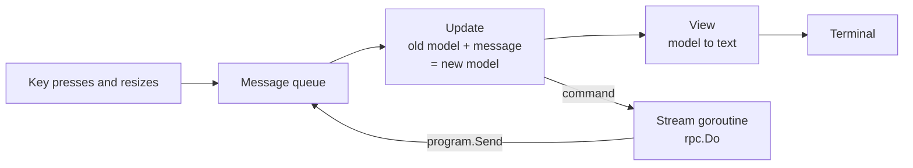
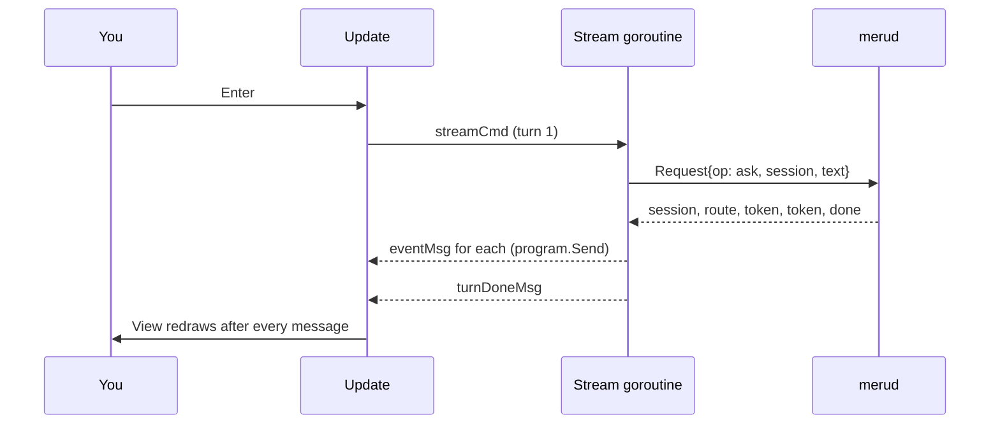

# tui

**Code:** `internal/tui/` (`doc.go`, `model.go`, `stream.go`, `run.go`), plus `cmd/meru/chat.go`
**Milestone:** v0.1
**Architecture:** [Terminal UI](../../ARCHITECTURE.md#terminal-ui)

## What it does

`meru chat` opens a chat screen in the terminal. You type a question at the bottom,
press Enter, and the answer appears above it a few words at a time as the model
writes it. This package draws that screen. It sends each question to `merud` over
the Unix socket with `rpc.Do` and draws whatever comes back. It holds no model or
store logic.

`cmd/meru/chat.go` connects the package to the `meru` command. `main.go` declares a
hook, `runChat`, and `chat.go` fills it with `tui.Run`.

## The picture

Bubble Tea, the library we build on, runs one loop. A message arrives, `Update` turns
the old state into a new one, `View` draws the new state, and Bubble Tea repaints the
terminal. Every input reaches `Update` as a message: a key press, a window resize, a
token from `merud`.



One question, from Enter to the end of the answer:



## Walk through the code

### The Elm-style loop

The pattern comes from Elm, a language for web pages. You describe the screen as one
value, the *model*, and write two functions: one to change it, one to draw it. Your
code never paints the terminal and never waits on input. Bubble Tea does both and
calls your functions.

In Go, a `tea.Model` is any type with three methods:

```go
func (m Model) Init() tea.Cmd
func (m Model) Update(msg tea.Msg) (tea.Model, tea.Cmd)
func (m Model) View() string
```

- `Init` returns the first *command* to run. Ours starts the cursor blinking.
- `Update` takes a message and returns the next model plus an optional command.
- `View` returns the whole screen as one string.

A *command* (`tea.Cmd`) is a function that does slow work, such as reading from a
socket. Bubble Tea runs each command in a goroutine (a function running alongside the
rest of the program) and feeds its return value back to `Update` as a message. That
keeps `Update` fast: it never blocks, so the screen stays responsive while an answer
streams.

`Update` and `View` touch no terminal and no socket, so tests call them with made-up
messages and check the result.

### model.go

`Model` is a struct (a named group of fields) that holds everything on screen:

```go
type Model struct {
	ask  askFunc // sends a question to merud
	send sender  // puts stream events back into the program

	input      textinput.Model // the line the user types in
	transcript viewport.Model  // the scrolling pane above it
	spin       spinner.Model   // spins in the status line while an answer streams

	entries      []entry
	session      string
	lastQuestion string
	streaming    bool
	turn         int
	cancel       context.CancelFunc
	// ...
}
```

`textinput`, `viewport` and `spinner` come from Bubbles, a set of ready-made parts
from the Bubble Tea authors. Each part is a small model of its own, with its own
`Update` and `View`. Our `Update` passes key presses it doesn't want to
`m.input.Update`, which handles typing, Backspace and cursor movement.

`entries` is the transcript as a list of blocks: a question, a route line, an answer,
an error, or a note such as "(cancelled)". `render` turns the list into wrapped text
and hands it to the viewport.

`Update` picks what to do with a *type switch*, which branches on the concrete type of
the message ([go-basics/type-switches.md](go-basics/type-switches.md)):

```go
switch msg := msg.(type) {
case tea.WindowSizeMsg:
	m.resize(msg.Width, msg.Height)
	return m, nil
case tea.KeyMsg:
	return m.handleKey(msg)
case eventMsg:
	m.handleEvent(msg)
	return m, nil
case turnDoneMsg:
	m.handleDone(msg)
	return m, nil
// ...
}
```

`Update` has a *value receiver*, `(m Model)`: Go hands it a copy of the model. It
changes the copy and returns it, and Bubble Tea keeps what comes back. The helpers
`handleEvent`, `resize` and `add` have *pointer receivers*, `(m *Model)`, so they can
change that copy in place before `Update` returns it.

The keys:

| Key | Idle | While an answer streams |
|---|---|---|
| Enter | send the question | ignored |
| Ctrl-C | quit | cancel this answer, keep the chat open |
| Ctrl-D | quit | cancel and quit |
| Up | put the last question back in the input | same |
| PgUp / PgDn | scroll the transcript | same |

`submit` runs on Enter. It clears the input, adds the question to the transcript,
bumps the turn counter, and returns two commands joined by `tea.Batch`: the stream and
the spinner.

```go
ctx, cancel := context.WithCancel(context.Background())
m.cancel = cancel
// ...
req := rpc.Request{
	Op:      rpc.OpAsk,
	Session: m.session, // empty on the first question
	Text:    text,
	Source:  rpc.SourceTUI,
}
return m, tea.Batch(streamCmd(ctx, m.ask, m.send, m.turn, req), m.spin.Tick)
```

A *context* carries a "stop now" signal. `context.WithCancel` makes a new one and a
`cancel` function that sends the signal. The model keeps `cancel`, so Ctrl-C can stop
the turn later. The context itself goes only into the command, because Meru's rule is
never to store a context in a struct.

`handleEvent` applies one event from `merud`:

- `session`: remember the ID. `submit` sends it with every later question, so `merud`
  continues the same conversation.
- `route`: add a dim line such as `route: direct (0.93)`.
- `token`: add the text to the current answer, or start a new answer.
- `error`: add the error text in line with the conversation.

### stream.go

`streamCmd` builds the command that runs one turn:

```go
return func() tea.Msg {
	for ev, err := range ask(ctx, req) {
		if err != nil {
			return turnDoneMsg{turn: turn, err: err}
		}
		send.Send(eventMsg{turn: turn, ev: ev})
	}
	return turnDoneMsg{turn: turn}
}
```

`ask` is `rpc.Do` in the real program. It returns an iterator: `range` over it gives
one event per step until `merud` sends `done` or `error`. Each event goes into the
program with `send.Send`, which puts it on Bubble Tea's message queue. When the loop
ends, the command returns `turnDoneMsg`, and Bubble Tea queues that too. Both come
from the same goroutine, so `turnDoneMsg` always arrives after the last event.

Every message carries its turn number. When you press Ctrl-C, `Update` cancels the
context and marks the screen idle at once. The goroutine may still deliver an event
or two before it notices, so `handleEvent` and `handleDone` drop any message whose
turn isn't the one streaming now.

`sender` is an interface (a list of methods a type must have) with one method,
`Send`. `*tea.Program` has that method, so it fits. The tests pass a fake that pushes
messages onto a channel instead ([go-basics/channels.md](go-basics/channels.md)).

### run.go

`Run` builds the real `ask` from the socket path, creates the program, and hands
over the terminal:

```go
relay := &programRelay{}
p := tea.NewProgram(newModel(ask, relay), tea.WithAltScreen(), tea.WithContext(ctx))
relay.p = p
final, err := p.Run()
```

The model needs a way to send into the program, but the program is built from the
model. `programRelay` breaks the circle: the model gets the relay first, and the relay
learns the program one line later. `tea.WithAltScreen` draws on the terminal's second
screen, so your shell history comes back untouched when you quit.

## Go ideas used here

- **Type switch**: branch on the concrete type inside an interface value. More in
  [go-basics/type-switches.md](go-basics/type-switches.md).
- **Channels**: the fake sender in the tests hands messages between goroutines on a
  channel. More in [go-basics/channels.md](go-basics/channels.md).
- **Value and pointer receivers**: `Update` works on a copy; helpers change that copy
  through a pointer.
- **Interfaces by method set**: `*tea.Program` satisfies `sender` without saying so.
- **`iota`**: numbers the `entryKind` constants 0, 1, 2 and up.
- **`init`**: `cmd/meru/chat.go` sets the `runChat` hook in a function Go runs before
  `main`.

## Try it

Run the tests. They need no terminal and no `merud`:

```sh
go test -race ./internal/tui/...
```

With `merud` running, open the chat:

```sh
go run ./cmd/meru chat
```

Ask something, then ask a follow-up that only makes sense with the first answer in
mind. Press Ctrl-C during a long answer to stop it, and Ctrl-D to leave.

## Why it's built this way

**Why Bubble Tea over a plain read-print loop?** A loop that reads a line and prints
the reply works until you want to type while an answer streams, resize the window, or
scroll back. Each of those needs its own goroutine and locking. Bubble Tea puts every
input on one queue and handles them one at a time in `Update`, so the model needs no
locks.

**Why `program.Send` for tokens?** The other common pattern returns a command per
token that waits on a channel for the next one. That spreads one turn across many
commands. With `Send`, one goroutine owns the whole turn and reads like the one-shot
`meru "..."` client.

**Why turn numbers?** Cancelling a context doesn't stop a goroutine on the spot. Turn
numbers let `Update` ignore the stragglers without waiting for the goroutine to
finish.

**Why plain text?** ARCHITECTURE.md adds Glamour (markdown rendering) or Lip Gloss
(styling) only if plain text proves hard to read. The one faint style comes from Lip
Gloss, which Bubbles already pulls in.
