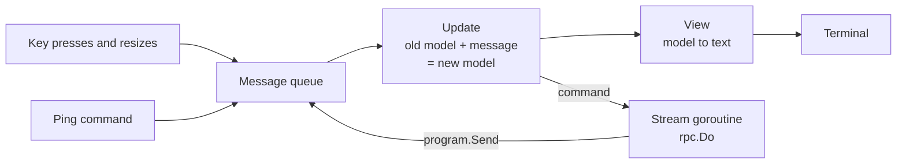
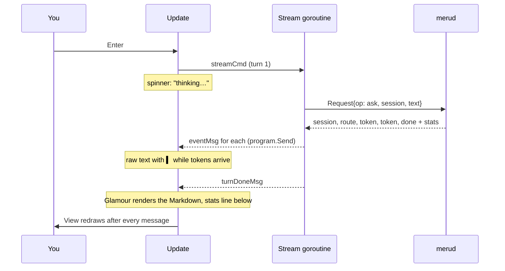
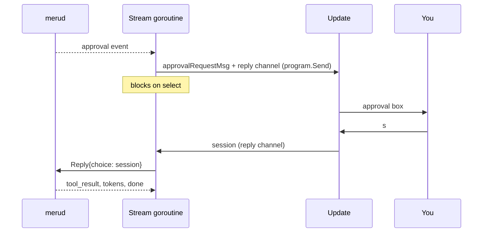

# tui

**Code:** `internal/tui/` (`doc.go`, `model.go`, `view.go`, `styles.go`, `stream.go`, `approval.go`, `commands.go`, `box.go`, `usage.go`, `me.go`, `mcp.go`, `run.go`), plus the `chat` case in `cmd/meru/main.go`
**Milestone:** v0.1; sources under answers in v0.2; tool lines, the approval box, usage in the header and in `/usage`, and `/mcp` in v0.3; the memory count, the profile nudge and `/me` in v0.4
**Architecture:** [Terminal UI](../../ARCHITECTURE.md#terminal-ui), [Approving a tool call](../../ARCHITECTURE.md#approving-a-tool-call)

## What it does

`meru chat` opens a chat screen in the terminal. You type a question in the box at
the bottom and press Enter. The answer appears above it a few words at a time as the
model writes it, and once it is finished, Meru redraws it as formatted Markdown:
headings, bold text, lists, and code blocks with coloured syntax. This package draws
that screen. It sends each question to `merud` over the Unix socket with `rpc.Do` and
draws whatever comes back. It holds no model or store logic.

`cmd/meru/main.go` calls `tui.Run` for `meru chat`. Before that, `chatInfo` reads the
profile and main model from `~/.meru/config.toml` for the header. If the file doesn't
load, the header leaves them out; `merud` reports config errors itself.

## The picture

The screen, top to bottom:

```text
Meru मेरु lite · minicpm5:2b · session 101500-ab12              ● connected
────────────────────────────────────────────────────────────────────────────
You
  │ How do I reverse a slice in Go?

Meru  direct · 0.91
  Use slices.Reverse. It works in place:

  • no copy
  • any element type

    slices.Reverse(s)
  0.8s to first token · 40.0 tok/s · 2.4s
╭──────────────────────────────────────────────────────────────────────────╮
│ Ask Meru anything…                                                       │
╰──────────────────────────────────────────────────────────────────────────╯
enter send · ctrl+c stop/quit · ↑ recall · pgup/dn scroll · /new /usage /me /mcp
```

Once `merud` has answered the first status check, the header also says how big the
search index is and how many memories Meru keeps, and on a wide terminal how much
you asked in the last hour:

```text
Meru मेरु lite · minicpm5:2b · 2637 docs (11698 vectors, 84 MB) · 7 memories        1h: 4 questions · 18k in · 2.1k out  ● connected
```

While Meru knows nothing about you, the header says `no profile`, and the empty
conversation says how to fix that:

```text
Meru मेरु lite · minicpm5:2b · 2637 docs · no profile                  ● connected
────────────────────────────────────────────────────────────────────────────────

  Ask a question below. The answer comes from models on this machine.

  Meru doesn't know you yet. Run meru setup user in another terminal, or tell it
  about yourself in a message.
```

When the model calls a tool, a dim line inside the Meru message tracks it. When the
tool is one you asked to approve first, an amber box opens under that line and waits
for your answer:

```text
Meru  tools · 0.82
  ✓ notes.search · 120 ms
  → mail.send
  ╭──────────────────────────────────────────────╮
  │ Run mail.send?  mcp                          │
  │ {                                            │
  │   "to": "sam@example.com",                   │
  │   "subject": "Garden plan",                  │
  │   "body": "We sow the tomatoes on 12 April." │
  │ }                                            │
  │                                              │
  │  o once   s this session  [d deny]           │
  ╰──────────────────────────────────────────────╯
...
o once · s this session · d deny · ←/→ enter choose · ctrl+c stop
```

Once the call ends, its line changes to `✓ mail.send · 80 ms`, or to
`✗ mail.send · declined` when you said no.

Type `/me` and press Enter, and a box takes the conversation's place with what Meru
knows about you, the memories that go into every prompt:

```text
  ╭────────────────────────────────────────────────────────────────────────────╮
  │ About you                                                                  │
  │                                                                            │
  │ me                                                                         │
  │ Name: Dana Reyes                                                           │
  │ Work: staff engineer on the registry team at Acme, in the platform group   │
  │                                                                            │
  │ preferences                                                                │
  │ Answers: short, with bullet points                                         │
  │                                                                            │
  │ Say "remember that …" in a message, or run meru setup user in another      │
  │ terminal.                                                                  │
  ╰────────────────────────────────────────────────────────────────────────────╯
```

`/mcp` opens one with the state of each MCP server, the same table `meru mcp`
prints:

```text
  ╭─────────────────────────────────────────────────────────────────────────────────────────────╮
  │ MCP servers                                                                                 │
  │                                                                                             │
  │ SERVER     TRANSPORT  STATE         TOOLS  ALLOWED  CONFIRM                                 │
  │ google     http       connected       124        6        2   127.0.0.1:8000/mcp            │
  │ obsidian   stdio      connected        13        5        1                                 │
  │ notes      stdio      not connected     —        3        1   exec: "npx" not found         │
  │                                                                                             │
  │ meru tools lists each tool; meru mcp list shows the catalog and meru mcp add adds a server. │
  ╰─────────────────────────────────────────────────────────────────────────────────────────────╯
```

`/usage` opens a box of the same kind, with one column per window of time:

```text
  ╭───────────────────────────────────────────────────────────────╮
  │ Usage                                                         │
  │                                                               │
  │                   1h   today     week   month     30d     all │
  │ sessions           1       2        5      12      14      30 │
  │ questions          4       9       31      88      97     212 │
  │ tokens in        18k     41k     150k    420k    468k    1.4M │
  │ tokens out      2.1k    5.3k      19k     61k     66k    180k │
  │ active time   2m 14s  5m 01s  20m 10s  1h 01m  1h 07m  3h 05m │
  │ docs touched       3       7       22      51      55     140 │
  │ tool calls         1       2        6      14      15      40 │
  │                                                               │
  │ Today, week and month follow the local calendar.              │
  ╰───────────────────────────────────────────────────────────────╯
...
esc/q close · ctrl+c stop/quit
```

In colour, the header's name and the input border are Meru's teal. The "You" label and
the bar beside your question are blue, and the "Meru" label is green, so a glance tells
you who wrote what. "● connected" is green and "● merud not running" red; a route the
router fell back to is amber; errors sit in a red box.

Bubble Tea, the library we build on, runs one loop. A message arrives, `Update` turns
the old state into a new one, `View` draws the new state, and Bubble Tea repaints the
terminal. Every input reaches `Update` as a message: a key press, a window resize, a
token from `merud`, the answer to the opening ping.



One question, from Enter to the end of the answer:



## Walk through the code

### The Elm-style loop

The pattern comes from Elm, a language for web pages. You describe the screen as one
value, the *model*, and write two functions: one to change it, one to draw it. Your
code never paints the terminal and never waits on input. Bubble Tea does both and
calls your functions.

In Go, a `tea.Model` is any type with three methods:

```go
func (m Model) Init() tea.Cmd
func (m Model) Update(msg tea.Msg) (tea.Model, tea.Cmd)
func (m Model) View() string
```

- `Init` returns the first *command* to run. Ours starts the cursor blinking and
  pings `merud`.
- `Update` takes a message and returns the next model plus an optional command.
- `View` returns the whole screen as one string.

A *command* (`tea.Cmd`) is a function that does slow work, such as reading from a
socket. Bubble Tea runs each command in a goroutine (a function running alongside the
rest of the program) and feeds its return value back to `Update` as a message. That
keeps `Update` fast: it never blocks, so the screen stays responsive while an answer
streams.

`Update` and `View` touch no terminal and no socket, so tests call them with made-up
messages and check the result.

### model.go

`Model` is a struct (a named group of fields) that holds everything on screen:

```go
type Model struct {
	ask  askFunc // sends a request to merud
	send sender  // puts stream events back into the program
	info Info    // profile and model for the header

	input        textarea.Model // where the user types
	conversation viewport.Model // the scrolling pane above the input
	spin         spinner.Model  // spins while merud thinks
	help         help.Model     // the key help at the bottom

	turns     []exchange
	session   string
	link      link // connected, not running, or not known yet
	streaming bool
	turn      int
	cancel    context.CancelFunc
	approval  *pendingApproval // the tool call waiting for an answer, or nil
	// ...
}
```

`textarea`, `viewport`, `spinner` and `help` come from Bubbles, a set of ready-made
parts from the Bubble Tea authors. Each part is a small model of its own. Our
`Update` passes key presses it doesn't want to `m.input.Update`, which handles typing,
Backspace and cursor movement.

`turns` holds the conversation, one `exchange` per question:

```go
type exchange struct {
	question   string
	state      turnState // active, done, stopped or failed
	route      string
	confidence float64
	fallback   bool
	skills     []string // skills the turn loaded, from the route event
	sources    []rpc.Citation
	tools      []toolCall // the turn's tool calls, in order
	answer     string    // raw text, grown token by token
	err        string
	stats      rpc.Event // the closing "done" event and its stats
	rendered      string // the answer as Glamour drew it
	renderedWidth int    // the width it was drawn for
}
```

`turnState` and `link` are small integer types with named values made with `iota`,
which counts 0, 1, 2 inside a `const` block.

`Update` picks what to do with a *type switch*, which branches on the concrete type of
the message ([go-basics/type-switches.md](go-basics/type-switches.md)):

```go
switch msg := msg.(type) {
case tea.WindowSizeMsg:
	m.resize(msg.Width, msg.Height)
	return m, nil
case tea.KeyMsg:
	return m.handleKey(msg)
case pingMsg:
	// ...
case eventMsg:
	m.handleEvent(msg)
	return m, nil
// ...
}
```

`Update` has a *value receiver*, `(m Model)`: Go hands it a copy of the model. It
changes the copy and returns it, and Bubble Tea keeps what comes back. The helpers
`handleEvent`, `resize` and `refresh` have *pointer receivers*, `(m *Model)`, so they
can change that copy in place before `Update` returns it.

The keys live in a `keyMap` in `styles.go`. Each `key.Binding` pairs the keys with the
text the help line shows, and `handleKey` tests a press with `key.Matches`, so the
help line and the behaviour come from one place.

| Key | Idle | While an answer streams |
|---|---|---|
| Enter | send the question | ignored |
| Ctrl-J | new line in the question | same |
| Ctrl-C | quit | stop this answer, keep the chat open |
| Ctrl-D | quit | stop and quit |
| Up (on the input's first line) | put the last question back | same |
| PgUp / PgDn | scroll the conversation | same |
| `/usage` then Enter | open the usage box | same; the answer keeps streaming behind it |
| `/mcp` then Enter | open the MCP status box | same |
| `/exit` then Enter | quit | stop and quit, like Ctrl-D |

While the approval box is open, the keys answer it instead, and typing doesn't reach
the input:

| Key | What it does |
|---|---|
| o, s, d | approve once, approve for this session, deny; only the choices `merud` offers work |
| ← / → then Enter | move the selection, then pick it |
| Ctrl-C | stop the turn; the call doesn't run |
| Ctrl-D | quit |

While the usage box is open, Esc or q closes it. Ctrl-C and Ctrl-D work as always,
and every other key does nothing.

The input is a multi-line text area. Enter sends, so the text area's "new line" key is
set to Ctrl-J. `layout` grows the box by one row per line, up to five, and gives the
conversation the rows that are left.

`submit` runs on Enter. A line that starts with `/` goes to `command` in `usage.go`
and never reaches the model. Otherwise `submit` clears the input, adds an `exchange`, bumps the turn
counter, and returns two commands joined by `tea.Batch`: the stream and the spinner.

```go
ctx, cancel := context.WithCancel(context.Background())
m.cancel = cancel
// ...
req := rpc.Request{
	Op:      rpc.OpAsk,
	Session: m.session, // empty on the first question
	Text:    text,
	Source:  rpc.SourceTUI,
}
return m, tea.Batch(streamCmd(ctx, m.ask, m.send, m.turn, req), m.spin.Tick)
```

A *context* carries a "stop now" signal. `context.WithCancel` makes a new one and a
`cancel` function that sends the signal. The model keeps `cancel`, so Ctrl-C can stop
the turn later. The context itself goes only into the command, because Meru's rule is
never to store a context in a struct.

`handleEvent` applies one event from `merud` to the newest turn:

- `session`: remember the ID. `submit` sends it with every later question, so `merud`
  continues the same conversation.
- `route`: keep the route, its confidence, whether the router fell back, and the
  names of the skills the turn loaded. `badge` draws them after the confidence,
  as in `direct · 0.91 · writing`.
- `sources`: keep the excerpts for the list under the answer.
- `tool_call`: add a tool line. `tool_result`: `finishTool` finds the line with the
  same ID and fills in the outcome and the time.
- `token`: add the text to the answer.
- `done`: keep the stats for the line under the answer.
- `error`: mark the turn failed and keep the message.

Any event also marks `merud` as connected. `handleDone` ends the turn. A connection
error marks the turn failed and turns the header's status red.

### view.go

`View` stacks five parts: the header, a rule, the conversation, the input box and the
help line.

```go
return strings.Join([]string{m.header(), rule, pane, input, helpLine}, "\n")
```

`pane` is the conversation, or the `/usage`, `/me` or `/mcp` box drawn at the same
size while one is open.
`helpLine` lists the keys; while a box is open, it lists the keys that answer that
box. `helpView` draws it and drops keys from the end until the line fits. The help
component from Bubbles cuts a long line and ends it with "…" on its own, except
when the keys that fit leave less than two columns: then it adds every key and the
line runs off the screen.

`header` puts the name, profile, model, the size of the search index, the memory
count, a `no profile` marker and a short session ID on the left. `docCount` writes the size, such as
`2637 docs (11698 vectors, 84 MB)`, from the `IndexStatus` that `merud` sends: the
document and vector counts, and `DBBytes`, the size of `meru.db` on disk. A
`DBBytes` of 0 means an older `merud` didn't send it, so the size stays out:
`(11698 vectors)`. `humanBytes` writes the size with one decimal below ten, counting
by 1,024 as `ls -lh` does, and labels the units KB, MB and GB. The whole count stays
out until `merud` has answered once, so the header never shows a zero it hasn't
checked.

`memoryCount` writes `7 memories` from the same status, and nothing when `merud`
sends -1, its way of saying it couldn't read the memory folder. When the status
says `Profile` is 0, no memory of kind `me` or `preferences` exists, and `details`
adds `no profile`. `noProfile` makes that call for the header and for the empty
conversation, which adds the nudge under its usual hint.

On the right sit the last hour's usage, dim, from `lastHour`
(`1h: 4 questions · 18k in · 2.1k out`), and the connection status. When the
terminal is narrow, the header gives things up in this order: the usage first,
because `/usage` shows it in full; then the bracket with the vectors and size, whole,
because cutting it mid-way would leave an open `(`, and the memory count with it;
then the rest of the details shrink with an ellipsis from the right, and last they
disappear. `no profile` sits before the session ID, so it outlasts it: the marker
asks you to do something, and the ID only labels the chat. The status always stays.

`renderTurn` draws one turn. Under the "Meru" label come the tool lines first, one
per call, dim, drawn by `toolText`: `→ notes.search` while the call runs, then
`✓ notes.search · 120 ms` or `✗ mail.send · declined`. On the newest turn, the
approval box follows them while it is open. What comes next depends on the state:

- waiting for the first token: the spinner and "thinking…", unless the approval box
  already says what Meru waits for;
- streaming: the raw text, wrapped, with a teal `▍` at the end;
- finished or stopped: the answer rendered as Markdown;

and then, on lines of their own: for a finished answer, the files it cites and the
stats; "stopped"; or the error box.

`sourcesBlock` draws the files, dim, like the stats line under them:

```text
  The garden project sows tomatoes on 12 April [1].
  Sources
  [1] ~/notes/garden.md, "Planting", lines 3–5
  0.8s to first token · 40.0 tok/s · 2.4s
```

The list comes from `merud`'s `sources` event, which `handleEvent` keeps in the
turn's `sources` field. It waits until the answer is finished, because
`rpc.Cited` needs the whole text to see which numbers it cites; when it cites
none, the block stays empty. `Citation.String`, shared
with `meru`, writes each line, and each wraps to the screen width.

The answer stays raw while it streams for two reasons. Half-written Markdown renders
badly: an open code fence swallows everything after it. And Glamour takes longer to
render an answer than the model takes to write a token.

**Glamour** turns Markdown into terminal text. A `glamour.TermRenderer` holds one
style and one wrap width:

```go
r, err := glamour.NewTermRenderer(
	glamour.WithStandardStyle(m.look.markdownStyle),
	glamour.WithColorProfile(m.look.renderer.ColorProfile()),
	glamour.WithWordWrap(m.width),
)
```

Building one parses the style, so the model keeps it and builds a new one only when
the width changes. Each finished answer keeps its rendered text and the width it was
drawn for, so a resize redraws every answer at the new width and a token redraws
none. `tidy` trims the blank lines and padding Glamour puts round its output.

`statsLine` formats the numbers `merud` sends with `done`: time to first token, tokens
per second, and total time. Tokens per second uses Ollama's own writing time
(`eval_ms`) when it is there. A `done` with no stats, from an older `merud`, gives no
line.

### styles.go

A Lip Gloss *style* describes how to draw text: colour, bold, borders, padding.
`style.Render(s)` returns `s` wrapped in the terminal's escape codes for that look.

```go
question: r.NewStyle().
	Border(lipgloss.NormalBorder(), false, false, false, true).
	BorderForeground(blue).
	PaddingLeft(1).
	MarginLeft(answerIndent),
```

That style draws the blue bar to the left of each question: a border on the left side
only (the four booleans are top, right, bottom, left), one space of padding, and two
columns of margin.

The colours are `lipgloss.AdaptiveColor` values, each with one hex value for light
terminals and one for dark ones. Lip Gloss asks the terminal which background it has
and picks. `newStyles` builds every style from a `*lipgloss.Renderer`, the object
that knows how many colours the terminal supports. With `NO_COLOR` set, the renderer's
profile is plain ASCII and `Render` adds no escape codes at all.

### stream.go

`streamCmd` builds the command that runs one turn:

```go
return func() tea.Msg {
	for ev, err := range ask(ctx, req) {
		if err != nil {
			return turnDoneMsg{turn: turn, err: err}
		}
		send.Send(eventMsg{turn: turn, ev: ev})
	}
	return turnDoneMsg{turn: turn}
}
```

`ask` is `rpc.Do` in the real program. It returns an iterator: `range` over it gives
one event per step until `merud` sends `done` or `error`. Each event goes into the
program with `send.Send`, which puts it on Bubble Tea's message queue. When the loop
ends, the command returns `turnDoneMsg`, and Bubble Tea queues that too. Both come
from the same goroutine, so `turnDoneMsg` always arrives after the last event.

Every message carries its turn number. When you press Ctrl-C, `Update` cancels the
context and marks the screen idle at once. The goroutine may still deliver an event
or two before it notices, so `handleEvent` and `handleDone` drop any message whose
turn isn't the one streaming now.

`pingCmd` is the other command. It asks `merud` for its index status, with a
two-second timeout, and returns a `pingMsg`. The answer does two jobs: it shows that
`merud` is up, and it carries the index's size for the header. `usageCmd` runs next
to it and asks for `OpUsage`, the usage numbers, which come back as a `usageMsg`.
The chat runs both when it opens, after each answer, and on a timer: every 5 seconds
while a scan runs (the header then reads `2637 docs (11698 vectors, 84 MB) ·
indexing`), every 30 seconds otherwise, when only the watcher adds files.
`nextRefresh` picks the wait. The timer is a `tea.Tick`, a command that sends a
`refreshMsg` once the time is up. Update answers it with both requests and the next
tick, and only that branch books a tick, so there is one chain of checks however
many answers come in.

`usageMsg` has an `answered` field, true when `merud` replied at all. A `merud`
older than `OpUsage` replies with an error event, `unknown op "usage"`: the header
then leaves the usage out, and the status stays green, because `merud` did answer.
When `merud` can't be reached, the header keeps the last numbers, as it keeps the
document count, and `pingCmd` alone turns the status red.

**Approvals cross from the goroutine to `Update`.** When a tool call needs your
approval, `merud` sends an `approval` event. `rpc.Do` doesn't hand that event to the
loop; it calls the `ApproveFunc` it was given and waits for a choice to write back.
That call happens on the stream goroutine, which can't draw a box or read a key.
Only `Update` can. `approveVia` bridges the two:

```go
func approveVia(send sender, turn int) rpc.ApproveFunc {
	return func(ctx context.Context, a rpc.Approval) (rpc.Choice, error) {
		reply := make(chan rpc.Choice, 1)
		send.Send(approvalRequestMsg{turn: turn, approval: a, reply: reply})
		select {
		case c := <-reply:
			return c, nil
		case <-ctx.Done():
			return "", ctx.Err()
		}
	}
}
```

The function makes a channel, sends it to `Update` inside an `approvalRequestMsg`,
and blocks. `select` waits for whichever comes first: `Update` putting your choice on
the channel, or the turn's context ending because you pressed Ctrl-C
([go-basics/select.md](go-basics/select.md)). The channel is *buffered* with room for
one value, so `Update` can put the choice there and move on without waiting, even if
the goroutine already gave up. `Update` must never block, or the whole screen would
freeze.



`sender` is an interface (a list of methods a type must have) with one method,
`Send`. `*tea.Program` has that method, so it fits. The tests pass a fake that pushes
messages onto a channel instead ([go-basics/channels.md](go-basics/channels.md)).

### approval.go

`openApproval` runs when an `approvalRequestMsg` reaches `Update`. It stores the
request in `m.approval`, hides the input's cursor, and redraws. A request from a turn
that has stopped, or one with no choices, gets "deny" at once: nobody could see it,
so nobody could agree to it. The box opens with "deny" selected, so an Enter meant
for the input can't approve a call by accident.

While `m.approval` is set, `handleKey` sends every key except Ctrl-C and Ctrl-D to
`approvalKey`. A choice's letter picks it; ← and → move the selection and Enter
picks it. Other keys do nothing, so text you type can't slip into the next question.
`closeApproval` puts the choice on the reply channel, clears `m.approval` and gives
the input its cursor back. `stopTurn` calls it with "deny", so Ctrl-C, Ctrl-D and a
dropped connection all close the box.

`approvalBoxView` draws the box: the name and kind, the arguments as indented JSON
(`rpc.ArgsLines`, at most ten lines), and the choices merud offered. Square brackets
mark the selected choice, so the selection shows with colour off too. `View` swaps
the help line for a `keyList`, a slice of key bindings with the two methods the
help component needs, so the bottom line lists the keys that answer the box.

An approval box closes an open `/usage`, `/me` or `/mcp` box: the approval needs
the keys, and it sits in the conversation those boxes cover.

### commands.go

A line that starts with `/` never reaches the model; `submit` hands it to
`command`. `/usage` opens the usage box, `/me` the profile box and `/mcp` the MCP
status box (all below). `/new` calls `newSession`, which
stops a streaming answer, clears the screen and forgets the session ID, so the next
question asks `merud` for a new session. It also counts up `m.turn`: the stopped
answer may still send events, and `handleEvent` drops any event whose turn number
isn't the current one, so a late `session` event can't bring the old session back.
`/exit` does what Ctrl-D does: it stops a streaming answer and returns `tea.Quit`.
People type it out of habit from other chat programs. The help line leaves it out,
because it would push the line past 80 columns, and Ctrl-C already shows there as
the way to quit. Any other `/word` stays in the input and the help line lists the
commands.

`/new` exists because a conversation carries forward: each turn's prompt holds the
turns before it. After a small model answers "I don't know" twice, it tends to say it
again even when the next search finds the right files.

**Source links.** `sourcesBlock` wraps each source line to the screen width, then,
when `look.links` is on, wraps every resulting screen line in `rpc.Hyperlink` with
the file's URL. Linking after wrapping keeps a link from spanning a line break, which
some terminals draw badly. `look.links` follows styling: `terminalLook` turns it off
with `NO_COLOR` or on a terminal with no colour, and the tests' plain renderer leaves
it off, so the golden files stay plain text.

### usage.go

`command` runs a line that starts with `/`. For `/usage` it clears the input, opens
the box with `loading` set, hides the input's cursor and returns `usageCmd`. For any
other command it leaves the text in the input, so you can fix a typo, and sets
`notice`, a dim line that takes the help line's place until the next key:

```text
unknown command /usag · commands: /new, /usage, /me, /mcp, /exit
```

`applyUsage` takes each `usageMsg`. The header keeps the windows for `lastHour`. A
box still loading takes the first reply that comes, whichever request it answers,
because they all ask for the same numbers. When `merud` answered with an error, the
box shows it.

`usageBoxView` draws the box. `rpc.UsageTable` turns the windows into rows of cells,
the same cells `meru usage` prints, and `usageTableLines` lines them up: labels on
the left, numbers on the right of each column, two spaces between. When six columns
don't fit, it drops windows from the right, `all` first, then `30d`, down to `1h`
alone. The recent windows say most about how you use Meru now, and `meru usage`
prints every window at any width. The note on the local calendar wraps to the box.
The box pads itself to the conversation's height, so the screen keeps its shape.

`boxKey`, in `box.go`, closes the box on Esc or q. `handleKey` sends it every key
except Ctrl-C and Ctrl-D, as it does for the approval box, so typing can't slip into
the input.

`/usage` has no shortcut key. Ctrl-U would be the obvious one, but the text area
already uses it to delete to the start of the line. The help line lists `/usage`
through a key binding whose key is the text `/usage`, which no key press produces;
Bubbles skips a binding with no keys at all. The binding's help splits
"/new /usage /me /mcp" across its key and description slots, and the scroll key
reads `pgup/dn`, so the whole help line still fits in 80 columns.

### box.go

The `/usage`, `/me` and `/mcp` boxes share their frame. `boxPane` draws a title, a blank
line, the body, a blank line and a dim note inside a teal border, as wide as the
widest line allows up to the pane's width, and pads the result to the pane's height.
A body line too wide for the box ends in "…", so a caller that wants its lines whole
wraps them to `boxRoom(width)` first. `boxOpen` says whether either box is open,
`boxKey` handles the keys while one is, and `closeBox` closes it and gives the input
its cursor back. The `Model` holds one pointer per box (`usageBox`, `meBox`,
`mcpBox`); nil means closed, so `boxOpen` checks all three.

### me.go

`/me` works like `/usage`: `command` opens a `meBox` with `loading` set and returns
`meCmd`, which asks `merud` for `OpMemoryList` and keeps the memories whose kind is
in `rpc.ProfileKinds()`, `me` and `preferences`. Those are the memories `merud` puts
into every prompt, so the box shows what the model knows about you before it
searches anything. `applyMe` fills a waiting box and ignores a reply that comes after
the box closed. `meBoxView` groups the memories under their kind, wraps each to the
box, and ends with the two ways to add more: say "remember that …" in chat, or run
`meru setup user`.

The chat itself never writes a memory. Telling Meru something in a message goes
through `merud`'s `remember` tool, like any tool call, and `meru setup user` runs in
another terminal. The profile counts in the status move on the next status check,
so the nudge and the `no profile` marker go away within 30 seconds of the first
memory. `Update` redraws the conversation when a status check turns the nudge on or
off.

### mcp.go

`/mcp` works like `/me`: `command` opens an `mcpBox` with `loading` set and returns
`mcpCmd`, which sends `rpc.OpMCPStatus` once and hands the rows back as an
`mcpMsg`. `applyMCP` fills a waiting box and ignores a reply that comes after the
box closed. `mcpBoxView` draws the rows with `MCPTable`, or `merud`'s error, such
as an older `merud` that doesn't know the op.

`MCPTable` starts with a capital letter, which in Go makes it visible to other
packages: `meru mcp` calls it to print the same table in the shell, so the two
views can't drift apart. It returns one string per line:

```go
line := func(name, transport, state, tools, allowed, confirm, last string) string {
    s := fmt.Sprintf("%-*s %-10s %-13s %5s  %7s  %7s   %s",
        nameWidth, name, transport, state, tools, allowed, confirm, last)
    return strings.TrimRight(s, " ")
}
```

`line` is a function value stored in a variable, a closure: it reads `nameWidth`
from the function around it. In the format, `%-10s` pads a string on the right to
10 columns and `%5s` pads on the left, so the numbers line up on the right. `%-*s`
takes its width from the argument before the string, here `nameWidth`, which grows
to fit the longest server name. `fmt` counts characters, so `—` takes one column.

`TOOLS` shows `—` when `Tools` is -1, the value `merud` sends for a server that
isn't connected. The last field is the reason a server isn't connected, folded onto
one line by `oneLine`, or else an HTTP server's URL without its scheme. With no rows,
`MCPTable` returns one line that says how to add a server. A box too narrow for the
table cuts each line with "…", as `boxPane` does for any box.

### run.go

`Run` builds the real `ask` from the socket path, picks the look, creates the
program, and hands over the terminal:

```go
relay := &programRelay{}
p := tea.NewProgram(newModel(ask, relay, info, terminalLook()), tea.WithAltScreen(), tea.WithContext(ctx))
relay.p = p
final, err := p.Run()
```

`terminalLook` asks Lip Gloss's default renderer about the terminal before Bubble Tea
takes it over. A dark background gets Glamour's `dark` style, a light one `light`, and
no colour gets `notty`, which keeps the structure and sends no escape codes.

The model needs a way to send into the program, but the program is built from the
model. `programRelay` breaks the circle: the model gets the relay first, and the relay
learns the program one line later. `tea.WithAltScreen` draws on the terminal's second
screen, so your shell history comes back untouched when you quit.

## Go ideas used here

- **Type switch**: branch on the concrete type inside an interface value. More in
  [go-basics/type-switches.md](go-basics/type-switches.md).
- **Channels**: the fake sender in the tests hands messages between goroutines on a
  channel, and each approval carries a buffered channel for its answer. More in
  [go-basics/channels.md](go-basics/channels.md).
- **`select`**: `approveVia` waits for the answer or for Ctrl-C, whichever comes
  first. More in [go-basics/select.md](go-basics/select.md).
- **Value and pointer receivers**: `Update` works on a copy; helpers change that copy
  through a pointer.
- **Interfaces by method set**: `*tea.Program` satisfies `sender`, and `keyMap`
  satisfies `help.KeyMap`, without saying so.
- **`iota`**: numbers the `turnState` and `link` constants 0, 1, 2 and up.
- **Test flags**: `view_test.go` declares `-update` with `flag.Bool`, and the test
  binary parses it before the tests run.

## Try it

Run the tests. They need no terminal and no `merud`:

```sh
go test -race ./internal/tui/...
```

The golden tests in `view_test.go` draw the screen at a fixed size with colour off and
compare it with the files in `internal/tui/testdata/`: an empty screen, waiting,
streaming, a finished Markdown answer, a fallback route, a route badge with a
skill, an answer with sources, an
error, a stopped answer, a 40-column terminal, tool lines, the approval box at 80
and 40 columns, the header with usage, index size and memory count at 130, 100 and 60 columns, the
usage box and the `/me` box at 80 and 40 columns, the `/mcp` box at 100 and 40
columns, and the empty screen with the
profile nudge. After a deliberate change to the look, rewrite them and read the
diff:

```sh
go test ./internal/tui -update
git diff internal/tui/testdata
```

With `merud` running, open the chat:

```sh
go run ./cmd/meru chat
```

Ask for a list and a code sample, then a follow-up that only makes sense with the
first answer in mind. Press Ctrl-C during a long answer to stop it, and Ctrl-D to
leave. Run it again with `NO_COLOR=1` to see the plain version.

`approval_test.go` runs a turn in its own goroutine against a fake `merud` that asks
about one tool call. It checks each key (o, s, d, capitals, ←/→ with Enter, a choice
not offered), that typing stays out of the input while the box is open, that Ctrl-C
closes the box and stops the turn, and that a request from a stopped turn gets
"deny" at once.

`usage_test.go` checks `/usage` against a fake `merud`: the box opens and fills, the
request is `OpUsage` and no question goes to the model. It checks each key while the
box is open, that an unknown `/command` sends nothing, what an unreachable and an
older `merud` do to the header, and, one column at a time from 140 down to 30, that
the header gives up the usage before the index size, drops the memory count with
the bracket, and never cuts a bracket.

`me_test.go` checks `/me` the same way: the request is `OpMemoryList`, the box shows
only the profile kinds, it says so when Meru knows nothing or `merud` fails, and Esc
or q closes it. It also walks the profile counts through a run (no status, -1, 0,
then some) and checks that the nudge and the header marker follow them, and that
the marker stays once a question has replaced the nudge.

`mcp_test.go` checks `MCPTable` (connected and unconnected rows, `—`, the URL
without its scheme, a reason with a line break, a long name that widens the first
column, no servers), that `/mcp` sends `OpMCPStatus`, fills the box, ignores a late
reply and closes on q, and that the box shows `merud`'s error.

## Why it's built this way

**Why a channel for the answer and not a field on the model?** The stream goroutine
and `Update` run at the same time. A shared field would need a lock, and the
goroutine would have to poll it. A channel hands the choice over once and wakes the
goroutine the moment it arrives.

**Why does the box open on "deny"?** You may be typing the next question when the
box appears. Enter would then pick whatever is selected, and approving by accident is
worse than denying by accident: a denied call can be asked again.

**Why Bubble Tea over a plain read-print loop?** A loop that reads a line and prints
the reply works until you want to type while an answer streams, resize the window, or
scroll back. Each of those needs its own goroutine and locking. Bubble Tea puts every
input on one queue and handles them one at a time in `Update`, so the model needs no
locks.

**Why `program.Send` for tokens?** The other common pattern returns a command per
token that waits on a channel for the next one. That spreads one turn across many
commands. With `Send`, one goroutine owns the whole turn and reads like the one-shot
`meru "..."` client.

**Why turn numbers?** Cancelling a context doesn't stop a goroutine on the spot. Turn
numbers let `Update` ignore the stragglers without waiting for the goroutine to
finish.

**Why Glamour?** Models answer in Markdown. As plain text, a code block and a list
look like the prose around them, and `**bold**` shows its asterisks. Glamour is the
Markdown renderer from the Bubble Tea authors and uses the same colour handling as Lip
Gloss. It brings in a Markdown parser (goldmark) and a syntax highlighter (chroma);
we judged that cost worth readable answers. One-shot `meru "..."` doesn't use it and
still prints plain text for scripts and pipes.

**Why render only finished answers?** Rendering on every token would redraw the whole
answer dozens of times a second, and half-written Markdown renders wrong. The raw
text streams at once, and the Markdown appears when the answer is complete.

**Why does the usage go first when the header is narrow?** The left side says what
Meru runs on and how much it searches, which you need to read an answer. The usage
is a running total you can see in full with `/usage`, so it is the cheapest part to
lose.

**Why a box for `/usage` over a line in the conversation?** Seven rows of six
numbers make a table, and a table printed into the conversation would scroll away
with it and land in the middle of your questions. The box shows the numbers on top
and leaves the conversation as it was.

**Why a renderer passed in, not the global one?** The tests build the model with an
ASCII renderer, so the golden files hold plain text however the tests are run. The
real program passes Lip Gloss's default renderer, which honours `NO_COLOR`.
