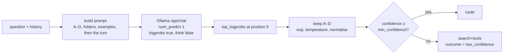

# The fast router: one token, read from the logits

How `merud` picks a route. This design note sits under
[ARCHITECTURE.md](../ARCHITECTURE.md) and covers step 1 of the
[agent loop](../ARCHITECTURE.md#agent-loop). It belongs to v0.1.

Related: [open question 1](../ARCHITECTURE.md#open-questions) asks whether a 2B model
can route. This note answers it by changing the question — the router stops writing
JSON (JavaScript Object Notation) and starts returning a probability.

---

## The problem

The router runs on every turn and decides one of four things:

| Route | Meaning |
| --- | --- |
| `direct` | answer from the model alone |
| `search` | retrieve from the user's files first |
| `tools` | call MCP (Model Context Protocol) tools |
| `search+tools` | both |

Asking a 2B model to write that as JSON has three failure modes. It emits malformed
JSON and the parse fails. It invents a fifth route. It returns valid JSON with a
confident wrong answer and no way to tell.

The first two stall the turn or force a silent default. The third is worse, because
`meru.turn.*` by route is the measurement that settles open question 1, and a silent
default poisons it.

## The mechanism

A route decision is a classification, so read it from the logits instead of parsing
prose.

1. Prompt the `fast` model with one lettered option per route, each with a
   description, the folders Meru indexes, two worked examples per route, then the
   session history and the question.
2. Ask Ollama for **one** token with log probabilities, with thinking turned off
   (`think: false`). A thinking model otherwise spends that token starting its hidden
   reasoning.
3. Take the alternatives at position 0, keep the ones whose text is a route letter,
   and turn each log probability back into a probability.
4. Divide each logit by a stored temperature, then normalise so the four sum to 1.
5. The highest is the route. Its probability is the confidence.

The model decodes a single token, so a turn pays for prompt evaluation and nothing
else. The model cannot name a route that does not exist, because the answer is read
from a fixed set of letters rather than from whatever it wrote.



### Why this model

MiniCPM5-2B already fills the `fast` tier in the `lite` profile and `merud` already
keeps it warm. A route decision costs no extra download, no extra memory and no
extra slot in `OLLAMA_MAX_LOADED_MODELS`. Nothing self-hosted is cheaper than a
model that is already resident.

The model name stays in `config.toml`, as every model name does. This design works
with any model Ollama serves; it assumes nothing about MiniCPM beyond a tokeniser
that emits single letters as their own tokens, which the startup probe checks.

## Scope

**In scope.** The route decision, and only that.

**Out of scope, on purpose.** No model rewrites the query. Search uses the question
itself, and on a short follow-up `merud` appends the session's latest earlier question
that isn't only filler words such as "try the last question again". That needs no
model call (see
[How a conversation continues](../ARCHITECTURE.md#how-a-conversation-continues)).
A rewrite would need generated text, a second model call on every search turn;
nobody has measured that search needs one. Skill selection arrives in v0.4 as its own
short call. It could become a second classification, but one decision per call means
one call per decision. Revisit either when there is a number.

This keeps the change small: one new path, one prompt, one parser.

## The prompt contract

The prompt ends with a bare `Answer: ` so the next token is the letter. Options carry
a description, because small models lean on the label text.

```text
<system prompt, when there is one>

Decide how to answer the user's next question.

A = General knowledge, chit-chat, maths, coding or writing help. Needs nothing about the user and nothing recent or live.
B = Look in the user's own saved notes, documents, code repos or past chats. Nothing live, no action. The user's files are in ~/notes, ~/repos/meru; questions about projects kept there, by name, are B.
C = Live, recent or outside data (web, news, scores, weather, prices, email inbox, calendar) or an action (send, book, create, schedule). Nothing from the user's notes.
D = Needs the user's notes or files AND a live lookup or an action.

Examples:
what's the boiling point of water in Denver -> A
fix the grammar: me and him was late -> A
what did I note about the gym contract -> B
which of my scripts use ffmpeg -> B
is it windy in Chicago now -> C
move my Monday standup to 10 -> C
text Maya the gate code from my notes -> D
does the hotel in my trip notes have rooms free -> D

Conversation so far:
<history, newest first, within the history budget>

Question:
<the user's question>

Reply with one letter and nothing else.
Answer: 
```

The letter-to-route mapping lives in Go, next to the prompt template, so the two
never drift. Do not read the letters from config; they are part of the prompt.

Each part earned its place on the labelled set (see [Calibration](#calibration)):

- **Fixed part first.** The options and examples never change, so they open the
  prompt and the turn's history and question close it. Ollama reuses its work on a
  prompt's opening tokens when the next prompt starts the same way, so the fixed
  part costs little after the first turn. The order also raised accuracy more than
  any other single change.
- **Contrastive descriptions.** Each option names the questions that belong to it
  and says what it excludes. "Email inbox" and "calendar" sit under C, because
  they are live services, not notes.
- **Folders on B's line.** When `[index] folders` lists any, B's line names them
  as `config.toml` writes them, and says that questions about projects kept there,
  by name, are B. `merud` passes them in `Turn.Folders`. Without the line the model
  sent "what database does meru use" to `direct` with 0.902 confidence, because
  nothing told it that "meru" is one of the user's own projects. The folders change
  only when config does, so the line sits in the fixed part and Ollama's reuse
  still works. With no folders the line is left out.
- **Two examples per route.** None repeats a question in the labelled set, and a
  unit test checks that.
- **Letters A to D in route order.** Every other order tried did worse, and so did
  the words `direct`, `search`, `tools` and `both`, which the tokenizer splits.

The prompt costs about 256 tokens for a question with no history and no folders,
against about 120 before these changes.

### Tokeniser detail

A tokeniser may return `A` or ` A` depending on what precedes it. Trim each candidate
token before comparing, and compare case-insensitively. Match on the trimmed text
only, never on a token identifier, because identifiers differ per model.

## Engine changes

The `Engine` interface keeps its four methods. Log probabilities are a request option
and a response field, not a fifth method.

```go
// Options gains two fields. Both default to off, so every existing caller behaves
// as before.
type Options struct {
    // ... existing fields ...

    // LogProbs asks the runtime to report how likely each generated token was.
    LogProbs bool
    // TopLogProbs is how many alternatives to report at each position. Ollama caps
    // this at 20. Zero means "only the chosen token".
    TopLogProbs int
}

// TokenLogProb is one token and how likely the model thought it was, as a natural
// logarithm. Log probabilities are always zero or negative; closer to zero is more
// likely.
type TokenLogProb struct {
    Token   string
    LogProb float64
}

// PositionLogProbs is what the model considered at one position in its answer: the
// token it picked, and the alternatives it weighed.
type PositionLogProbs struct {
    Chosen TokenLogProb
    Top    []TokenLogProb
}

// Completion gains one field, empty unless Options.LogProbs was set.
type Completion struct {
    // ... existing fields ...
    LogProbs []PositionLogProbs
}
```

`OllamaEngine` sets `logprobs` and `top_logprobs` on the request body and copies the
response array across. It converts nothing else; the router owns the arithmetic.

### Ollama version

Log probabilities arrived in Ollama v0.12.11. `merud` reads `/api/version` at startup
and refuses to start below it, with a message naming the version it found and the one
it needs. No compatibility branch, no fallback path — one way to do each thing.

## The router package

`internal/router`. One exported function and one result type.

```go
// Decide picks a route for one turn. It sends a single prompt to the fast model,
// reads the probabilities the model assigned to each route letter, and returns the
// most likely route with its confidence.
//
// It returns an error only when the model call itself fails. A model that answers
// unclearly is not an error: Decide returns the fallback route and says why in
// Outcome, so the caller can carry on and the metrics can record it.
func Decide(ctx context.Context, eng engine.Engine, cfg Config, turn Turn) (Decision, error)

// Decision is what the router concluded.
type Decision struct {
    Route      Route   // the chosen route, or cfg.Fallback
    Confidence float64 // probability of Route after normalisation, 0 to 1
    Outcome    Outcome // ok, low_confidence or degraded
    Probs      map[Route]float64
}

type Outcome string

const (
    // OutcomeOK means the model gave a clear answer above the confidence floor.
    OutcomeOK Outcome = "ok"
    // OutcomeLowConfidence means the winning route scored below min_confidence.
    OutcomeLowConfidence Outcome = "low_confidence"
    // OutcomeDegraded means fewer than two route letters appeared in the
    // alternatives, so the distribution means nothing.
    OutcomeDegraded Outcome = "degraded"
)
```

### The arithmetic

```go
// probs turns the model's log probabilities into a distribution over routes.
//
// Ollama reports a natural logarithm per token. math.Exp turns each back into a
// probability. Dividing the logit by a temperature above 1 flattens the
// distribution. `make router-eval` fits the value; with the prompt above,
// MiniCPM5-2B needs 1.25. Temperature never changes which route wins, only how
// sure the router claims to be.
func probs(pos engine.PositionLogProbs, temp float64) map[Route]float64 {
    raw := map[Route]float64{}
    for _, alt := range pos.Top {
        r, ok := routeForLetter(alt.Token) // trims and lowercases
        if !ok {
            continue // not one of our letters; ignore it
        }
        raw[r] = math.Exp(alt.LogProb / temp)
    }
    sum := 0.0
    for _, v := range raw {
        sum += v
    }
    if sum == 0 {
        return nil // caller reports OutcomeDegraded
    }
    for r := range raw {
        raw[r] /= sum // normalise so the routes sum to 1
    }
    return raw
}
```

A route letter missing from the alternatives counts as zero. With four letters and
`top_logprobs = 20`, all four appear on any sane prompt; fewer than two appearing
means something is wrong with the prompt or the model, which is what `degraded`
records.

## Config

```toml
[router]
top_logprobs   = 20             # Ollama's cap
temperature    = 1.25           # fitted by `make router-eval`; see Calibration
min_confidence = 0.45           # below this, take the fallback route
fallback       = "search+tools" # the safe superset: retrieval and tools both allowed
```

`merud` validates all four at startup: `top_logprobs` between 1 and 20, `temperature`
above 0, `min_confidence` between 0 and 1, `fallback` one of the four routes.

`search+tools` is the fallback because it is the only route that cannot make the turn
fail for want of context. It costs more, which is the point — an unsure router should
spend tokens rather than guess.

## Calibration

`make router-eval` scores the router against the local Ollama. It needs the fast
model pulled, and skips otherwise.

**The labelled set.** `internal/router/testdata/routes.jsonl` holds 135 questions
written the way a user types them, about 30 per route, each with its route and a
reason. Some are follow-ups that carry a `history` of earlier turns. The harness
gives every row the same folders, `~/notes`, `~/repos/meru` and
`~/repos/blog` (`evalFolders`), so a row can ask about "meru" by name the way
a user asks about their own project. A fixed rule splits the set: of every ten rows
with the same route, the 3rd, 6th and 9th go to a held-out set of 40 rows, and the
other 95 form the fit set. Tune on the fit set and
report the held-out numbers.

**The report.** The harness sends every question through `Decide` with the shipped
config and keeps each raw completion. It then replays the arithmetic offline, so one
pass over the model covers every temperature and threshold. For each set it prints
accuracy (the route `Decide` returned) and top-pick accuracy (before any fallback),
per-route precision and recall, the confusion matrix, mean confidence when right and
when wrong, expected calibration error (ECE) over ten bins, the fallback rate, the
share of turns that *missed* (the route lacks a search or a tool the question needs;
a fallback never misses) and latency at p50 and p95.

**Temperature.** A sweep from 0.5 to 5 picks the value with the lowest ECE over all
135 rows. Temperature never changes the top pick, so fitting it on every row leaks
nothing into the accuracy numbers. The held-out set alone, at 40 rows, gives an ECE
too jumpy to fit on.

**Threshold.** A sweep of `min_confidence` shows the fallback rate, accuracy and
missed rate at each floor. Pick the floor with the highest accuracy on the fit set,
and break ties by the lowest missed rate.

**Refit** after any change to the prompt, the examples or the fast model, and write
the results into `config.toml` defaults and `config.example.toml`.

## Observability

The `meru.route` span already exists. Add these attributes:

| Attribute | Value |
| --- | --- |
| `meru.route.decision` | the chosen route |
| `meru.route.confidence` | the winning probability |
| `meru.route.outcome` | `ok`, `low_confidence` or `degraded` |

Spans take floats; metrics do not. Add one counter and keep its attributes bounded:

| Metric | Type | Attributes | Answers |
| --- | --- | --- | --- |
| `meru.route.decisions` | counter | route, outcome | how often each route wins, and how often the router is unsure |

Never put the question, the prompt or the probability map on a metric attribute. The
probability map belongs on the span, and only when `capture_content = true`, because
it leaks something about the question.

## Tests

Standard `testing`, table-driven, no assertion library.

- **Scoring.** `eval_test.go` checks the split, ECE, percentiles and the report
  against fixtures. The real-model harness in `eval_integration_test.go` runs only
  with the `integration` tag.
- **`probs` arithmetic.** Table of alternative lists and temperatures against expected
  distributions. Include a list with no route letters, one with a single letter, and
  one where two letters tie.
- **Letter matching.** `A`, ` A`, `a`, ` a` all map to the same route. `AB`, `Alpha`
  and `1` map to nothing.
- **Fake Ollama.** `httptest` server returning a canned `logprobs` array. Assert that
  the request body carries `logprobs: true`, the configured `top_logprobs` and
  `num_predict: 1`. No test needs a real model.
- **Outcomes.** Each of `ok`, `low_confidence` and `degraded` reached by a fixture,
  with the fallback route returned for the last two.
- **Version gate.** A fake `/api/version` below v0.12.11 makes startup fail with a
  message naming both versions.

`go test -race ./...` must pass.

## Done when

`merud` routes a turn from a single decoded token, the dashboard shows
`meru.route.decisions` by route and outcome, and the routing call adds under 150 ms to
a warm turn on the development machine.

## What this changes in ARCHITECTURE.md

Per [AGENTS.md](../AGENTS.md), ARCHITECTURE.md changes first and the level 200 and 100
pages follow in the same pull request.

1. **[Agent loop](../ARCHITECTURE.md#agent-loop), step 1** — say the router returns a
   route by classification, and nothing else.
2. **[Who decides what](../ARCHITECTURE.md#who-decides-what)** — the row for the route
   decision gains "reads the probability of each route letter from one decoded token".
3. **[Engine layer](../ARCHITECTURE.md#engine-layer)** — note the two new `Options`
   fields and the `Completion` field, and that the interface stays at four methods.
4. **[Model tiers](../ARCHITECTURE.md#model-tiers)** — record that the `fast` tier now
   needs a runtime that reports log probabilities, and name the Ollama version.
5. **[Metrics](../ARCHITECTURE.md#metrics)** — add `meru.route.decisions`.
6. **[Open questions](../ARCHITECTURE.md#open-questions)** — rewrite question 1. The
   question is no longer whether a 2B model can emit a valid route, but whether its
   probabilities separate the four routes well enough to act on.

## Coding notes this work must add

- `docs/coding-notes/router.md` — what the package does and why a probability beats
  parsed text.
- `docs/coding-notes/engine.md` — update for the new option and result fields.
- `docs/coding-notes/go-basics/maps.md` — first use of a map with a named key type.

## Open items

- Refit the temperature and the threshold on labelled turns from real transcripts
  once there are enough of them.
- `tools` has the weakest recall: the model still answers questions about recent
  events, such as last night's score or the latest release, from memory, and sends
  requests such as "text alex that I'm on my way" to `search`. In v0.2 the agent
  searches on the `tools` route as well, so a question about the user's files that
  lands there still gets excerpts.
- Measure whether skill selection should become a second classification. Needs a
  number first.

## Notes from the v0.1 build

- **Endpoint.** Ollama 0.34 returns log probabilities from `/api/chat`, so the
  router uses it rather than `/api/generate`, and shares the chat code path with
  every other call.
- **Thinking.** The engine sends `think: false` whenever `LogProbs` is set.
  Models that don't think accept the flag and ignore it.
- **Spellings.** When both `A` and ` A` appear among the alternatives, their
  probabilities add up. A tie goes to the earlier letter.
- **First measurement.** On the development machine, MiniCPM5-2B at temperature
  1.0 took about 13 ms per warm decision and picked the expected route for 2 of 7
  hand-picked questions, leaning towards `search+tools`. Calibration and prompt
  tuning are the next steps (see open question 1 in ARCHITECTURE.md).

## Notes from the v0.2 calibration

Measured with `make router-eval` on the development machine: Ollama 0.34,
MiniCPM5-2B at Q4_K_M, held-out set of 36 questions.

| | v0.1 prompt, T = 1.0 | v0.2 prompt, T = 1.25 |
| --- | --- | --- |
| accuracy (after fallback) | 0.444 | 0.806 |
| top-pick accuracy | 0.472 | 0.778 |
| recall: direct, search, tools, search+tools | 0.22, 0.11, 0.89, 0.67 | 1.00, 0.78, 0.44, 0.89 |
| missed (route lacks a needed search or tool) | 0.167 | 0.056 |
| fallback rate at `min_confidence = 0.45` | 0.056 | 0.139 |
| ECE | 0.222 | 0.150 (0.043 over all 121 rows) |
| mean confidence right / wrong | 0.70 / 0.66 | 0.85 / 0.48 |
| prompt tokens, no history | 116 | 256 |
| latency p50 / p95 | 56 ms / 64 ms | 28 ms / 49 ms |

- **The lean.** The v0.1 prompt sent almost everything to `tools` or
  `search+tools`; top-pick accuracy on the fit set was 0.34, and 2 of 22 `direct`
  questions came back `direct`. The new prompt spreads the four routes out. Its
  errors now lean the other way: questions about recent events come back
  `direct`.
- **What helped.** Top-pick accuracy on the fit set, one change at a time: the
  v0.1 prompt scored 0.34; contrastive descriptions alone, 0.42 (and lower on the
  held-out set); eight examples after the question, 0.61; the fixed part moved
  first, 0.75 to 0.89 depending on the wording. Of the wordings in that last group
  the one shipped had the lowest log loss on the fit set. Three other letter orders
  scored 0.40 to 0.55, the labels `direct`/`search`/`tools`/`both` 0.47, and the
  digits 1 to 4 0.73.
- **Temperature.** The v0.1 prompt needed T = 4 for its lowest ECE. With the new
  prompt the raw probabilities sit close to calibrated, and ECE stays flat from 0.9
  to 1.25, so the fit is a light touch.
- **Latency.** The new prompt is twice as long and still faster. The likely
  reason: Ollama reuses the fixed opening from the previous turn and evaluates
  only the history and the question.
- **Full profile.** The `full` profile uses the same fast model, so these numbers
  cover it too.

## Notes from the folder line

Measured with `make router-eval` on the development machine: Ollama 0.34.0,
MiniCPM5-2B at Q4_K_M, temperature 1.25, `min_confidence = 0.45`. The labelled set
grew from 121 to 135 rows. The 14 new rows are 11 `search` questions and 3 `direct`
look-alikes. The `search` rows ask about the user's projects by name ("what
database does meru use", "what files can you see") or ask to retry ("try the last
question again", "search again, I think it's in there"). The look-alikes ask the
same kind of thing about someone else's project: "what database does wordpress
use", "what is sqlite good for", "what language is kubernetes written in".

| | old prompt, 121 rows | old prompt, 135 rows | folders on B's line, 135 rows |
| --- | --- | --- | --- |
| fit top-pick accuracy | 0.859 | 0.811 | 0.874 |
| fit accuracy (after fallback) | 0.859 | 0.800 | 0.884 |
| held-out top pick | 28 of 36 (0.778) | 30 of 40 (0.750) | 32 of 40 (0.800) |
| held-out search recall | 0.778 | 0.667 (8 of 12) | 0.917 (11 of 12) |
| held-out tools recall | 0.444 | 0.444 | 0.444 (4 of 9) |
| fallback rate, fit / held-out | 0.035 / 0.139 | 0.042 / 0.125 | 0.011 / 0.025 |
| ECE over all rows | 0.043 | 0.061 | 0.065 |

- **Two placements that lost.** A separate line after the options that said
  questions about those projects are "B or D" pushed 10 fit `search` rows to
  `search+tools`, and held-out top pick fell to 29 of 40. The same line saying
  only "B" pulled requests to text or send into `search`: 28 of 40. The shipped
  version adds the folders to B's own line.
- **What got worse.** Held-out `tools` requests now go to `search` rather than
  `search+tools`: 4 of the 9, such as "text alex that I'm on my way". The router
  also falls back less, and a fallback never misses, so the held-out missed rate
  rose from 0.056 to 0.175. In v0.2 the
  agent searched on `tools` as well, and no route called tools, so these misses
  cost nothing then. From v0.3 a request sent to `search` gets no tools, unless it
  names a tool server (see the second rule below).
- **Temperature.** The sweep's lowest ECE over all rows is now at T = 1.10
  (0.050), against 0.065 at 1.25. The gap is small, so the default stays at 1.25.
- **A rule after the router.** Even with the folder line, the router sent "what
  database does Meru use to store its index?" to `direct` at 0.621, and the model
  made up an answer. So the agent loop, outside this package, changes a `direct`
  route to `search` when the question names an indexed folder as a whole word,
  such as "meru" for `~/repos/meru`. A wrong guess costs one search of about
  50 ms. The `meru.route` span and `meru.route.decisions` still record what the
  router chose; the turn's route event, log line and span show `search`. See
  [docs/coding-notes/agent.md](coding-notes/agent.md).
- **A second rule, for tools (v0.3).** The router sent "Search my Obsidian vault
  for notes mentioning 'AI'" to `search` at 0.65. With no tools offered, the
  model said it couldn't search the vault. So after the folder rule, the agent
  loop adds tools when the question names a connected MCP server or A2A agent as
  a whole word and the route offers none: `direct` becomes `tools`, and `search`
  becomes `search+tools`. The names come from the tools dispatch offers, such as
  "obsidian" from `obsidian.obsidian_simple_search` and "research" from
  `a2a.research.summarize`, read on each turn because `configure` can add a
  server while merud runs. Built-in tools don't count: their owner is "meru",
  the assistant's own name. With the rule, the same question listed the vaults,
  searched one and answered. The router's span and metric keep what it chose,
  as with the folder rule.
