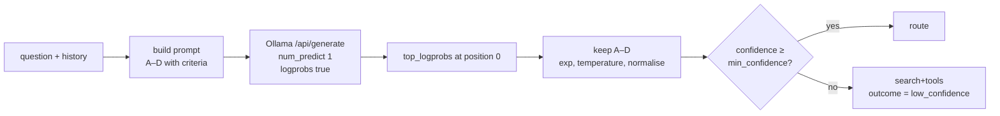

# The fast router: one token, read from the logits

How `merud` picks a route. This design note sits under
[ARCHITECTURE.md](../ARCHITECTURE.md) and covers step 1 of the
[agent loop](../ARCHITECTURE.md#agent-loop). It belongs to v0.1.

Related: [open question 1](../ARCHITECTURE.md#open-questions) asks whether a 2B model
can route. This note answers it by changing the question — the router stops writing
JSON (JavaScript Object Notation) and starts returning a probability.

---

## The problem

The router runs on every turn and decides one of four things:

| Route | Meaning |
| --- | --- |
| `direct` | answer from the model alone |
| `search` | retrieve from the user's files first |
| `tools` | call MCP (Model Context Protocol) tools |
| `search+tools` | both |

Asking a 2B model to write that as JSON has three failure modes. It emits malformed
JSON and the parse fails. It invents a fifth route. It returns valid JSON with a
confident wrong answer and no way to tell.

The first two stall the turn or force a silent default. The third is worse, because
`meru.turn.*` by route is the measurement that settles open question 1, and a silent
default poisons it.

## The mechanism

A route decision is a classification, so read it from the logits instead of parsing
prose.

1. Prompt the `fast` model with the question, the session history and one lettered
   option per route, each with a description.
2. Ask Ollama for **one** token with log probabilities.
3. Take the alternatives at position 0, keep the ones whose text is a route letter,
   and turn each log probability back into a probability.
4. Divide each logit by a stored temperature, then normalise so the four sum to 1.
5. The highest is the route. Its probability is the confidence.

The model decodes a single token, so a turn pays for prompt evaluation and nothing
else. The model cannot name a route that does not exist, because the answer is read
from a fixed set of letters rather than from whatever it wrote.



### Why this model

MiniCPM5-2B already fills the `fast` tier in the `lite` profile and `merud` already
keeps it warm. A route decision costs no extra download, no extra memory and no
extra slot in `OLLAMA_MAX_LOADED_MODELS`. Nothing self-hosted is cheaper than a
model that is already resident.

The model name stays in `config.toml`, as every model name does. This design works
with any model Ollama serves; it assumes nothing about MiniCPM beyond a tokeniser
that emits single letters as their own tokens, which the startup probe checks.

## Scope

**In scope.** The route decision, and only that.

**Out of scope, on purpose.** The query rewrite and the skills to load stay in the
generation call they live in today. A rewrite needs generated text, so it cannot come
from a single token. Skill selection could become a second classification, but one
decision per call means one call per decision, and nobody has measured that the
current path is a problem. Revisit when there is a number.

This keeps the change small: one new path, one prompt, one parser.

## The prompt contract

The prompt ends with a bare `Answer: ` so the next token is the letter. Options carry
a description, because small models lean on the label text.

```text
<system prompt>

Conversation so far:
<history, newest first, within the history budget>

Question:
<the user's question>

Pick the best way to answer it.

A = Answer from what you already know. No files or tools needed.
B = The answer is in the user's own notes, documents or repositories. Retrieve first.
C = The answer needs a tool: live data, an external service, or an action.
D = Both: retrieve from the user's files and call a tool.

Reply with one letter and nothing else.
Answer: 
```

The letter-to-route mapping lives in Go, next to the prompt template, so the two
never drift. Do not read the letters from config; they are part of the prompt.

### Tokeniser detail

A tokeniser may return `A` or ` A` depending on what precedes it. Trim each candidate
token before comparing, and compare case-insensitively. Match on the trimmed text
only, never on a token identifier, because identifiers differ per model.

## Engine changes

The `Engine` interface keeps its four methods. Log probabilities are a request option
and a response field, not a fifth method.

```go
// Options gains two fields. Both default to off, so every existing caller behaves
// as before.
type Options struct {
    // ... existing fields ...

    // LogProbs asks the runtime to report how likely each generated token was.
    LogProbs bool
    // TopLogProbs is how many alternatives to report at each position. Ollama caps
    // this at 20. Zero means "only the chosen token".
    TopLogProbs int
}

// TokenLogProb is one token and how likely the model thought it was, as a natural
// logarithm. Log probabilities are always zero or negative; closer to zero is more
// likely.
type TokenLogProb struct {
    Token   string
    LogProb float64
}

// PositionLogProbs is what the model considered at one position in its answer: the
// token it picked, and the alternatives it weighed.
type PositionLogProbs struct {
    Chosen TokenLogProb
    Top    []TokenLogProb
}

// Completion gains one field, empty unless Options.LogProbs was set.
type Completion struct {
    // ... existing fields ...
    LogProbs []PositionLogProbs
}
```

`OllamaEngine` sets `logprobs` and `top_logprobs` on the request body and copies the
response array across. It converts nothing else; the router owns the arithmetic.

### Ollama version

Log probabilities arrived in Ollama v0.12.11. `merud` reads `/api/version` at startup
and refuses to start below it, with a message naming the version it found and the one
it needs. No compatibility branch, no fallback path — one way to do each thing.

## The router package

`internal/router`. One exported function and one result type.

```go
// Decide picks a route for one turn. It sends a single prompt to the fast model,
// reads the probabilities the model assigned to each route letter, and returns the
// most likely route with its confidence.
//
// It returns an error only when the model call itself fails. A model that answers
// unclearly is not an error: Decide returns the fallback route and says why in
// Outcome, so the caller can carry on and the metrics can record it.
func Decide(ctx context.Context, eng engine.Engine, cfg Config, turn Turn) (Decision, error)

// Decision is what the router concluded.
type Decision struct {
    Route      Route   // the chosen route, or cfg.Fallback
    Confidence float64 // probability of Route after normalisation, 0 to 1
    Outcome    Outcome // ok, low_confidence or degraded
    Probs      map[Route]float64
}

type Outcome string

const (
    // OutcomeOK means the model gave a clear answer above the confidence floor.
    OutcomeOK Outcome = "ok"
    // OutcomeLowConfidence means the winning route scored below min_confidence.
    OutcomeLowConfidence Outcome = "low_confidence"
    // OutcomeDegraded means fewer than two route letters appeared in the
    // alternatives, so the distribution means nothing.
    OutcomeDegraded Outcome = "degraded"
)
```

### The arithmetic

```go
// probs turns the model's log probabilities into a distribution over routes.
//
// Ollama reports a natural logarithm per token. math.Exp turns each back into a
// probability. Dividing the logit by a temperature above 1 flattens the
// distribution; small models are overconfident, and the fitted value for a model
// of this size usually lands between 2 and 2.5. Temperature never changes which
// route wins, only how sure the router claims to be.
func probs(pos engine.PositionLogProbs, temp float64) map[Route]float64 {
    raw := map[Route]float64{}
    for _, alt := range pos.Top {
        r, ok := routeForLetter(alt.Token) // trims and lowercases
        if !ok {
            continue // not one of our letters; ignore it
        }
        raw[r] = math.Exp(alt.LogProb / temp)
    }
    sum := 0.0
    for _, v := range raw {
        sum += v
    }
    if sum == 0 {
        return nil // caller reports OutcomeDegraded
    }
    for r := range raw {
        raw[r] /= sum // normalise so the routes sum to 1
    }
    return raw
}
```

A route letter missing from the alternatives counts as zero. With four letters and
`top_logprobs = 20`, all four appear on any sane prompt; fewer than two appearing
means something is wrong with the prompt or the model, which is what `degraded`
records.

## Config

```toml
[router]
top_logprobs   = 20             # Ollama's cap
temperature    = 1.0            # 1.0 = raw. Fit this later; see Calibration.
min_confidence = 0.45           # below this, take the fallback route
fallback       = "search+tools" # the safe superset: retrieval and tools both allowed
```

`merud` validates all four at startup: `top_logprobs` between 1 and 20, `temperature`
above 0, `min_confidence` between 0 and 1, `fallback` one of the four routes.

`search+tools` is the fallback because it is the only route that cannot make the turn
fail for want of context. It costs more, which is the point — an unsure router should
spend tokens rather than guess.

## Calibration

Raw probabilities from a 2B model are overconfident, so `min_confidence` means little
until a temperature is fitted. Ship `temperature = 1.0` and treat the threshold as
provisional.

Fitting it takes about 200 labelled turns and one scalar, not a training run: sweep
temperature over a small grid, pick the value with the lowest expected calibration
error on held-out rows, write it to config. Worth a `meru router calibrate` command
once there are transcripts to fit on. Out of scope for this note.

## Observability

The `meru.route` span already exists. Add these attributes:

| Attribute | Value |
| --- | --- |
| `meru.route.decision` | the chosen route |
| `meru.route.confidence` | the winning probability |
| `meru.route.outcome` | `ok`, `low_confidence` or `degraded` |

Spans take floats; metrics do not. Add one counter and keep its attributes bounded:

| Metric | Type | Attributes | Answers |
| --- | --- | --- | --- |
| `meru.route.decisions` | counter | route, outcome | how often each route wins, and how often the router is unsure |

Never put the question, the prompt or the probability map on a metric attribute. The
probability map belongs on the span, and only when `capture_content = true`, because
it leaks something about the question.

## Tests

Standard `testing`, table-driven, no assertion library.

- **`probs` arithmetic.** Table of alternative lists and temperatures against expected
  distributions. Include a list with no route letters, one with a single letter, and
  one where two letters tie.
- **Letter matching.** `A`, ` A`, `a`, ` a` all map to the same route. `AB`, `Alpha`
  and `1` map to nothing.
- **Fake Ollama.** `httptest` server returning a canned `logprobs` array. Assert that
  the request body carries `logprobs: true`, the configured `top_logprobs` and
  `num_predict: 1`. No test needs a real model.
- **Outcomes.** Each of `ok`, `low_confidence` and `degraded` reached by a fixture,
  with the fallback route returned for the last two.
- **Version gate.** A fake `/api/version` below v0.12.11 makes startup fail with a
  message naming both versions.

`go test -race ./...` must pass.

## Done when

`merud` routes a turn from a single decoded token, the dashboard shows
`meru.route.decisions` by route and outcome, and the routing call adds under 150 ms to
a warm turn on the development machine.

## What this changes in ARCHITECTURE.md

Per [AGENTS.md](../AGENTS.md), ARCHITECTURE.md changes first and the level 200 and 100
pages follow in the same pull request.

1. **[Agent loop](../ARCHITECTURE.md#agent-loop), step 1** — say the router returns a
   route by classification and the rewrite stays a generation call.
2. **[Who decides what](../ARCHITECTURE.md#who-decides-what)** — the row for the route
   decision gains "reads the probability of each route letter from one decoded token".
3. **[Engine layer](../ARCHITECTURE.md#engine-layer)** — note the two new `Options`
   fields and the `Completion` field, and that the interface stays at four methods.
4. **[Model tiers](../ARCHITECTURE.md#model-tiers)** — record that the `fast` tier now
   needs a runtime that reports log probabilities, and name the Ollama version.
5. **[Metrics](../ARCHITECTURE.md#metrics)** — add `meru.route.decisions`.
6. **[Open questions](../ARCHITECTURE.md#open-questions)** — rewrite question 1. The
   question is no longer whether a 2B model can emit a valid route, but whether its
   probabilities separate the four routes well enough to act on.

## Coding notes this work must add

- `docs/coding-notes/router.md` — what the package does and why a probability beats
  parsed text.
- `docs/coding-notes/engine.md` — update for the new option and result fields.
- `docs/coding-notes/go-basics/maps.md` — first use of a map with a named key type.

## Open items

- Fit a temperature once transcripts exist, and revisit `min_confidence` with it.
- Measure whether skill selection should become a second classification. Needs a
  number first.
- Check MiniCPM5-2B's tokeniser emits `A` through `D` as single tokens. If it does
  not, use four distinct single-token words instead of letters.
