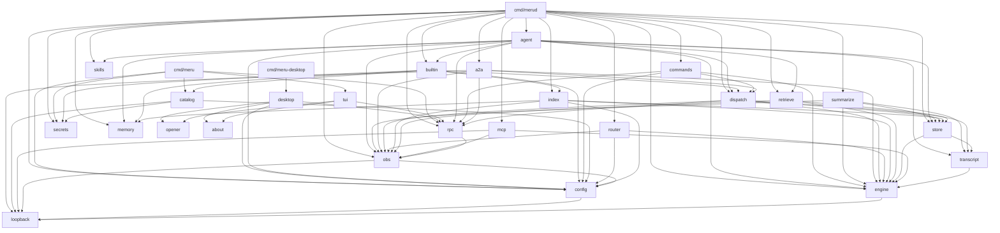
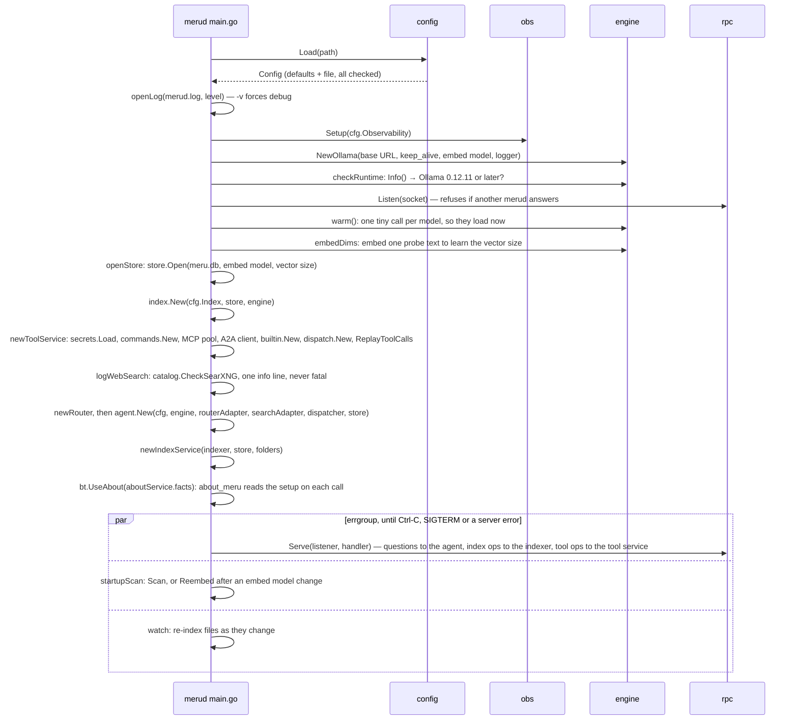

# Meru low-level design, level 100: how the code fits together

This page is a map of Meru's code for someone new to Go. It shows how the code is
organized, the few interfaces that hold it together, and the path one question
takes through the functions, so you know which file to open next.
[ARCHITECTURE.md](../ARCHITECTURE.md) explains *why* Meru is built this way; this
page explains *where* each part lives. It describes v0.3: the v0.1 question path,
the v0.2 store, indexer and hybrid search, and v0.3's tools: `dispatch`, the MCP
and A2A clients, the built-in `configure` tool, approvals over the socket, and
`meru setup`. It also covers the v0.4 work built so far: the profile, memory
recall, session summaries and past conversations, skills and `write_file`, and
the desktop app.

You need three Go ideas to follow it:

- A **package** is a folder of `.go` files that share a name, such as
  `internal/engine`. Code in one package uses another by importing it, then writes
  `engine.Message` or `rpc.Do(...)`.
  ([more](coding-notes/go-basics/packages-and-imports.md))
- A **struct** is a type with named fields, such as a `Config` with a `Profile`
  field. A **method** is a function attached to a type: `func (s *Session) Append(...)`
  can be called as `sess.Append(...)`.
- An **interface** lists methods and nothing else. Any type that has those methods
  satisfies it, without saying so. Meru uses interfaces at the seams between
  packages, so each side can be tested with a fake.
  ([more](coding-notes/go-basics/interfaces.md))

## 1. Two programs and their packages

Meru builds two programs from `cmd/`, plus the desktop app, which builds only with
the `desktop` build tag. Everything else is a package under `internal/`, which Go
allows only code inside this repo to import.

| Package | What it does | Start reading at |
| --- | --- | --- |
| `cmd/merud` | the daemon: starts everything, serves questions, the index ops, the tool ops and the desktop app's settings ops | `main.go`: `main`, `run`, `serve`, then `index.go`, `tools.go`, `connections.go`, `folders.go`, `save.go` and `models.go` |
| `cmd/meru` | the client you type into, plus `meru setup` and `meru mcp` | `main.go`: `run`, `ask`, `ping`, then `approve.go`, `tools.go`, `log.go`, `setup.go`, `mcp.go`, `probe.go` |
| `cmd/meru-desktop` | the desktop app's window (Wails v3, build tag `desktop`): opens it, serves the page, binds the Bridge | `main.go`: `run` |
| `internal/desktop` | everything in the desktop app that needs no window: the Bridge the page calls, the views it sends, and the page (`web/`) | `bridge.go`: `Send`, `run`, then `views.go`, `history.go`, `status.go`, `settings.go`, `files.go`, `commands.go`, `assets.go` |
| `internal/opener` | hands an `http`, `https` or `file` URL to the system's opener, with no shell | `opener.go`: `Check`, `Open` |
| `internal/config` | reads and checks `~/.meru/config.toml` | `load.go`: `Load` |
| `internal/engine` | the `Engine` interface and the Ollama client | `engine.go`, then `ollama.go` |
| `internal/router` | picks a route from one token's probabilities | `router.go`: `Decide` |
| `internal/store` | `meru.db`: documents, chunks, vectors, the keyword index and the `tool_calls` log | `store.go`: `Open`, then `documents.go`, `search.go` and `toolcalls.go` |
| `internal/retrieve` | hybrid search: vector and keyword, merged by reciprocal-rank fusion | `search.go`: `Search`, then `rrf.go` and `format.go` |
| `internal/index` | reads `[index] folders` into the store: skip rules, chunking, watching | `indexer.go`: `Scan`, then `skip.go` and `watch.go` |
| `internal/agent` | runs one turn, from question to answer, with its tool rounds | `agent.go`: `Handle`, then `tools.go`: `converse`, `runTools` |
| `internal/dispatch` | the one path for every tool call: allowlist, approval, call, transcript lines, `tool_calls` row, metrics, span | `dispatch.go`: `Backend`, then `dispatcher.go`: `Dispatch` |
| `internal/a2a` | the A2A client: reads agent cards, turns allowed skills into tools, sends messages | `client.go`: `New`, then `call.go`: `Call` |
| `internal/builtin` | tools that live inside `merud`: `configure`, `datetime` and `about_meru`, and from v0.4 `remember`, `write_file`, the read-only `read_file`, `list_folder`, `grep` and `search_files`, and the web tools `web_search` and `web_fetch` | `builtin.go`: `Confirm`, `Call`; then `files.go`, `web.go`, `webguard.go`: `ConfirmCall` and `webdownload.go` |
| `internal/commands` | the `[[commands]]` entries: startup checks, rendering the model's arguments into an argv, running the program with no shell, and the `dispatch` backend for `cmd.<name>` tools | `commands.go`: `New`, then `render.go`: `Render`, `run.go`: `Run` and `set.go` |
| `internal/catalog` | the starter MCP servers, the config block for each, the safe append to `config.toml`, and the edits of one list in it | `catalog.go`: `Entries`, then `block.go`, `append.go` and `edit.go` |
| `internal/secrets` | `~/.meru/secrets.toml`: load with a mode check, resolve `secret:<name>`, redact, save | `secrets.go`: `Load`, `Resolve`, `Redact`, `Set` |
| `internal/transcript` | reads and writes session files (JSONL), and lists them | `transcript.go`: `New`, `Append`, `History`, then `list.go`: `List` |
| `internal/rpc` | the socket protocol between `meru` and `merud` | `protocol.go`, then `client.go` and `server.go` |
| `internal/obs` | OpenTelemetry metrics and traces | `obs.go` |
| `internal/tui` | the `meru chat` screen (Bubble Tea, Lip Gloss, Glamour), with the desktop app's features as slash commands and boxes | `run.go`: `Run`, then `model.go`, `view.go`, `commands.go` and `box.go` |
| `internal/about` | the tagline, the version and the project's links, for the desktop app and `meru chat` | `about.go`: `Version`, `ShortVersion`, `Links` |
| `internal/loopback` | the rule "this address is on this machine" | `loopback.go`: `CheckURL` |
| `internal/mcp` | the MCP client pool: starts or connects to servers, keeps allowed tools | `pool.go`: `NewPool`, then `call.go` |
| `internal/skills` | loads `SKILL.md` folders, installs the built-in skills, and stamps the folder so `merud` sees edits | `skills.go`: `Load`, then `builtin.go` and `stamp.go` |
| `internal/memory` | one Markdown file per memory under `memory/<kind>/`; `merud` syncs the files into the store, where recall searches them | `memory.go`: `Open`, `Add`, `List` |
| `internal/summarize` | writes a summary line into each quiet session's transcript and embeds it, for recall of past conversations | `summarize.go`: `New`, `Run`, `Tick` |

A few more packages exist only for testing: `internal/policy` (tests that enforce
Meru's rules), `internal/testutil/fakeollama` and `cmd/fakeollama` (a fake Ollama
server), `cmd/fakemcp` (a small MCP server with one allowed tool, one that asks
first and one that is never allowed), and `test/e2e` (tests that run the real
programs).

## 2. Who imports whom

An arrow means "imports". Go refuses to compile a loop of imports, so this picture
is also the order to learn the packages in: start at the bottom.



`skills`, `memory` and `secrets` import only the standard library. `agent`
reads the profile and the skills through them, `builtin` saves memories, and
`index` copies the memory files into the store. `builtin` imports `index` so the
file tools apply the indexer's skip rules instead of a copy, and `agent` imports
`builtin` for `IsFileTool`, which names the file tools the `search` route offers. `mcp` doesn't
know `dispatch`: `cmd/merud/backends.go` wraps the pool in `mcpBackend`, so the
pool stays a plain MCP client.

Three things to notice:

- **`cmd/meru` stays small.** It reaches `rpc`, `tui`, `config` and `loopback`,
  plus `catalog` and `secrets` for `meru setup` and `meru mcp add`, which write
  `config.toml` and `secrets.toml` and talk to no model and no store. It never
  reaches `engine`, `agent`, `transcript`, `store`, `index`, `dispatch`, `mcp` or
  `commands`.
  The client only moves messages; the daemon does the work. A test in
  `internal/policy` fails the build if this ever changes.
- **The desktop app stays smaller still.** `cmd/meru-desktop` imports Wails and
  `internal/desktop`, which reaches only `rpc`, `config` (read, to name the
  answer model), `opener` and `about`. The same policy test checks both, forbids them
  `catalog`, `secrets` and `tui` as well, and fails on any use of Wails'
  self-updater.
- **`loopback` imports nothing of Meru's.** It sits at the bottom so every package
  that talks to an address can use the same check.
- **`store` imports only `engine` and `transcript`,** for the `Vector` type and for
  reading transcripts back when it rebuilds `tool_calls`. It calls no model:
  `index` hands it finished chunks and vectors, and `retrieve` merges its two
  searches.

## 3. The interfaces and types that hold it together

Most of the code is plain functions and structs. A few definitions connect the
packages; learn these and the rest reads easily.

### `engine.Engine`: the only door to a model

```go
// internal/engine/engine.go
type Engine interface {
    Generate(ctx context.Context, msgs []Message, tools []ToolSpec, opts Options) (Completion, error)
    Stream(ctx context.Context, msgs []Message, tools []ToolSpec, opts Options) (iter.Seq2[Delta, error], error)
    Embed(ctx context.Context, texts []string) ([]Vector, error)
    Info(ctx context.Context) (ModelInfo, error)
}
```

`OllamaEngine` in `ollama.go` is the one real implementation; the tests use fakes.
`Generate` waits for the whole answer, and the router uses it. `Stream` hands the
answer back piece by piece, and the agent uses it so text appears as the model
writes it. `iter.Seq2` is Go's type for something you loop over with `for delta,
err := range stream`. ([more](coding-notes/go-basics/iterators.md))

### `rpc.Request` and `rpc.Event`: the socket messages

```go
// internal/rpc/protocol.go
type Request struct {
    Op      Op     // "ask", "ping", "index", "index_status", "tools", "log", ...
    Session string // empty starts a new conversation
    Text    string // the question
    Source  Source // "cli", "tui", "job" or "desktop"
    Scope   string // for "ask": "", "auto", "files", "mail", "web" or "talk"
    Path    string // for "index" and the folder ops: one folder or file
    Limit   int    // for "log": how many rows; zero means merud's default (20)
    Kind    string // for "memory_add" the memory's kind; for "save_file" "chat" or "note"
    ID      string // names the memory, skill, server or secret an op works on
    Policy  *PolicyChange // for "tool_policy": kind, server, tool and off, ask or allow
}

type Event struct {
    Type       EventType    // see the list below
    Session    string
    Text       string       // token text, or one progress line
    Route      string
    Confidence float64
    Fallback   bool         // route event: the router wasn't sure and fell back
    Error      string
    Sources    []Citation   // sources event: the numbered excerpts the answer may cite
    Report     *IndexReport // report event: what one index run did
    Status     *IndexStatus // status event: what the index holds
    Tool       *ToolEvent   // tool_call and tool_result events: ID, name, kind, args or outcome
    Approval   *Approval    // approval event: a call waiting for your answer
    Servers    []ServerInfo // tools event: each tool source and its allowed tools
    Log        []LogEntry   // log event: the newest tool_calls rows
    MCP        []MCPStatus  // mcp_status event: one row per MCP server
    Sessions   []SessionInfo // sessions event: past chats, newest change first
    Turns      []TurnInfo    // turns event: one past chat's questions and answers
    Memories   []MemoryInfo  // memories event: the memory ops, and what an ask recalled
    Connections []Connection // connections event: every tool source, tool by tool
    Catalog    []CatalogEntry // connections event: the catalog servers
    Folders, Suggested []FolderInfo // folders event
    Models     *ModelsInfo   // models event

    // Stats, on the "done" event that ends an ask:
    TTFTMillis     int64 // question received to first token, routing included
    DurationMillis int64 // question received to end of turn
    EvalMillis     int64 // the model's own time spent writing the answer
    TokensIn       int   // prompt tokens
    TokensOut      int   // answer tokens
}
```

`meru` sends one `Request`, as one line of JSON. `merud` answers with a stream of
`Event`s, one per line, and every reply ends with `done` or `error`:

| Op | Events, in order |
| --- | --- |
| `ask` | `session`; `route` (with `Fallback` set when the router wasn't sure); `sources` when the turn searched your files and found something; `memories` when recall put any in the prompt; `token` events for each piece of text; on a tool round, a `tool_call` per call, an `approval` for each call that needs your yes, and a `tool_result` per call as it ends; `notice` when the answer claims an action and no tool call succeeded; `done` with the turn's stats |
| `ping` | `done` |
| `index` | zero or more `progress` lines; one `report`; `done` |
| `index_status` | one `status`; `done` |
| `tools` | one `tools`; `done` |
| `log` | one `log`; `done` |
| `mcp_status` | one `mcp_status`; `done` |
| `sessions` | one `sessions`; `done` |
| `session_turns` | one `turns`, for the session in `Session`; `done` |
| `connections`, `tool_policy`, `mcp_add`, `mcp_remove` | one `connections`; `done` |
| `secret_set` | `done` |
| `folders`, `folder_add`, `folder_remove` | one `folders`; `done` |
| `skill_enable`, `skill_disable` | one `skills`; `done` |
| `save_file` | an `approval` when `write_file` asks; one `saved`, whose `Text` is the path; `done` |
| `models`, `model_use`, `model_save`, `model_set` | one `models`; `done` |

`meru index` sends `index`, and `meru index -status` sends `index_status`. The
desktop app sends `sessions` for its list of past chats and `session_turns` to
reopen one, and the settings ops for its Library and Setup screens:
`internal/rpc/settings.go` holds their types.
`meru tools` sends `tools`, `meru mcp` sends `mcp_status`, and `meru log -n 5`
sends `log` with `Limit` 5. A
`Citation` holds the number the answer cites, the path (as `~/…` under your home
folder), the heading, the line range or PDF page, and the fused score. The `done`
that ends an ask carries the turn's timings and token counts, which `meru chat`
shows under each answer. Fields are only ever added, so an older client reads a
newer `merud` without trouble.

One exchange breaks the "one request, then events" pattern. When a tool call needs
your yes, `merud` sends an `approval` event and waits, and the client writes one
more line back on the same connection:

```go
// internal/rpc/protocol.go
type Approval struct {
    ID      string          // the Reply must carry it back
    Name    string          // the tool's full name, such as "obsidian.obsidian_simple_search"
    Kind    string          // "mcp", "a2a" or "builtin"
    Args    json.RawMessage // the call's arguments
    Choices []Choice        // what the client may offer: "once", "session", "deny"
}

type Reply struct {
    ApprovalID string
    Choice     Choice
}

type ApproveFunc func(ctx context.Context, a Approval) (Choice, error)
```

`configure` offers only `once` and `deny`. A choice the approval didn't offer
counts as deny; the server checks that, and `dispatch` checks it again.

`ApproveFunc` is the same function type on both ends. On the client,
`rpc.Do(ctx, socket, req, approve)` calls it for each `approval` event and writes
the `Reply`; a nil `approve` answers deny. One-shot `meru` passes a prompter that
reads `o`, `s` or `d` from the terminal, or denies when standard input isn't a
terminal; `meru chat` passes a function that opens the approval box and waits for
your key; the desktop app passes one that shows a card in the answer and waits
for a button. On the server, the rpc server builds one per connection and passes it to
the handler, which hands it to `dispatch` inside each call.

### `rpc.Handler`: what the server calls for each request

```go
// internal/rpc/server.go
type Handler func(ctx context.Context, req Request, emit func(Event) error, approve ApproveFunc) error
```

This is a *function type*: any function with this shape is a `Handler`. The server
reads a request, calls the handler, and passes it `emit`, a function the handler
calls to send each event back, and `approve`, which sends an `approval` event and
waits for the client's `Reply`. `emit` takes a lock around each write, because a
round's tool calls emit events from several goroutines at once. `merud`'s
`handler` sends `ask` to `agent.Agent.Handle`, the index ops to the index service
and the tool ops to the tool service.
A handler may emit its own `done`, carrying stats: the server holds it back and
sends it last if the handler returns nil, or drops it and sends `error` if the
handler fails, so every reply ends with exactly one closing event.

### `agent.Router`: how the agent asks for a route

```go
// internal/agent/agent.go
type Router interface {
    Decide(ctx context.Context, question string, history []engine.Message) (Decision, error)
}
```

The agent doesn't import `internal/router`; it only knows this small interface.
`cmd/merud` joins the two with a tiny adapter, `routerAdapter`, that calls
`router.Decide`. That keeps the agent testable with a fake router. The adapter
also holds `[index] folders` and passes them in `router.Turn.Folders`, so the
router's prompt can name them. On each turn it also passes, in
`router.Turn.Tools`, what the tool service reports as connected:
`agent.ConnectedTools` built from config at startup and on each MCP reload.

### `agent.Searcher` and `index.Sink`: how v0.2 reaches the store

```go
// internal/agent/agent.go
func New(cfg config.Config, eng engine.Engine, router Router, search Searcher, tools ToolRunner, turns TurnRecorder, profile Profile, log *slog.Logger) *Agent

type Searcher interface {
    Search(ctx context.Context, query string) ([]retrieve.Result, error)
    SearchSessions(ctx context.Context, query, excludeSession string, n int) ([]retrieve.SessionResult, error) // v0.4
}

// internal/agent/profile.go (v0.4)
type Profile interface {
    Profile() ([]memory.Memory, error)
    Recall(ctx context.Context, query string) ([]retrieve.Memory, error)
}

// internal/index/indexer.go
type Sink interface {
    Document(ctx context.Context, path string) (doc store.Document, ok bool, err error)
    ReplaceDocument(ctx context.Context, doc store.Document, chunks []store.Chunk, vecs []engine.Vector) error
    DeleteDocument(ctx context.Context, path string) error
    Paths(ctx context.Context, prefix string) ([]string, error)
}
```

The same pattern again. `cmd/merud` passes `searchAdapter`, which calls
`retrieve.Search` on the store with the fixed list sizes (50, 50, 10), as the
agent's `Searcher`; a nil `Searcher` turns search off. From v0.4 the same
adapter calls `retrieve.SearchSessions`, which recalls past sessions for the
"From earlier conversations" section. Its `profileAdapter` is the agent's
`Profile`: it reads the `me` and `preferences` memories for every prompt, and
recalls other memories with `retrieve.SearchMemories`. It passes the
`*store.Store` itself as the indexer's `Sink`. Each package's tests pass a fake
instead, so neither needs a database file or a model.

`New` also reads `cfg.Index.Folders` twice. It adds `filesNote` to the system
prompt, which names the folders Meru searches, or says that none are set yet.
And it keeps each folder's last path part, such as `meru`, for the rule that
turns a `direct` route into `search`.

### `agent.ToolRunner` and `dispatch.Backend`: how a turn reaches a tool

```go
// internal/agent/tools.go
type ToolRunner interface {
    Tools() []engine.ToolSpec
    Dispatch(ctx context.Context, c dispatch.Call) (dispatch.Result, dispatch.Outcome)
    Asks(name string) bool // would a call ask first? picks the "search" route's commands
    Refresh(ctx context.Context) // list tools again; one try at each tool server that isn't connected
}

// internal/dispatch/dispatch.go
type Backend interface {
    Kind() string                              // "mcp", "a2a", "builtin" or "command"
    Tools() []engine.ToolSpec                  // allowed tools, by full name
    Confirm(name string) Confirm               // ConfirmNever, ConfirmAsk or ConfirmAlways
    Locate(name string) (server, tool string)  // for rows and metrics
    Call(ctx context.Context, name string, args json.RawMessage) (Result, error)
    Status() []rpc.ServerInfo                  // for `meru tools`
}

// A Backend may also be a Refresher: list each server's tools again, and one
// try at each server it can't reach.
type Refresher interface {
    Refresh(ctx context.Context)
}

// A Backend may also be a CallConfirmer: it decides per call whether the
// call asks, and dispatch asks it before Confirm. ok = false leaves the
// choice to Confirm. builtin.Tools uses it for web_fetch's URL guard.
type CallConfirmer interface {
    ConfirmCall(c Call) (confirm Confirm, ok bool)
}
```

The agent sees tools only through `ToolRunner`. `merud` passes a
`*dispatch.Dispatcher`; tests pass `fakeTools`; nil turns tools off. `Dispatch`
returns no error. A call that couldn't run still comes back with an outcome
(`denied`, `declined`, `error`, `timeout` or `cancelled`) and a `Result` whose text
tells the model what happened.

A `dispatch.Call` carries the call's ID, the tool's full name, the arguments, the
session, the user's words (`Question`: this turn's question and the earlier ones
in the history, which `web_fetch`'s guard reads), the source, the trace ID, and
two functions: `Append`, which writes a
transcript line through the agent, and `Approve`, the rpc server's
`ApproveFunc`. `dispatch` never touches the socket or the session file itself.

`Backend` is the one interface with four implementations, which is why it
exists: `builtin.Tools`, `*commands.Set`, `mcpBackend` (in
`cmd/merud/backends.go`, wrapping `*mcp.Pool`) and `*a2a.Client`.
`cmd/merud/tools.go` builds them in that order in `newToolService`. When two
backends offer the same name, the first keeps it, so no server can shadow
`configure` or a `cmd.` tool. `*commands.Set` is also a `dispatch.Auditor`: its
`AuditArgs` returns the argv a call will run, and `dispatch` records that in
place of the model's arguments in the `tool_call` line, the approval prompt and
the row. `Dispatcher.Replace` swaps in a new MCP backend
after `configure` changes the servers. `dispatch.Recorder`, one method,
`InsertToolCall`, is how `dispatch` writes the row; `*store.Store` satisfies it.

`mcpBackend` is the one `Refresher`. `merud` tries each MCP server once, in
`mcp.NewPool`, and never again on its own: no timer, no background goroutine, no
retry loop. On a turn on a tools route, `Handle` calls `ToolRunner.Refresh`,
which `Dispatcher.Refresh` passes to each backend that is a `Refresher`.
`mcp.Pool.Refresh` sends `tools/list` to each connected server (2 seconds,
`relistTimeout`) and keeps the answer; a listing that fails for any reason but
time drops the session. It then gives each server that isn't connected one try:
5 seconds for an HTTP server (`httpRetryTimeout`), 30 for a stdio child
(`connectTimeout`). `Handle` then lists the tools again, so a server the user
started after `merud`, restarted with new tools, or a child that crashed, is back
for this turn with its current tools. `Pool.Tools` offers only connected servers'
tools, and a call to a server that isn't connected fails at once with
`mcp.ErrUnavailable`. A call whose session is gone marks the server not
connected and isn't sent again, since the tool may already have run. One goroutine per
session waits for it to end and marks the server not connected; it never starts
the server again (ARCHITECTURE.md, "MCP").

`Handle` also calls `Tools()` on each turn for a second route rule. `toolTarget`
looks for a sign that the question points at a connected tool: it names an MCP
server or A2A agent (`toolServers`), says "remember", asks for the web
(`asksForWeb`), gives a URL (`givesURL`), or names what a server's tools act on. When it finds one and the route has no tools, `withTools`
adds them, `direct` to `tools` and `search` to `search+tools`. On a `tools` turn
the same sign skips the search of your files (`aboutFiles`). It reads the names
each turn because `configure` can add a server while `merud` runs.

### `config.Config`: settings, checked once

```go
// internal/config/config.go
type Config struct {
    Profile       string        // "lite" or "full"
    Models        Models        // the model for each tier: Fast, Main, Embed
    Ollama        Ollama        // BaseURL (loopback only) and KeepAlive
    Agent         Agent         // MaxRounds, HistoryTurns, SystemPrompt
    Router        Router        // the router's four settings
    Observability Observability // OTLPEndpoint and friends
    Log           Log           // Level: "debug", "info", "warn" or "error"
    Index         Index         // Folders, Ignore, MaxFileMB, ChunkTokens, OverlapTokens, Watch
    MCP           MCP           // Servers: the [[mcp.servers]] entries (v0.3)
    A2A           A2A           // Agents: the [[a2a.agents]] entries (v0.3)
    Builtin       Builtin       // Confirm: built-in tools that ask first (v0.3)
    Web           Web           // SearXNGURL (loopback only), Fetch, MaxResults (v0.3)
    Dir           string        // Meru's home, usually ~/.meru
}
```

`config.Load` fills in defaults, reads the file over them and checks every value.
After it returns, no other package re-checks config.

## 4. What happens when merud starts



All of this is in `cmd/merud/main.go` (`run` and `serve`), `cmd/merud/runtime.go`
(`checkRuntime` and `warm`), `cmd/merud/index.go` (`startupScan`, `watch` and the
adapters) and `cmd/merud/tools.go` (`newToolService`, `handleTools`, `handleLog`,
`reloadMCP` and `logWebSearch`).

`newToolService` loads `secrets.toml` first and fails when other users can read
it, then checks the `[[commands]]` entries with `commands.New`, starts the MCP
pool and builds the A2A client, which contacts no agent until a turn needs one.
It joins the built-in tools, the commands, the pool and the A2A client in one
`Dispatcher`, in that order. Last, `store.ReplayToolCalls` rebuilds
`tool_calls` from the transcripts, but only when the table is empty, so a deleted
`meru.db` loses no history. A bad `[[commands]]`, `[[mcp.servers]]` or
`[[a2a.agents]]` entry stops `merud` here, with a message that names the entry
and the key; a command's program missing from `PATH` only logs a warning. The probe asks the embedding model rather than config for the vector
size, so a new embedding model can't leave a stale number behind; when the model or
the size changed, `store.Open` drops the old vectors and the startup scan re-embeds.

The three last steps run side by side in an `errgroup` (from `golang.org/x/sync`),
so `merud` answers questions while the first scan is still running. The group
cancels the other two if `Serve` fails; the scan and the watcher log their own
errors and never stop the server. A scan and a `meru index` run take turns, so two
walks never race over the same files. `signal.NotifyContext` turns Ctrl-C into a
cancelled `context.Context`, and every step watches that context, so `merud` stops
cleanly wherever it is. ([more on context](coding-notes/go-basics/context.md))

`logWebSearch` runs `catalog.CheckSearXNG` against `[web] searxng_url` and logs
`web search ready`, `web search not ready` with the reason, or `web search off`.
The check asks SearXNG for an empty query, which SearXNG refuses without asking
any search engine, and gives up after 3 seconds. A missing SearXNG never stops
`merud`: `web_search` reports the same problem to the model when it runs.

## 5. One question, function by function

Follow `meru "search my obsidian vault for garden notes"` through the code. The
router picks `search`, the question names the `obsidian` server, so the turn
searches your files and offers tools. The model calls one tool, then answers. A
question such as "what is the capital of France?" takes the same path with no
search and no tool round:

```mermaid
sequenceDiagram
    participant U as meru (cmd/meru)
    participant S as rpc server
    participant A as agent.Handle
    participant T as transcript
    participant RT as router.Decide
    participant E as OllamaEngine
    participant D as dispatch

    U->>S: rpc.Do(ctx, socket, Request{Op: "ask", Text: ...}, approve)
    S->>A: Handle(ctx, req, emit, approve)
    A->>T: New() or Open(id) → Session
    A-->>U: emit session event
    A->>T: History(n) → earlier turns
    A->>T: Append(user line)
    A->>RT: Decide(question, history)
    RT->>E: Generate(one token, log probabilities)
    E-->>RT: Completion with log probabilities
    RT-->>A: Decision{Route, Confidence, Outcome}
    A->>A: namesFolder, toolTarget, withTools: search → search+tools
    opt a file turn (aboutFiles): search or search+tools, or tools with no tool target
        A->>A: searchFiles → retrieve.Search (embed, vector, keyword, rrf)
    end
    A->>A: askedWebFirst or namedWebFirst; withTools when the web goes first
    A-->>U: emit route event
    A-->>U: emit sources event, when the search found some
    opt the route offers tools
        A->>D: Refresh: list each MCP server's tools again; one try at each one not connected
        A->>A: toolSpecs(route) again
    end
    opt the web goes first
        A->>D: runWebFirst → runCalls: web_search or web_fetch, Caller "meru"
    end
    A->>A: prompt(system prompt + toolsNote + fileToolsNote + excerpts + "From the web", history, question)
    A->>E: round 1: Stream(messages, toolSpecs(route))
    E-->>A: Delta{ToolCalls: obsidian.obsidian_simple_search}
    A-->>U: emit tool_call event
    A->>D: Dispatch(Call{ID, Name, Args, Question, Append, Approve})
    D->>T: Append(tool_call line)
    opt the tool is on a confirm list, or ConfirmCall says this call asks
        D-->>U: approval event (through Approve)
        U-->>D: Reply{Choice}
        D->>T: Append(approval line)
    end
    D->>D: backend.Call → MCP server
    D->>T: Append(tool_result line)
    D->>D: store.InsertToolCall, obs.RecordToolCall, end meru.dispatch span
    D-->>A: Result{Text}, Outcome
    A-->>U: emit tool_result event
    A->>E: round 2: Stream(messages + call + result, toolSpecs(route))
    loop each piece of the answer
        E-->>A: Delta{Text}
        A-->>U: emit token event
    end
    A->>T: Append(assistant line, summed token counts, web notes)
    A-->>S: emit done event with the turn's stats
    S-->>U: done event (sent last)
```

The same path as a reading list, in order:

1. **`cmd/meru/main.go` → `ask`** builds a `Request` and calls `rpc.Do` with the
   prompter's `approve` (`approve.go`), then prints each `token` event's text as it
   arrives. Tool calls show on standard error as dim lines, `→` when a call starts
   and `✓` or `✗` when it ends. When a `sources` event came, it prints `Sources:`
   after the answer, with the sources `rpc.Cited` finds cited in it. An answer
   that cites none gets no list.
2. **`internal/rpc/client.go` → `Do`** connects to the socket, writes the request
   as one JSON line, and reads events back until `done` or `error`. For an
   `approval` event it calls `approve` and writes the `Reply` line.
3. **`internal/rpc/server.go` → `serveConn`** reads the request and calls the
   handler with `emit` and an `approve` for this connection. If the client hangs
   up, `watchHangup` cancels the turn's context.
4. **`internal/agent/agent.go` → `Handle`** runs the turn: it opens the session,
   reads the history, saves the question, asks for a route, builds the prompt,
   streams the answer and saves it, then emits a `done` event with the turn's
   stats (`doneEvent`). Each step is a short function below `Handle`, with its own
   span and debug line: `openSession`, `appendLine`, `routeAndPick`,
   `searchFiles`, `prompt` and `answer`. `routeAndPick` (`skills.go`) asks for
   the route and, at the same time, asks the fast model which skills the
   question needs; `skillsSection` then puts the skill list and the picked
   skills' instructions into the prompt. On a route with tools, `converse` (`tools.go`) runs the
   rounds instead of one `answer`.
5. **`internal/router/router.go` → `Decide`** writes the A-to-D prompt (`prompt.go`),
   asks the fast model for one token, and turns the log probabilities into a route
   (`probs.go`). The prompt names the `[index] folders` on option B's line.
   Back in `Handle`, a `direct` route becomes `search` when the question names an
   indexed folder as a whole word (`namesFolder`), and a route without tools gains
   them when the question points at a connected tool (`toolTarget`, `withTools`).
   Last, `skillTools` (`skills.go`) adds the tools a picked skill's
   `allowed-tools` names, when config allows them, and widens the route to match;
   a skill whose tools are all off leaves the prompt. These rules run in
   `respond`, the part of `Handle` between the question and the answer. After
   the search of your files, `respond` decides whether the web goes first
   (`webfirst.go`): `askedWebFirst` for a question that asks for the web or
   gives a URL, `namedWebFirst` for one that names a thing the excerpts don't
   cover. `runWebFirst` then runs the calls through `runCalls`, the function the
   model's calls use, with `Caller` set to `dispatch.CallerMeru`, and puts the
   results under "From the web".
6. **`internal/agent/agent.go` → `searchFiles`**, on a file turn (`aboutFiles`:
   `search` and `search+tools`, and `tools` when the question points at no
   connected tool), calls
   **`internal/retrieve/search.go` → `Search`** with the query from `searchQuery`:
   the question alone when it has three or more subject words (`subjectWords`),
   and otherwise the question plus the session's latest earlier question that
   isn't only filler words (`namesSubject`). No model rewrites it. `Search` embeds the query, runs
   `store.SearchVector` and `store.SearchKeyword`, merges the two lists with `rrf`
   (50 hits from each, 10 kept), and loads the top chunks with `store.Chunks`. `retrieve.Format`
   numbers them, and the agent puts them under the system prompt and sends the
   same numbered list to the client as a `sources` event. A failed search is logged
   and the turn answers without your files.
7. **Back in `Handle`**, when `toolSpecs(route)` isn't empty, `Handle` calls
   `ToolRunner.Refresh` once and then `toolSpecs` again, so a server that answers
   now, or whose tools changed, joins this turn with its current tools. A server
   that still fails is left out.
8. **`internal/agent/tools.go` → `converse`** runs the rounds. Each round calls
   `answer` with the schemas from `toolSpecs(route)`, or none on the last allowed
   round (`[agent] max_rounds`, default 8) and after the model has repeated a
   call twice. Each call caps the model at `[agent] max_output_tokens`. When the
   model calls tools, `runRound` hands back the earlier result for a call it
   already made (same name, same arguments), and `runTools`, through `runCalls`,
   gives each new call an ID, emits `tool_call`, and runs the calls at the same time in an
   `errgroup`, each through `ToolRunner.Dispatch`. Each result goes back to the
   model as a `RoleTool` message, in call order, and each call emits
   `tool_result` as it ends. The loop stops when a round has no tool calls. When
   that round has no text either and the turn has a round left, `retryEmpty`
   asks the model once more with no tools and a nudge to answer. The
   whole turn runs under `[agent] turn_timeout`; a turn that runs out of time,
   hits the token cap or ends with no text answers with an apology
   (`endTurn`).
9. **`internal/dispatch/dispatcher.go` → `Dispatch`** finds the backend that
   offers the tool, or ends the call as `denied`. It writes the `tool_call` line,
   asks through `approve` when the tool needs a yes, runs `Backend.Call`, swaps long base64 runs in an MCP or
   A2A result for a note (`stripBase64`), adds the text of a mail
   attachment such a call saved (`Options.Attachments`), redacts
   secrets, cuts the result (16,000 characters for the model, 4,000 for the log),
   and writes the `tool_result` line, the `tool_calls` row, the metrics and the
   `meru.dispatch` span.
10. **`internal/engine/ollama.go` → `Generate` and `Stream`** turn Meru's types into
    Ollama's JSON (`ollama_wire.go`), send the HTTP request, and turn the reply back.
    Ollama sends each tool call whole, in a chunk of its own.
11. **`internal/transcript/transcript.go` → `Append`** adds one JSON line to the
    session file; `History` reads only the user and assistant lines back into
    messages, so earlier tool results stay out of later prompts.

Along the way, `internal/obs` records the timings and token counts, and each stage
opens a span under one trace per question: `rpc.request` at the root, `meru.turn`
under it, and a span for each step (ARCHITECTURE.md, "Observability" → "Traces").
With `merud -v`, each stage also writes a debug line to `merud.log` that carries
the trace's ID. When no metrics endpoint is set, the metric calls do nothing and
the spans record nothing, but each question still gets a trace ID for the log.

`meru chat` takes the same path. The only difference is at the ends:
`internal/tui` sends the `Request`, draws the events on screen with Lip Gloss
instead of printing them, renders the finished answer as Markdown with Glamour,
and passes the session ID back each time so the conversation continues. Its
`approve` opens an approval box, with deny selected, and waits for your key.

### `meru tools` and `meru log`, function by function

1. **`cmd/meru/tools.go` → `toolsCmd`** sends `tools`. `merud`'s
   **`handleTools`** emits one `tools` event from `Dispatcher.Servers`, which joins
   each backend's `Status`. `toolsText` prints each source, whether `merud`
   reached it, its allowed tools and which ask first, and for a local command the
   argv template it runs.
2. **`cmd/meru/log.go` → `logCmd`** sends `log` with `-n` as `Limit`.
   **`handleLog`** reads the newest rows with `store.ToolCalls` and cuts each
   result to 300 characters. `writeLog` lines them up with `text/tabwriter`; `-v`
   adds each result under its row. A local command's row shows the argv it ran,
   as a command line.

### `meru setup` and `meru mcp add`

These talk to you, so they live in the client (`cmd/meru/setup.go`, `mcp.go`
and `probe.go`). They read the catalog from `internal/catalog` and save keys
with `secrets.Set`. Before writing, `probeAndPick` sends `mcp_probe`, shows the
tools `merud` found, and lets you pick which the model may use.
`catalog.AppendServer` then appends the block to `config.toml`, loads the result
from a temporary copy, and renames it into place only when it loads; `meru mcp
remove` takes a block out the same way with `catalog.RemoveServer`. Both end
with `mcp_reload`. The built-in `configure` tool calls the same `AppendServer`,
so chat and terminal write the same block.

The catalog holds two entries, in this order: `google` (Gmail, Calendar, Drive
and Docs) and `obsidian` (notes). Web search is built in, so it has no entry;
`setupCmd`'s Web search step calls `checkWebSearch`, which runs
`catalog.CheckSearXNG` and on failure prints the container commands or the
`formats` setting, then waits for Enter or `s`. `google` is a `url` entry
the user starts; its `Entry.Start` holds the command, which `meru mcp add` prints
and never runs. Before it probes such an entry, `doIt` asks `urlAnswers`, a
one-second TCP dial to the URL's host and port. When nothing answers, it skips
the probe and writes the catalog's lists.

### `/model gemma-moe`, function by function

1. **`internal/tui/models.go` → `modelCommand`** refuses while an answer
   streams, then sends `model_use` with `ID` `gemma-moe` through `modelsCmd`,
   which waits up to three minutes. `meru model use` does the same from
   `cmd/meru/model.go`, and the desktop app from `Bridge.UseModelSet`.
2. **`cmd/merud/models.go` → `handleModelUse`** finds the set with
   `config.FindSet`, refuses one that changes `embed` without `Rebuild`, and
   takes `switchMu`.
3. **`switchMain`** checks `Pulled` for the new model, calls
   `OllamaEngine.Unload` on the old one (`keep_alive: 0`), polls `Info` in
   `waitUnloaded` until `/api/ps` drops it, loads the new model with a
   one-token `Generate`, then calls `agent.SetMain(model, noThink)`.
4. **`handleModelUse`** records the set in use and replies with `info`, the
   `models` event, with any `Warning`. `applyModels` in the chat puts the result
   on the notice line and the set's name in the header.
5. **The next turn**: `agent.answer` reads the model and `noThink` together,
   and `Handle` calls `noteModel`, which writes a `model_switch` line before the
   answer. `store.turnsOf` reads that line when it rebuilds `turns`, and
   `Store.UsageByModel` adds the rows up for `/usage by model`.

### `meru mcp` and `/mcp`, function by function

1. **`cmd/meru/mcp.go` → `mcpStatus`** sends `mcp_status` and collects the rows.
   With `--json` it prints them as a JSON array; otherwise it prints
   `tui.MCPTable(rows)`. In `meru chat`, `/mcp` opens the app's Connections
   instead: it sends `connections` and changes a tool with `tool_policy`
   (`internal/tui/mcp.go`, `mcpKey`).
2. **`cmd/merud/tools.go` → `handleMCPStatus`** reads `mcp.Pool.Status` and
   emits one `mcp_status` event. It sends nothing to any server, so it answers at
   once while one is down.
3. **`cmd/merud/backends.go` → `mcpStatus`** turns each `mcp.ServerStatus` into
   an `rpc.MCPStatus`: `State` is `connected` or `not connected`, `Tools` is
   `-1` for a server that isn't connected (the table shows `—`), and `Allowed`
   and `Confirm` come from config, so they show either way.

### `meru index`, function by function

1. **`cmd/meru/index.go` → `indexCmd`** parses `-status` (or `--status`) and an
   optional path, which it makes absolute, because `merud` runs in another folder.
2. **`cmd/merud/main.go` → `handler`** sends `index` and `index_status` to the
   `indexService` in `cmd/merud/index.go`.
3. **`handleIndex`** refuses when `[index] folders` is empty, or when the path sits
   outside every folder, and names the config file to change. Otherwise **`run`**
   waits for its turn, then calls **`index.Indexer.Scan`** (or `Reembed` after an
   embedding model change) for every folder, or **`IndexPaths`** for one path, and
   emits `progress` lines and one `report`.
4. **`handleStatus`** reads `store.Stats` and the last scan's report, and emits one
   `status`.

The indexer records a `meru.index.scan` span for a full scan and a `meru.index.file`
span for each file, in traces of their own (ARCHITECTURE.md, "Traces").

### The desktop app, function by function

1. **`cmd/meru-desktop/main.go` → `run`** reads `-socket`, builds the options
   with **`desktop.DefaultOptions`** (the socket, the answer model from
   `config.toml`, the home folder), makes the Bridge with **`desktop.New`**, and
   gives it Wails' `app.Event.Emit` as its emit function. It serves the page with
   **`desktop.Assets`**, binds the Bridge as a Wails service and opens the window.
2. **The page** (`internal/desktop/web/js/app.js`) calls the Bridge's methods by
   name through Wails' runtime (`api.js`) and listens for one event,
   `meru:update`.
3. **`Bridge.Send`** trims the question. If a turn runs, it queues the question
   (five at most) and emits a `queue` update; otherwise **`start`** numbers the
   turn, emits `start`, and runs **`run`** in a goroutine.
4. **`run`** ranges over **`rpc.Do`** with source `desktop`. **`event`** turns
   each event into an `Update`: a `session` event sets the session the next
   questions go to, and a tool event gets its `Step` from **`stepOf`**. An
   `approval` event reaches **`approver`**, which emits the card from
   **`approvalView`** and waits for **`Bridge.Approve`** or the turn's end.
5. **`finish`** emits `end` with **`contacted`**'s list, then starts the oldest
   queued question. **`Stop`** cancels the turn, which closes the connection,
   and drops the queue.
6. **`Sessions`** and **`SessionTurns`** send the `sessions` and
   `session_turns` ops. In `merud`, **`historyService`**
   (`cmd/merud/history.go`) answers them with **`transcript.List`** and
   **`turnsOf`**, from the JSONL files alone.
7. **`OpenURL`** and **`OpenSource`** pass links to **`opener.Open`**, which
   refuses anything but `http`, `https` and `file`.
8. **The Library and Setup** (`library.js`, `setup.js`) call the methods in
   `settings.go`, each of which sends one op through **`one`**, with a longer
   wait for an op that changes a setting. In `merud`, **`handleToolPolicy`**,
   **`handleMCPAdd`**, **`handleMCPRemove`** and **`handleSecretSet`**
   (`cmd/merud/connections.go`) write `config.toml` or `secrets.toml` with
   **`catalog.SetEntryLists`**, **`catalog.SetTableLists`**,
   **`catalog.AppendServer`**, **`catalog.RemoveServer`** and **`secrets.Set`**,
   under **`builtin.Tools.EditConfig`**, the lock `configure` holds, then reload
   the MCP pool, the A2A client or the built-in lists. **`changeFolders`**
   (`folders.go`) edits `[index] folders`, calls **`index.Indexer.SetFolders`**
   and wakes **`watchAndRescan`**, which restarts the watcher and scans.
9. **Share as file and Save to a note** call **`SaveChat`** or **`SaveNote`**
   (`files.go`), which sends `save_file` with an **`approver`** whose cards carry
   the task `save`. In `merud`, **`saveService.handleSave`** (`save.go`) writes
   the Markdown with one **`dispatcher.Dispatch`** call to `write_file`.
10. **A scoped question.** The composer's switch goes to **`Send`** as the scope.
    **`Agent.Handle`** checks it with **`scopeOf`**, and **`respond`** hands a
    turn whose scope isn't auto to **`respondScoped`** (`internal/agent/scope.go`),
    which skips the router and takes its tools from **`scopeSpecs`**. Both paths
    end in **`finishPrompt`**, which sends the `memories` event before the prompt.

## 6. Where errors and cancellation go

- **Errors travel up.** A function that can fail returns an `error` as its last
  result, and the caller checks it on the next line: `if err != nil { return
  fmt.Errorf("route: %w", err) }`. Each layer adds a few words of context, so the
  message that reaches you reads like a path: `meru: route: ollama /api/chat: …`.
  ([more](coding-notes/go-basics/errors.md))
- **Cancellation travels down.** Every function that waits on something takes a
  `ctx context.Context` first. Ctrl-C in `meru` closes the connection; the server
  sees the hang-up and cancels `ctx`; the engine's HTTP request stops; each open
  tool call ends as `cancelled`, and its `tool_calls` row still goes in; the agent
  writes no answer line for the cancelled turn.
- **The server always ends a reply.** If the handler returns an error, the server
  sends an `error` event; otherwise it sends `done`. The client never waits on a
  reply that won't come.

## 7. Where the tests are

Every package has `_test.go` files next to its code; `go test ./internal/agent/`
runs one package's tests. There are three kinds:

| Kind | Where | What it uses |
| --- | --- | --- |
| Unit tests | next to the code in each package | fakes: a fake `Engine`, a fake `Router`, `httptest` servers |
| End-to-end tests | `test/e2e/` (build tag `e2e`) | the real `merud` and `meru` binaries, against `cmd/fakeollama` and `cmd/fakemcp` |
| Integration tests | build tag `integration` | your real Ollama and models, opt-in |

`make check` runs all of them except the opt-in ones, plus every lint and security
check. [coding-notes/testing.md](coding-notes/testing.md) and
[coding-notes/e2e.md](coding-notes/e2e.md) explain how the tests work.

## 8. Where to go next

- **Each package in depth:** [docs/coding-notes/](coding-notes/), one note per
  package, in reading order, with short notes on each Go idea the code uses.
- **Why it is built this way:** [ARCHITECTURE.md](../ARCHITECTURE.md), and the
  gentler [level 100](architecture/100.md) and [level 200](architecture/200.md)
  versions.
- **Rules for changing the code:** [AGENTS.md](../AGENTS.md).
- **Running it:** [docs/running.md](running.md).
