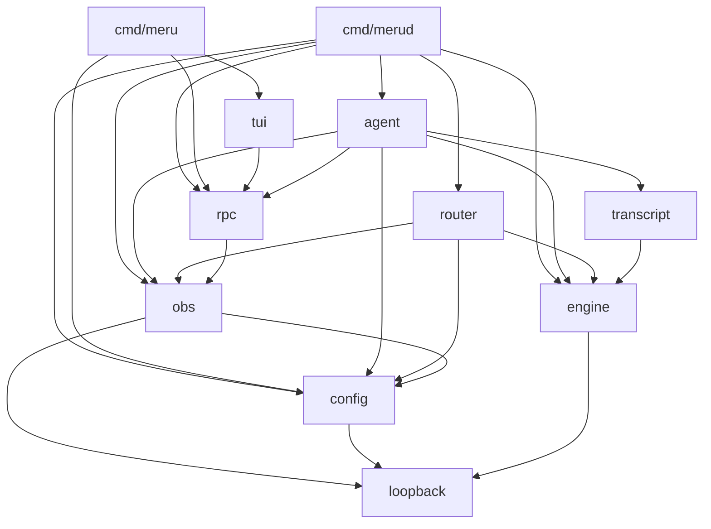
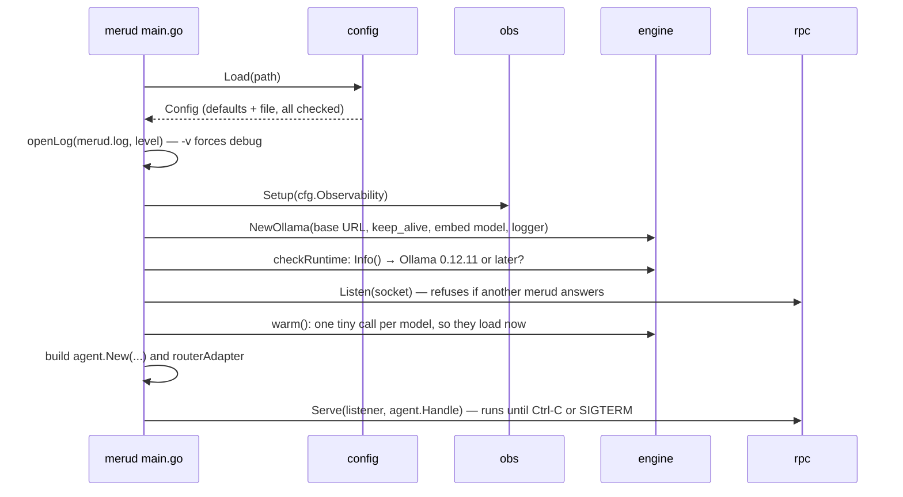
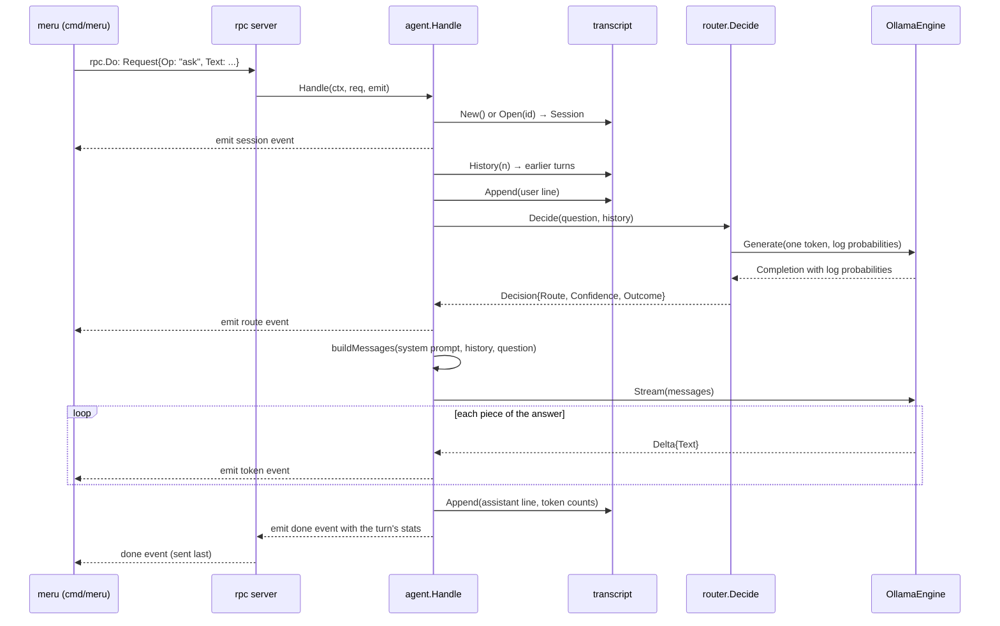

# Meru low-level design, level 100: how the code fits together

This page is a map of Meru's code for someone new to Go. It shows how the code is
organized, the few interfaces that hold it together, and the path one question
takes through the functions, so you know which file to open next.
[ARCHITECTURE.md](../ARCHITECTURE.md) explains *why* Meru is built this way; this
page explains *where* each part lives. It describes v0.1.

You need three Go ideas to follow it:

- A **package** is a folder of `.go` files that share a name, such as
  `internal/engine`. Code in one package uses another by importing it, then writes
  `engine.Message` or `rpc.Do(...)`.
  ([more](coding-notes/go-basics/packages-and-imports.md))
- A **struct** is a type with named fields, such as a `Config` with a `Profile`
  field. A **method** is a function attached to a type: `func (s *Session) Append(...)`
  can be called as `sess.Append(...)`.
- An **interface** lists methods and nothing else. Any type that has those methods
  satisfies it, without saying so. Meru uses interfaces at the seams between
  packages, so each side can be tested with a fake.
  ([more](coding-notes/go-basics/interfaces.md))

## 1. Two programs, eleven packages

Meru builds two programs from `cmd/`. Everything else is a package under
`internal/`, which Go allows only code inside this repo to import.

| Package | What it does | Start reading at |
| --- | --- | --- |
| `cmd/merud` | the daemon: starts everything and serves questions | `main.go`: `main`, `run`, `serve` |
| `cmd/meru` | the client you type into | `main.go`: `run`, `ask`, `ping` |
| `internal/config` | reads and checks `~/.meru/config.toml` | `load.go`: `Load` |
| `internal/engine` | the `Engine` interface and the Ollama client | `engine.go`, then `ollama.go` |
| `internal/router` | picks a route from one token's probabilities | `router.go`: `Decide` |
| `internal/agent` | runs one turn, from question to answer | `agent.go`: `Handle` |
| `internal/transcript` | reads and writes session files (JSONL) | `transcript.go`: `New`, `Append`, `History` |
| `internal/rpc` | the socket protocol between `meru` and `merud` | `protocol.go`, then `client.go` and `server.go` |
| `internal/obs` | OpenTelemetry metrics and traces | `obs.go` |
| `internal/tui` | the `meru chat` screen (Bubble Tea, Lip Gloss, Glamour) | `run.go`: `Run`, then `model.go` and `view.go` |
| `internal/loopback` | the rule "this address is on this machine" | `loopback.go`: `CheckURL` |

Three more packages exist only for testing: `internal/policy` (tests that enforce
Meru's rules), `internal/testutil/fakeollama` and `cmd/fakeollama` (a fake Ollama
server), and `test/e2e` (tests that run the real programs).

## 2. Who imports whom

An arrow means "imports". Go refuses to compile a loop of imports, so this picture
is also the order to learn the packages in: start at the bottom.



Two things to notice:

- **`cmd/meru` stays small.** It reaches `rpc`, `tui` and `config`, and never
  `engine`, `agent` or `transcript`. The client only moves messages; the daemon
  does the work. A test in `internal/policy` fails the build if this ever changes.
- **`loopback` imports nothing of Meru's.** It sits at the bottom so every package
  that talks to an address can use the same check.

## 3. The five interfaces and types that hold it together

Most of the code is plain functions and structs. Five definitions connect the
packages; learn these and the rest reads easily.

### `engine.Engine`: the only door to a model

```go
// internal/engine/engine.go
type Engine interface {
    Generate(ctx context.Context, msgs []Message, tools []ToolSpec, opts Options) (Completion, error)
    Stream(ctx context.Context, msgs []Message, tools []ToolSpec, opts Options) (iter.Seq2[Delta, error], error)
    Embed(ctx context.Context, texts []string) ([]Vector, error)
    Info(ctx context.Context) (ModelInfo, error)
}
```

`OllamaEngine` in `ollama.go` is the one real implementation; the tests use fakes.
`Generate` waits for the whole answer, and the router uses it. `Stream` hands the
answer back piece by piece, and the agent uses it so text appears as the model
writes it. `iter.Seq2` is Go's type for something you loop over with `for delta,
err := range stream`. ([more](coding-notes/go-basics/iterators.md))

### `rpc.Request` and `rpc.Event`: the socket messages

```go
// internal/rpc/protocol.go
type Request struct {
    Op      Op     // "ask" or "ping"
    Session string // empty starts a new conversation
    Text    string // the question
    Source  Source // "cli", "tui" or "job"
}

type Event struct {
    Type       EventType // "session", "route", "token", "done" or "error"
    Session    string
    Text       string
    Route      string
    Confidence float64
    Fallback   bool   // route event: the router wasn't sure and fell back
    Error      string

    // Stats, on the "done" event that ends an ask:
    TTFTMillis     int64 // question received to first token, routing included
    DurationMillis int64 // question received to end of turn
    EvalMillis     int64 // the model's own time spent writing the answer
    TokensIn       int   // prompt tokens
    TokensOut      int   // answer tokens
}
```

`meru` sends one `Request`, as one line of JSON. `merud` answers with a stream of
`Event`s, one per line: first `session`, then `route` (with `Fallback` set when the
router wasn't sure), then one `token` per piece of the answer, and finally `done` or
`error`. The `done` that ends an ask carries the turn's timings and token counts,
which `meru chat` shows under each answer. Fields are only ever added, so an older
client reads a newer `merud` without trouble.

### `rpc.Handler`: what the server calls for each request

```go
// internal/rpc/server.go
type Handler func(ctx context.Context, req Request, emit func(Event) error) error
```

This is a *function type*: any function with this shape is a `Handler`. The server
reads a request, calls the handler, and passes it `emit`, a function the handler
calls to send each event back. `agent.Agent.Handle` is the handler `merud` uses.
A handler may emit its own `done`, carrying stats: the server holds it back and
sends it last if the handler returns nil, or drops it and sends `error` if the
handler fails, so every reply ends with exactly one closing event.

### `agent.Router`: how the agent asks for a route

```go
// internal/agent/agent.go
type Router interface {
    Decide(ctx context.Context, question string, history []engine.Message) (Decision, error)
}
```

The agent doesn't import `internal/router`; it only knows this small interface.
`cmd/merud` joins the two with a tiny adapter, `routerAdapter`, that calls
`router.Decide`. That keeps the agent testable with a fake router.

### `config.Config`: settings, checked once

```go
// internal/config/config.go
type Config struct {
    Profile       string        // "lite" or "full"
    Models        Models        // the model for each tier: Fast, Main, Embed
    Ollama        Ollama        // BaseURL (loopback only) and KeepAlive
    Agent         Agent         // MaxRounds, HistoryTurns, SystemPrompt
    Router        Router        // the router's four settings
    Observability Observability // OTLPEndpoint and friends
    Log           Log           // Level: "debug", "info", "warn" or "error"
    Dir           string        // Meru's home, usually ~/.meru
}
```

`config.Load` fills in defaults, reads the file over them and checks every value.
After it returns, no other package re-checks config.

## 4. What happens when merud starts



All of this is in `cmd/merud/main.go` (`run` and `serve`) and `cmd/merud/runtime.go`
(`checkRuntime` and `warm`). `signal.NotifyContext` turns Ctrl-C into a cancelled
`context.Context`, and every step watches that context, so `merud` stops cleanly
wherever it is. ([more on context](coding-notes/go-basics/context.md))

## 5. One question, function by function

Follow `meru "what is the capital of France?"` through the code:



The same path as a reading list, in order:

1. **`cmd/meru/main.go` → `ask`** builds a `Request` and calls `rpc.Do`, then prints
   each `token` event's text as it arrives.
2. **`internal/rpc/client.go` → `Do`** connects to the socket, writes the request
   as one JSON line, and reads events back until `done` or `error`.
3. **`internal/rpc/server.go` → `serveConn`** reads the request and calls the
   handler. If the client hangs up, `watchHangup` cancels the turn's context.
4. **`internal/agent/agent.go` → `Handle`** runs the turn: it opens the session,
   reads the history, saves the question, asks for a route, builds the prompt,
   streams the answer and saves it, then emits a `done` event with the turn's
   stats (`doneEvent`). Each step is a short function below `Handle`, with its own
   span and debug line: `openSession`, `appendLine`, `route`, `prompt` and `answer`.
5. **`internal/router/router.go` → `Decide`** writes the A-to-D prompt (`prompt.go`),
   asks the fast model for one token, and turns the log probabilities into a route
   (`probs.go`).
6. **`internal/engine/ollama.go` → `Generate` and `Stream`** turn Meru's types into
   Ollama's JSON (`ollama_wire.go`), send the HTTP request, and turn the reply back.
7. **`internal/transcript/transcript.go` → `Append`** adds one JSON line to the
   session file; `History` reads the file back into messages.

Along the way, `internal/obs` records the timings and token counts, and each stage
opens a span under one trace per question: `rpc.request` at the root, `meru.turn`
under it, and a span for each step (ARCHITECTURE.md, "Observability" → "Traces").
With `merud -v`, each stage also writes a debug line to `merud.log` that carries
the trace's ID. When no metrics endpoint is set, the metric calls do nothing and
the spans record nothing, but each question still gets a trace ID for the log.

`meru chat` takes the same path. The only difference is at the ends:
`internal/tui` sends the `Request`, draws the events on screen with Lip Gloss
instead of printing them, renders the finished answer as Markdown with Glamour,
and passes the session ID back each time so the conversation continues.

## 6. Where errors and cancellation go

- **Errors travel up.** A function that can fail returns an `error` as its last
  result, and the caller checks it on the next line: `if err != nil { return
  fmt.Errorf("route: %w", err) }`. Each layer adds a few words of context, so the
  message that reaches you reads like a path: `meru: route: ollama /api/chat: …`.
  ([more](coding-notes/go-basics/errors.md))
- **Cancellation travels down.** Every function that waits on something takes a
  `ctx context.Context` first. Ctrl-C in `meru` closes the connection; the server
  sees the hang-up and cancels `ctx`; the engine's HTTP request stops; the agent
  writes no answer line for the cancelled turn.
- **The server always ends a reply.** If the handler returns an error, the server
  sends an `error` event; otherwise it sends `done`. The client never waits on a
  reply that won't come.

## 7. Where the tests are

Every package has `_test.go` files next to its code; `go test ./internal/agent/`
runs one package's tests. There are three kinds:

| Kind | Where | What it uses |
| --- | --- | --- |
| Unit tests | next to the code in each package | fakes: a fake `Engine`, a fake `Router`, `httptest` servers |
| End-to-end tests | `test/e2e/` (build tag `e2e`) | the real `merud` and `meru` binaries, against `cmd/fakeollama` |
| Integration tests | build tag `integration` | your real Ollama and models, opt-in |

`make check` runs all of them except the opt-in ones, plus every lint and security
check. [coding-notes/testing.md](coding-notes/testing.md) and
[coding-notes/e2e.md](coding-notes/e2e.md) explain how the tests work.

## 8. Where to go next

- **Each package in depth:** [docs/coding-notes/](coding-notes/), one note per
  package, in reading order, with short notes on each Go idea the code uses.
- **Why it is built this way:** [ARCHITECTURE.md](../ARCHITECTURE.md), and the
  gentler [level 100](architecture/100.md) and [level 200](architecture/200.md)
  versions.
- **Rules for changing the code:** [AGENTS.md](../AGENTS.md).
- **Running it:** [docs/running.md](running.md).
